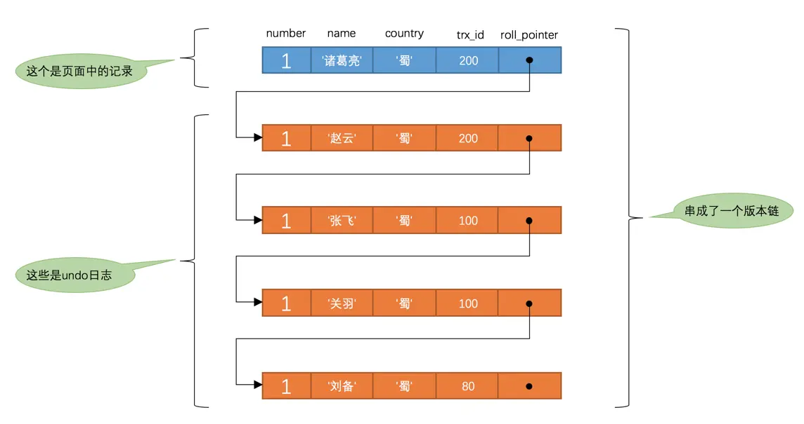
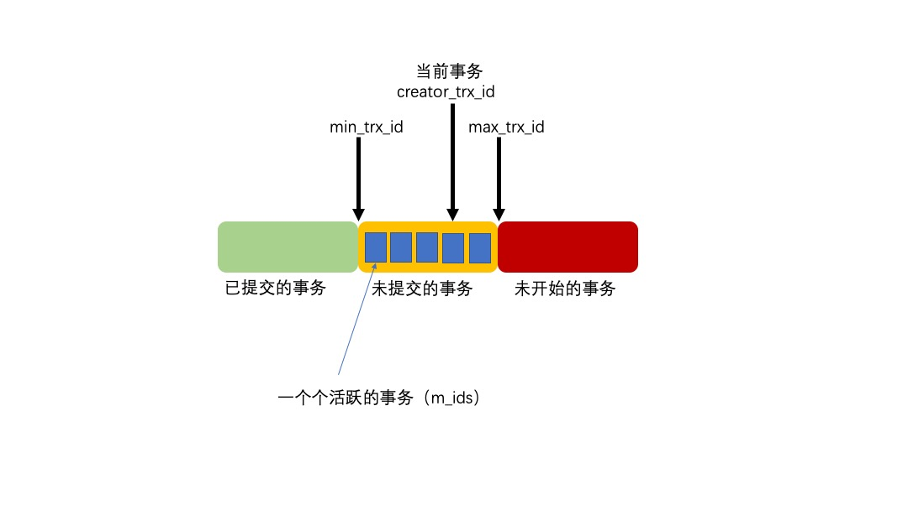

# 事务

事务是逻辑上的一组操作，要么都执行，要么都不执行

## 四大特性 ACID

- 原子性（Atomicity）：一个事务中的所有操作，要么都执行，要么都不执行，不可能停滞在中间环节
  - 通过 undo log 保证
- 一致性（Consistency）：执行事务前后，数据保持一致状态
  - 例如无论转账是否成功，转账前后的参与转账的账户总余额应是一致的
  - 由其他三大特性保证，程序代码要保证业务上的一致性
- 隔离性（Isolation）：事务之间相互独立，互不干扰
  - 通过 MVCC 与锁保证
- 持久性（Durability）：事务完成之后，对数据库所作的更改将持久地保存在数据库中
  - 通过 redo log 保证

只有保证了事务的持久性、原子性、隔离性之后，一致性才能得到保障。即 **A、I、D 是手段，C 是目的**

## 自动提交

MySQL 中有一个系统变量 autocommit，默认值是 ON。在默认情况下，如果不显式的使用 `START TRANSACTION` 或者 `BEGIN` 语句开启一个事务，那么 **每一条语句都算是一个独立的事务**，这种特性称之为事务的自动提交

如果我们想关闭这种自动提交，可以使用下边两种方法

- 显式的的使用 `START TRANSACTION` 或者 `BEGIN` 语句开启一个事务。这样在本次事务提交或者回滚前会暂时关闭掉自动提交的功能
- 将系统变量 autocommit 修改为 OFF。这样我们写入的多条语句就算是属于同一个事务了，直到我们显式的写出 `COMMIT` 语句提交事务，或者显式的写出 `ROLLBACK` 语句回滚事务

## 隐式提交

当我们使用某些特殊的语句而导致事务提交的情况被称为隐式提交

### 定义或修改数据库对象的数据定义语言（DDL，Data definition language）

使用 `CREATE`、`ALTER`、`DROP` 等语句去修改数据库、表、视图、存储过程等数据库对象

### 隐式使用或修改 mysql 数据库中的表

使用 `ALTER USER`、`CREATE USER`、`DROP USER`、`GRANT`、`RENAME USER`、`REVOKE`、`SET PASSWORD` 等语句

### 事务控制或关于锁定的语句

在一个事务还没提交或者回滚时，又使用 `START TRANSACTION` 或者 `BEGIN` 语句开启了另一个事务时，会隐式的提交上一个事务

当前的 autocommit 系统变量的值为 OFF，我们手动把它调为 ON 时，也会隐式的提交前边语句所属的事务

使用 `LOCK TABLES`、`UNLOCK TABLES` 等关于锁定的语句也会隐式的提交前边语句所属的事务

### 加载数据的语句

使用 `LOAD DATA` 语句来批量往数据库中导入数据时

### 关于 MySQL 复制的一些语句

`START SLAVE`、`STOP SLAVE`、`RESET SLAVE`、`CHANGE MASTER TO` 等语句

### 其它的一些语句

`ANALYZE TABLE`、`CACHE INDEX`、`CHECK TABLE`、`FLUSH`、`LOAD INDEX INTO CACHE`、`OPTIMIZE TABLE`、`REPAIR TABLE`、`RESET` 等语句

## 并发事务带来的问题

### 脏读（Dirty read）

一个事务读取到另一个事务未提交的数据

假设初始值为 100，事务 A 修改为 99，这时事务 B 读取到的值为 99。事务 A 发生回滚导致已产生修改未能提交到数据库，这时事务 A 中的值回滚成了 100，但事务 B 中的值仍是 99

### 更新丢失（Lost to modify）

当多个事务更新同一数据时，由于不知道其他事务的存在，就会发生丢失更新问题，最后的更新覆盖了其他事务所做的更新

假设初始值为 100，事务 A 先修改为 99，事务 B 再修改为 101，最终的结果为 101，事务 A 的修改丢失了

### 不可重复读（Unrepeatable read）

一个事务读取到另一个事务已提交的数据，导致多次读取同一数据时，数据内容不一致

假设初始值为 100，事务 A 读取到的值为 100，事务 B 将值修改为 99 并提交，事务 A 再去读取，发现值变成了 99，前后两次读取的结果不一致

### 幻读（Phantom read）

一个事务内读取到另一个事务插入的数据，导致前后多次读取，数据总量不一致

事务 A 读取了一个范围内的数据，发现该范围一共有 99 条数据，此时事务 B 在这个范围中添加了一条数据，事务 A 再去读取这个范围的数据时，发现该范围一共有 100 条数据，前后两次读取的数量不一致

#### 不可重复读与幻读的区别

- 不可重复读侧重于内容，多次读取同一条数据发现内容不一致
- 幻读侧重于数据量，多次读取同一范围数据发现数据量不一致

## 事务隔离级别

- 读未提交（READ UNCOMMITTED）：最低的隔离级别，允许读取尚未提交的数据
  - 可能会导致脏读、幻读、不可重复读
  - 一般只是理论上存在，数据库的默认隔离级别都高于该级别
- 读已提交（READ COMMITTED）：允许读取已提交的数据
  - 可以避免脏读，还是可能发生幻读、不可重复读
- 可重复读（REPEATABLE READ）：MySQL 默认的隔离级别，对同一字段的多次读取结果都是一致的，除非数据是被本身事务自己所修改
  - 可以避免脏读、不可重复读，还是可能发生幻读
- 串行化（SERIALIZABLE）：最高的隔离级别，所有的事务依次逐个执行，这样事务之间就完全不可能产生干扰
  - 可以避免脏读、幻读、不可重复读
  - 一般很少使用，吞吐量太低，效率太差，用户体验不好

### 隔离级别的实现

事务的隔离级别基于锁和 MVCC 机制共同实现的。锁可以看作是悲观控制的模式，MVCC 可以看作是乐观控制的模式

- SERIALIZABLE：通过锁来实现
- READ COMMITTED 与 REPEATABLE READ：通过 MVCC 实现

> 是不是发觉少了 READ UNCOMMITTED？你觉得为什么没有他

## MVCC（Multiversion concurrency control，多版本并发控制）

MVCC 是一种并发控制机制，用于在多个并发事务同时读写数据库时保持数据的一致性和隔离性，通过维护数据的历史版本来实现的

MVCC 的实现依赖于隐藏字段、ReadView、undo log

- 通过 trx_id 与 ReadView 判断数据的可见版本
- 通过 roll_pointer 与 undo log 维护数据的历史版本

通过锁与 MVCC 的配合就能解决并发事务带来脏读、不可重复读、幻读

## 版本链

每次对记录进行改动，都会记录一条 undo log，每条 undo log 也都有一个 roll_pointer 属性（INSERT 操作对应的 undo log 没有该属性，因为该记录并没有更早的版本），可以将这些 undo log 都连起来，串成一个链表



<small>[MySQL 是怎样运行的：从根儿上理解 MySQL - 事务隔离级别和MVCC](https://juejin.cn/book/6844733769996304392)</small>

每次对该记录更新后，都会将旧值放到一条 undo log 中，就算是该记录的一个旧版本，随着更新次数的增多，所有的版本都会被 roll_pointer 属性连接成一个链表，这就是版本链，版本链的头节点就是当前记录最新的值。另外，每个版本中还包含生成该版本时对应的事务 id

## ReadView

ReadView 用于判断当前事务可以看见的版本



<small>[一篇文章带你掌握mysql的一致性视图（MVCC）- ReadView](https://www.cnblogs.com/luozhiyun/p/11216287.html)</small>

- m_ids：在生成 ReadView 时当前系统中活跃的读写事务的事务 id 列表
  - 活跃事务：已启动但还没提交的事务
- min_trx_id：在生成 ReadView 时当前系统中活跃的读写事务中最小的事务 id，也就是 m_ids 中的最小值
- max_trx_id：生成 ReadView 时系统中应该分配给下一个事务的 id 值，并不是 m_ids 中的最大值
- creator_trx_id：生成该 ReadView 的事务的事务 id

### 如何判断某个版本对于当前事务可见

有了 ReadView，这样在访问某条记录时，只需要按照下边的步骤判断记录的某个版本是否可见

- 被访问版本的 trx_id 与 creator_trx_id 相同，`trx_id = creator_trx_id`
  - 当前事务在访问它自己修改过的记录，所以该版本可以被当前事务访问
- 被访问版本的 trx_id 小于 min_trx_id，`trx_id < min_trx_id`
  - 生成该版本的事务，在当前事务生成 ReadView 前已经提交，所以该版本可以被当前事务访问
- 被访问版本的 trx_id 大于或等于 max_trx_id，`trx_id >= max_trx_id`
  - 生成该版本的事务，在当前事务生成 ReadView 后才开启，所以该版本不可以被当前事务访问
- 被访问版本的 trx_id 在 min_trx_id 和 max_trx_id 之间，需要再判断一下 trx_id 是否在在 m_ids 列表中，`min_trx_id < trx_id < max_trx_id`
  - 如果在，说明创建 ReadView 时生成该版本的事务还是活跃的，该版本不可以被访问
  - 如果不在，说明创建 ReadView 时生成该版本的事务已经被提交，该版本可以被访问

如果某个版本的数据对当前事务不可见的话，那就顺着版本链找到下一个版本的数据，继续按照上边的步骤判断可见性，依此类推，直到版本链中的最后一个版本。如果最后一个版本也不可见的话，那么就意味着该条记录对该事务完全不可见，查询结果就不包含该记录

```java
# 模拟判断代码，不保证运行^_^
class Version {
    int trx_id;
    Object value;
    Version roll_pointer;
}

class ReadView {
    int creator_id;
    int min_trx_id;
    int max_trx_id;
    Set<Integer> m_ids;
}

Version check(Version version, ReadView readView) {

    boolean result;

    if (version.trx_id == readView.creator_id) {
        result = true;
    } else if (version.trx_id < readView.min_trx_id) {
        result = true;
    } else if (version.trx_id >= readView.max_trx_id) {
        result = false;
    } else {
        result = !readView.m_ids.contains(version.trx_id);
    }

    return result ? version : version.roll_pointer != null ? check(version.roll_pointer, readView) : null;
}
```

### 生成 ReadView 的时机

#### READ COMMITTED

每次读取数据前都生成一个 ReadView

当前事务多次访问某条记录时，如果有其他事务对其进行了修改并提交，得到的结果可能不同

#### REPEATABLE READ

在第一次读取数据时生成一个 ReadView

保证当前事务多次访问某条记录时，得到的结果都是相同的，即便有其他事务对其进行了修改并提交

## REPEATABLE READ 解决了幻读吗

REPEATABLE READ 很大程度上避免了幻读，但并没有能完全解决幻读

- 事务 A

```sql
BEGIN;

# 查询一个不存在的记录
SELECT * FROM test WHERE id = 1;
```

- 事务 B

```sql
BEGIN;

# 插入一条记录
INSERT INTO test (id, `name`) VALUES (1, 'first');

COMMIT;
```

- 事务 A 继续执行

```sql
# 再次查询，仍没有查找到记录
SELECT * FROM test WHERE id = 1;

# 修改事务B插入的记录，修改成功
UPDATE test SET `name` = 'second' WHERE id = 1;

# 再次查询，发现能查到事务B提交的记录了
SELECT * FROM test WHERE id = 1;
```

事务开启时，会先使用快照读。在使用快照读时，如果当前事务修改了其他事务插入的记录，仍会发生幻读。在使用当前读时，是不会发生幻读的，所以尽量在开启事务之后，马上执行 `select ... for update` 这类锁定读的语句

- 快照读：通过 MVCC 解决，事务执行过程中看到的数据，一直跟这个事务启动时看到的数据是一致的，即使中途有其他事务插入了一条数据，是查询不出来这条数据的
- 锁定读：加锁，如果有其他事务在当前事务使用的范围内插入了一条记录，那么这个插入语句就会被阻塞，无法成功插入

## 参考

- [MySQL 是怎样运行的：从根儿上理解 MySQL](https://juejin.cn/book/6844733769996304392)
- [浅谈MySQL如何保证ACID](https://juejin.cn/post/6844904095103320078)
- [InnoDB存储引擎对MVCC的实现](https://javaguide.cn/database/mysql/innodb-implementation-of-mvcc.html)
- [一篇文章带你掌握mysql的一致性视图（MVCC）](https://www.cnblogs.com/luozhiyun/p/11216287.html)
- [MySQL 可重复读隔离级别，完全解决幻读了吗？](https://xiaolincoding.com/mysql/transaction/phantom.html)
