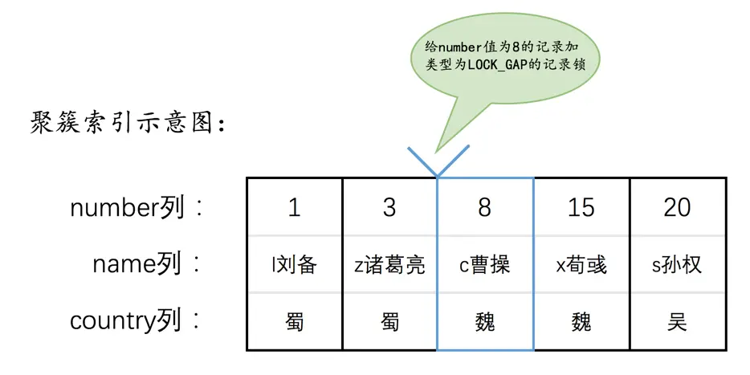
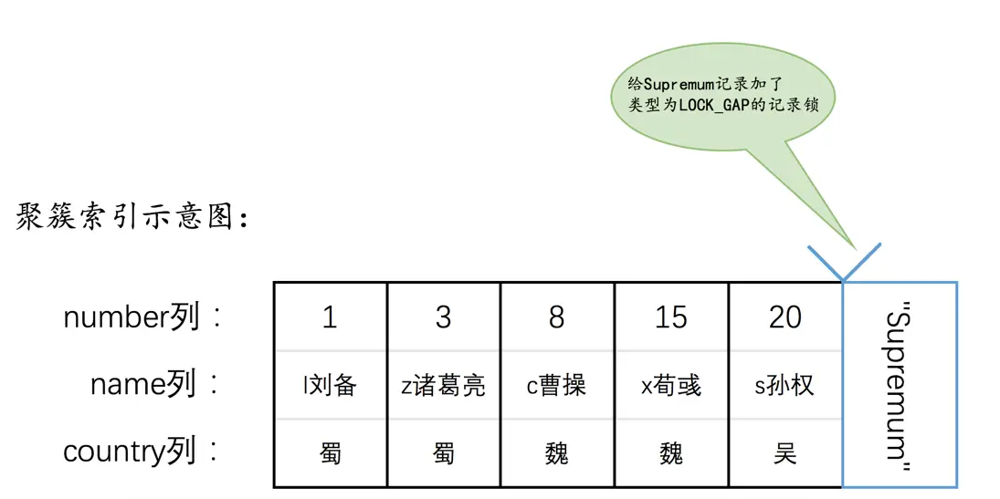
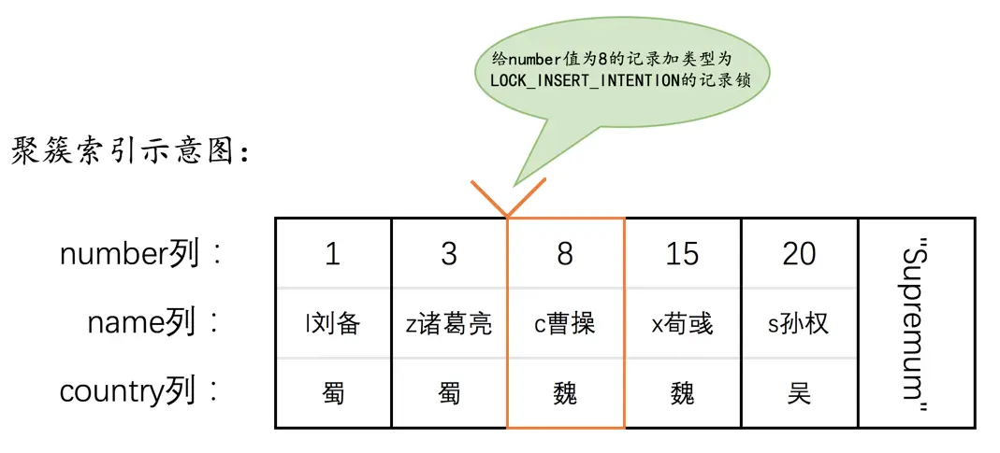
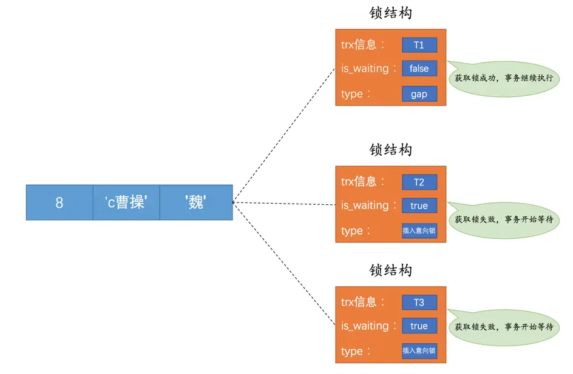

# 锁

## 共享锁（Shared Locks）和独占锁（Exclusive Locks）

MySQL 中的锁大致可分为两类

- 共享锁：简称 S 锁
- 独占锁：简称 X 锁

一个事务获取到了某条记录的 S 锁，其他事务也可以获取到该条记录的 S 锁。但如果想获取该条记录的 X 锁，就必须等待该事务提交后将锁释放掉

一个事务获取到了某条记录的 X 锁，其他事务就必须等待该事务提交后将锁释放掉，无论想获取的是 S 锁还是 X 锁

## 一致性读（Consistent Reads）

也被称为 **一致性无锁读**（Consistent Nonlocking Reads）或 **快照读**（snapshot read），**不会对记录加锁，通过 MVCC 实现**。读取的可能是数据的最新版本，也可能是旧版本，其他事务可以自由的对表中的记录做改动

事务执行过程中看到的数据，一直跟这个事务启动时看到的数据是一致的，即使中途有其他事务插入了数据，在当前事务中也是查询不出来这些数据的

- 所有普通的 `SELECT` 语句在 READ COMMITTED、REPEATABLE READ 隔离级别下都算是一致性读

## 锁定读（Locking Reads）

也被称为 **当前读**（current read），**对读取到的记录加锁**，读取的是数据的最新版本

如果有其他事务在当前事务使用的范围内插入了一条记录，那么这个插入语句就会被阻塞，无法成功插入

显式的使用加锁语句，或者执行 `INSERT`、`DELETE`、`UPDATE` 时，使用的都是锁定读

- 对读取的记录加 S 锁

```sql
SELECT ... LOCK IN SHARE MODE;
```

- 对读取的记录加 X 锁

```sql
SELECT ... FOR UPDATE;
```

### DELETE

对一条记录做 DELETE 操作的过程，就是先在 B+ 树中定位到这条记录，然后获取这条记录的 X 锁，然后再执行 delete mark 操作

实际上的删除过程需要经历两个阶段

1. **delete mark**：仅仅 **将记录的 delete_mask 标识位设置为 1**，其他的不做修改
    - 此时该记录并没有被加入到垃圾链表，还处于一个中间状态，直到删除语句所在的事务进行提交，**不会释放占用的空间**
2. **purge**：当该删除语句所在的事务提交之后，会有专门的线程把记录真正的删除掉，**释放空间**。也就是把该记录 **从正常记录链表转移到垃圾链表中**，同时调整一些页面的其他信息

> delete mark：逻辑删除
> purge：物理删除

### UPDATE

在对一条记录做 UPDATE 操作时分为 3 种情况

#### 不更新主键，被更新的列更新前后占用的存储空间大小一致

可以进行就地更新，**直接在原记录的基础上修改对应列的值**

先在 B+ 树中定位到这条记录的位置，然后再获取一下记录的 X 锁，最后在原记录的位置进行修改操作

#### 不更新主键，任一被更新的列更新前后占用的存储空间大小不一致

先在 B+ 树中定位到这条记录的位置，然后获取一下记录的 X 锁，将该记录彻底删除掉，最后再插入一条新记录，即 **先删除再插入**

- 删除并不是 delete mark 操作，而是真正的删除掉

#### 更新主键

如果修改了该记录的主键值，则相当于在原记录上做 DELETE 操作之后再来一次 INSERT 操作，加锁操作就需要按照 DELETE 和 INSERT 的规则进行了

1. 将旧记录进行 delete mark 操作
2. 插入一条新纪录到原来的位置中

### INSERT

一般情况下，新插入一条记录的操作并不加锁，InnoDB 通过 **隐式锁** 来保护这条新插入的记录在本事务提交前不被别的事务访问

## 表级锁

- 意向锁（Intention Locks）
- AUTO-INC 锁

在对某个表执行 `SELECT`、`INSERT`、`DELETE`、`UPDATE` 语句时，InnoDB 存储引擎是不会为这个表添加表级别的 S 锁或者 X 锁的

在对某个表执行一些诸如 `ALTER TABLE`、`DROP TABLE` 这类的 DDL 语句时，其他事务对这个表并发执行诸如 `SELECT`、`INSERT`、`DELETE`、`UPDATE` 的语句会发生阻塞

同理，某个事务中对某个表执行 `SELECT`、`INSERT`、`DELETE`、`UPDATE` 语句时，在其他会话中对这个表执行 DDL 语句也会发生阻塞

这个过程其实是通过在 server 层元数据锁（Metadata Locks，MDL）来实现的，一般情况下也不会使用 InnoDB 存储引擎自己提供的表级别的 S 锁和 X 锁

InnoDB 提供的表级 S 锁或者 X 锁相当鸡肋，只会在一些特殊情况下，比方说崩溃恢复过程中用到，并不会提供什么额外的保护，只是会降低并发能力

- `LOCK TABLES t READ`：对表 t 加表级别的 S 锁
- `LOCK TABLES t WRITE`：对表 t 加表级别的 X 锁

### 意向锁（Intention Locks）

在加表锁的时候需要判断表内是否存在行锁，通过意向锁可以用来快速判断表中的记录是否被上锁，以避免用遍历的方式来查看表中有没有上锁的记录

- 意向共享锁（Intention Shared Lock，IS 锁）：当事务准备在某条记录上加 S 锁时，需要先在表级别加一个 IS 锁
- 意向独占锁（Intention Exclusive Lock，IX 锁）：当事务准备在某条记录上加 X 锁时，需要先在表级别加一个 IX 锁

如果需要获取一个表级的 S 锁，需要先判断表上是否已被加入 IX 锁，如果有，需等待 IX 锁释放后，才能获取到该表的 S 锁

如果需要获取一个表级的 X 锁，需要先判断表上是否已被加入 IX 锁或 IS 锁，如果有，需等待 IX 锁或 IS 锁释放后，才能获取到该表的 X 锁

> 意向锁就像商家门口挂着的牌子，一面是欢迎光临，一面是有事外出，你看到牌子就知道能不能进去了

表级别的各种锁的兼容性

| 兼容性 | X | IX | S | IS |
| :-: | :-: | :-: | :-: | :-: |
| X | × | × | × | × |
| IX | × | 兼容 | × | 兼容 |
| S | × | × | 兼容 | 兼容 |
| IS | × | 兼容 | 兼容 | 兼容 |

与 X 锁相关的都不兼容，意向锁之间是相互兼容的，S 锁与 S 锁、S 锁与 IS 锁也是兼容的

### AUTO-INC 锁

MySQL 中可以为表中的某个列添加 AUTO_INCREMENT 属性，之后在插入记录时，会自动为它赋上递增的值

- **表中只能有一个自增列，且该列必须是主键**

系统实现这种自动给 AUTO_INCREMENT 修饰的列递增赋值的原理主要是两个

- 采用 AUTO-INC 锁：在执行插入语句时在表级别加一个 AUTO-INC 锁，为每条待插入记录的自增列分配递增的值，在语句执行结束后，再把 AUTO-INC 锁释放掉。这样一个事务在持有 AUTO-INC 锁的过程中，其他事务的插入语句都要被阻塞，可以保证一个语句中分配的递增值是连续的
  - 一般适用于执行前不可以确定具体要插入多少条记录
- 采用一个轻量级的锁：在为插入语句生成自增列的值时，获取一下这个轻量级锁，然后生成本次插入语句需要用到的自增列的值之后，就把该轻量级锁释放掉，并不需要等到整个插入语句执行完才释放锁
  - 适用于在执行前就可以确定具体要插入多少条记录，可以避免锁定表，提升插入性能

## 行级锁

- 记录锁（Record Locks）
- 间隙锁（Gap Locks）
- 临键锁（Next-Key Locks）
- 插入意向锁（Insert Intention Locks）

行锁在 InnoDB 中是 **基于索引** 实现的，所以一旦某个加锁操作没有使用索引，那么该锁就会退化为表锁

### 记录锁（Record Locks）

普通的行级锁，为单个记录加锁

### 间隙锁（Gap Locks）

在 REPEATABLE READ 隔离级别下，有两种解决幻读问题的方案：MVCC、加锁

但是在使用加锁方案时有个问题，事务在第一次执行读取操作时，那些幻影记录尚不存在，我们是无法给这些幻影记录加上普通记录锁。这时就可以使用 Gap 锁，不允许其他事务在这个间隙内插入新数据



<small>[MySQL 是怎样运行的：从根儿上理解 MySQL - 锁](https://juejin.cn/book/6844733769996304392)</small>

Gap 锁的提出仅仅是为了防止插入幻影记录而提出的，虽然有共享 Gap 锁和独占 Gap 锁的说法，但是它们起到的作用都是相同的，如果对一条记录加了 Gap 锁，并不会限制其他事务对这条记录加记录锁或者继续加 Gap 锁

对于最后一条记录之后的间隙，会在该记录所处页面的 Supremum 记录上加上 Gap 锁



<small>[MySQL 是怎样运行的：从根儿上理解 MySQL - 锁](https://juejin.cn/book/6844733769996304392)</small>

### 临键锁（Next-Key Locks）

有时候我们既想锁住某条记录，又想阻止其他事务在该记录前边的间隙插入新记录，就可以使用 Next-Key 锁

Next-Key 锁的本质就是 **一个普通记录锁和一个 Gap 锁的合体**，它既能保护该条记录，又能阻止别的事务将新记录插入被保护记录前边的间隙

### 插入意向锁（Insert Intention Locks）

一个事务在插入一条记录时，需要判断一下插入位置，是不是被别的事务加了 Gap 锁（Next-Key 锁也包含 Gap 锁），如果有的话，插入操作需要等待，直到拥有 Gap 锁的那个事务提交

但是 InnoDB 规定事务在等待的时候，也需要在内存中生成一个锁结构，表明有事务想在某个间隙中插入新记录，但是现在在等待，这种锁就被称为插入意向锁





<small>[MySQL 是怎样运行的：从根儿上理解 MySQL - 锁](https://juejin.cn/book/6844733769996304392)</small>

当一个事务释放了 Gap 锁，其他事务就能获取到插入意向锁，且事务之间并不会相互阻塞，他们都能获取到插入意向锁，然后执行插入操作

- 插入意向锁并不会阻止别的事务继续获取该记录上任何类型的锁

## 隐式锁

一般情况下 INSERT 操作是不加锁的，除非即将插入的间隙已经被其他事务加了 Gap 锁，那么本次 INSERT 操作会被阻塞，并且当前事务会在该间隙上加一个插入意向锁

如果一个事务首先插入了一条记录（此时并没有与该记录关联的锁结构），然后另一个事务

- 立即使用 `SELECT ... LOCK IN SHARE MODE` 语句读取这条记录，也就是要获取这条记录的 S 锁
  - 如果允许这种情况的发生，那么可能产生脏读问题
- 立即修改这条记录，或者使用 `SELECT ... FOR UPDATE` 语句读取这条记录，也就是要获取这条记录的 X 锁
  - 如果允许这种情况的发生，那么可能产生脏写问题

这时事务 id 就起作用了

- 聚簇索引记录中有一个 trx_id 隐藏列，保存着 **最后改动该记录的事务 id**
  - 如果其他事务想对该记录添加 S 锁或者 X 锁，先会看一下该记录的 trx_id 保存的事务 id 是否是当前的活跃事务，如果是的话，那么就帮助当前事务创建一个 X 锁，然后自己进入等待状态

- 对于二级索引记录来说，本身并没有 trx_id 隐藏列，但是在二级索引页面的 Page Header 部分有一个 PAGE_MAX_TRX_ID 属性，该属性代表对该页面做改动的最大的事务 id
  - 如果 PAGE_MAX_TRX_ID 属性值小于当前最小的活跃事务 id，那么说明对该页面做修改的事务都已经提交了，否则就需要在页面中定位到对应的二级索引记录，然后回表找到它对应的聚簇索引记录，然后再重复情景一的做法

一个事务对新插入的记录可以不显式的加锁（生成一个锁结构），但是由于事务 id 的存在，相当于加了一个隐式锁。别的事务在对这条记录加 S 锁或者 X 锁时，由于隐式锁的存在，会先帮助当前事务生成一个锁结构，然后自己再生成一个锁结构后进入等待状态

## 参考

- [MySQL 是怎样运行的：从根儿上理解 MySQL](https://juejin.cn/book/6844733769996304392)
- [MySQL常见面试题总结](https://javaguide.cn/database/mysql/mysql-questions-01.html)
- [gap locks don't appear in data_locks table - What's happening?](https://stackoverflow.com/questions/74972075/gap-locks-dont-appear-in-data-locks-table-whats-happening)
- [17.7.1 InnoDB Locking](https://dev.mysql.com/doc/refman/8.0/en/innodb-locking.htmls)
- [Innodb中的事务隔离级别和锁的关系](https://tech.meituan.com/2014/08/20/innodb-lock.html)
