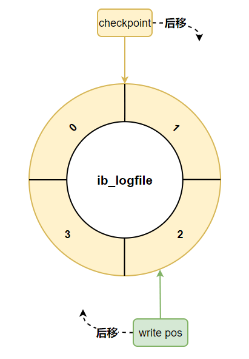
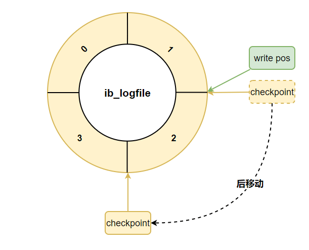

# 日志

## redo log

InnoDB 独有的日志，让 MySQL 具备了崩溃恢复能力，保证了事务的持久性

- redo log 占用的空间非常小
- redo log 是顺序写入磁盘的，在执行事务的过程中，每执行一条语句，就可能产生若干条 redo log，这些日志是按照产生的顺序写入磁盘的，也就是顺序 IO

### Buffer Pool

MySQL 是以页为单位来管理存储空间的，所有的数据都是存储在页中的，并且页还是磁盘和内存之间交互的基本单位

当我们查询或修改某条记录时，其实都是将一整个页的数据加载到内存中，存放在 Buffer Pool 中。后续的查询或修改操作，都会先从 Buffer Pool 中查找，没有再从硬盘中查找。减少了硬盘 IO 开销，提升了读写性能

由于 Buffer Pool 是位于内存中的，一个事务提交之后，我们对 Buffer Pool 中对应的页的修改可能还未持久化到磁盘，一旦系统崩溃重启，Buffer Pool 上的数据就会丢失，很显然违反了事务的持久性

为此 InnoDB 引入了 redo log，记录事务内作出的修改，在事务提交时将 redo log 刷新到磁盘上。这样即使系统崩溃，重启后也能根据 redo log 恢复未能从 Buffer Pool 刷新到新盘的数据，从而保证了事务的持久性

### redo log 缓冲区

InnoDB 为了解决磁盘速度过慢的问题而引入了 Buffer Pool。同理，写入 redo log 时也不能直接直接写到磁盘上，实际上服务器在启动时就向操作系统申请了一大片称之为 redo log buffer（redo 日志缓冲区）的连续内存空间

事务内作出的修改，会先写入到 redo log buffer 中，再根据不同的刷盘时机写入到磁盘中

#### 刷盘时机

- 事务提交时：在事务提交时可以不把修改过的 Buffer Pool 页面刷新到磁盘，但是为了保证持久性，必须要把修改这些页面对应的 redo log 刷新到磁盘
- redo log buffer 空间不足时：如果当前写入 redo log buffer 的日志量已经占满了总容量的大约一半左右，就需要把这些日志刷新到磁盘上
- 正常关闭服务器时：MySQL 关闭的时候，redo log 都会刷入到磁盘
- 后台线程：InnoDB 启动了一个后台线程，大约每秒都会刷新一次 redo log buffer 中的 redo log 到磁盘
- checkpoint：InnoDB 定期会执行检查点操作，将内存中的脏数据（已修改但尚未写入磁盘的数据）刷新到磁盘，并且会将相应的 redo log 一同刷新，以确保数据的一致性
- 脏页刷盘前：将某个脏页刷新到磁盘前，会保证先将该脏页对应的 redo log 刷新到磁盘中

#### innodb_flush_log_at_trx_commit

为了保证事务的持久性，用户线程在事务提交时需要将该事务执行过程中产生的所有 redo log 都刷新到磁盘上，这很明显的降低数据库性能。如果对事务的持久性要求不高的话，可以修改该参数

- 0：事务提交时不立即向磁盘中同步 redo log ，而是交给后台线程
  - 可以加快请求处理速度，但是如果事务提交后服务器挂了，后台线程没有及时将 redo log 刷新到磁盘，那么该事务对页面的修改会丢失
- 1：默认值，在事务提交时需要将 redo log 同步到磁盘，可以保证事务的持久性
- 2：在事务提交时需要将 redo log 写到操作系统的缓冲区中，但并不需要保证将日志真正的刷新到磁盘
  - 如果数据库挂了，操作系统没挂的话，事务的持久性还是可以保证的，但是操作系统也挂了的话，那就不能保证持久性了

### redo log 文件组

磁盘上的 redo 日志文件不只一个，而是以一个日志文件组的形式出现的

这些文件以 `ib_logfile[数字]` 的形式进行命名。在将 redo 日志写入日志文件组时，是从 ib_logfile0 开始写，如果 ib_logfile0 写满了，就接着 ib_logfile1 写，以此类推，写满最后一个文件时，再重新转到 ib_logfile0 继续写

redo 日志文件的个数默认为 2，最大值为 100，可以通过 `innodb_log_files_in_group` 参数进行修改

<small>[MySQL三大日志(binlog、redo log和undo log)详解 - 日志文件组](https://javaguide.cn/database/mysql/mysql-logs.html)</small>

#### checkpoint

redo 日志文件组容量是有限的，为此不得不选择循环使用 redo 日志文件组中的文件，但是这会造成最后写的 redo 日志与最开始写的 redo 日志追尾

> 衔尾蛇知道吗

redo 日志只是为了系统崩溃后恢复脏页用的，如果对应的脏页已经刷新到了磁盘，该 redo 日志也就没有存在的必要了，那么它占用的磁盘空间就可以被后续的 redo 日志所重用

InnoDB 使用了一个全局变量 checkpoint_lsn，来表示当前系统中可以被覆盖的 redo 日志总量，初始值为 8704

当 redo 日志就可以被覆盖了，就可以进行一个增加 checkpoint_lsn 的操作，这个过程也被称为做一次 checkpoint

#### write pos 与 checkpoint

- write pos：当前记录的位置
- checkpoint：当前要擦除的位置

每次刷盘 redo log 记录到日志文件组中，write pos 位置就会后移更新。每次 MySQL 加载日志文件组恢复数据时，会清空加载过的 redo log 记录，并把 checkpoint 后移更新

- write pos 之前：已使用的空间
- write pos 之后：未使用的空间
- checkpoint 之前：已擦除的空间，即可以使用的空间
- checkpoint 之后：可能有未使用的空间，但当前无法使用

如果 write pos 追上 checkpoint ，表示日志文件组满了，这时候不能再写入新的 redo log 记录，MySQL 得停下来，将 Buffer Pool 中的脏页刷新到磁盘中，并将已被刷盘的 redo log 记录进行擦除，等擦除完旧记录腾出了空间，checkpoint 就会往后移动

<small>[MySQL三大日志(binlog、redo log和undo log)详解 - 日志文件组](https://javaguide.cn/database/mysql/mysql-logs.html)</small>

## binlog

二进制日志文件，记录了数据库所有执行修改的操作（DDL 和 DML 语句），主要应用于数据备份、主从复制

### 记录格式

有三种记录格式，可以通过 binlog_format 参数指定

#### statement

记录每一条修改数据的 SQL 语句

<small>[MySQL三大日志(binlog、redo log和undo log)详解 - 记录格式](https://javaguide.cn/database/mysql/mysql-logs.html)</small>

- 注意语句中如果使用了动态函数，例如 `now()`，直接执行会导致与原库的数据不一致

#### row

记录的内容不再是简单的 SQL 语句，还包含操作的具体数据，需要通过特定的工具解析成可读的数据

<small>[MySQL三大日志(binlog、redo log和undo log)详解 - 记录格式](https://javaguide.cn/database/mysql/mysql-logs.html)</small>

需要更大的容量来记录，比较占用空间，恢复与同步时会更消耗 IO 资源，影响执行速度

#### mixed

混合了 statement 和 row。MySQL 会判断这条 SQL 语句是否可能引起数据不一致，如果是，就用 row 格式，否则就用 statement 格式

### 刷盘时机

事务在执行过程中，会先把日志写入到 binlog cache 中，只有在事务提交的时候，才会把 binlog cache 中的日志持久化到磁盘上的 binlog 文件中

因为一个事务的 binlog 不能被拆开，无论这个事务多大，也要确保一次性写入，所以系统会给每个线程分配一个块内存作为 binlog cache。可以通过 binlog_cache_size 参数控制单个线程 binlog cache 大小，如果存储内容超过了这个参数，就要暂存到磁盘

- 如果一个事务的 binlog 被拆开的时候，在备库执行就会被当做多个事务分段自行，这样破坏了原子性

可以通过 sync_binlog 参数来控制数据库的 binlog 刷到磁盘上的频率

- 0：不去强制要求，由系统自行判断何时写入磁盘
- 1：每次提交事务的时候都要将 binlog 写入磁盘
- N：每 N 个事务，才会将 binlog 写入磁盘

在 MySQL5.7 之后，sync_binlog 的默认值为 1

### 与 redo log 的区别

- redo log 是 **InnoDB 独有** 的，主要用于 **保证事务的持久性**，主要用于故障恢复；binlog 是 MySQL 的 Server 层实现的日志，**所有存储引擎都可以使用**，主要用于 **备份恢复、主从复制**
- redo log 是物理日志，记录的是在某个数据页做了什么修改；binlog 是逻辑日志，主要记录的是数据库执行的所有 DDL 和 DML 语句
- redo log 是 **循环写**，日志空间大小是固定，写满就会从头开始；binlog 是 **追加写**，写满一个文件，就创建一个新的文件继续写，不会覆盖以前的日志，保存的是全量的日志
- redo log 中已刷盘的数据可能会被擦除，如果所有的数据都已落盘，redo log 被清空也无所谓，更类似一个临时的缓存；binlog 记录的是所有修改操作，理论上可以通过 binlog 将数据库恢复到任意时间点的状态

### 主从复制原理

1. 主库将数据库中数据的变化写入到 binlog
2. 从库连接主库
3. 从库会创建一个 IO 线程向主库请求更新的 binlog
4. 主库会创建一个 binlog dump 线程来发送 binlog ，从库中的 IO 线程负责接收
5. 从库的 IO 线程将接收的 binlog 写入到 relay log 中
6. 从库的 SQL 线程读取 relay log 同步数据本地

<small>[面渣逆袭：MySQL六十六问，两万字+五十图详解！有点六！ - 主从复制原理](https://mp.weixin.qq.com/s?__biz=MzkwODE5ODM0Ng==&mid=2247491831&idx=1&sn=ef4b4bfa81c00db71768dc6600a0916a&chksm=c0cf0852f7b88144460749605fbd6da0b34ca614a41cfec6315d5a61833a1ae0b5bcc1fb76b3&scene=178&cur_album_id=2041709347461709827#rd)</small>

## 两阶段提交

在执行更新语句过程，会记录 redo log 与 binlog 两块日志，以基本的事务为单位，redo log 在事务执行过程中可以不断写入，而 binlog 只有在提交事务时才写入，所以 redo log 与 binlog 的写入时机不一样

- 如果先写入 redo log，写入 binlog 时崩溃
  - 可以通过 redo log 将事务已作出的修改恢复到数据库中，当前数据库存储的是新值
  - 但在 binlog 中这些数据仍是修改之前的值，如果使用 binlog 进行备份恢复或主从复制时，就会造成数据不一致
- 如果先写入 binlog，写入 redo log 时崩溃
  - 在 redo log 中，该事务所做的修改都无效，当前数据库存储的仍是旧值
  - 但在 binlog 中这些数据已经是修改后的值，如果使用 binlog 进行备份恢复或主从复制时，就会造成数据不一致

为了避免数据的不一致，将 redo log 的写入拆成了两个步骤 prepare 和 commit，即两阶段提交

- prepare：将事务 ID 写入到 redo log，同时将 redo log 对应的事务状态设置为 prepare，然后将 redo log 持久化到磁盘
- commit：将事务 ID 写入到 binlog，并将 binlog 刷新到磁盘上，再将 redo log 的事务状态设置为 commit
  - 只要 binlog 持久化成功，就可以认为事务已执行成功，哪怕 redo log 的事务状态仍是 prepare 也无所谓

<small>[MySQL三大日志(binlog、redo log和undo log)详解 - 两阶段提交](https://javaguide.cn/database/mysql/mysql-logs.html)</small>

- redo log 处于 prepare 阶段，写入 binlog 时崩溃
  - 通过 redo log 恢复数据时，发现 redo log 处于 prepare 阶段，且没有对应的 binlog，就会回滚该事务
- 写入 binlog 成功，redo log 在 commit 阶段崩溃
  - 通过 redo log 恢复数据时，发现 redo log 处于 prepare 阶段，但能通过事务 ID 找到对应的 binlog 日志，会提交事务恢复数据

## undo log

InnoDB 独有的日志

每一个事务对数据的修改都会被记录到 undo log ，当执行事务过程中出现错误或者需要执行回滚操作的话，MySQL 可以利用 undo log 将数据恢复到事务开始之前的状态，保证事务的原子性

回滚日志会先于数据持久化到磁盘上，这样就保证了即使遇到数据库突然宕机等情况，当用户再次启动数据库的时候，数据库还能够通过查询回滚日志来回滚将之前未完成的事务

undo log 属于逻辑日志，记录的是 SQL 语句，存入的是执行操作对应的相反操作

InnoDB 存储引擎中 MVCC 的实现用到了 undo log。当用户读取一行记录时，若该记录已经被其他事务占用，当前事务可以通过 undo log 读取之前的版本信息，以此实现非锁定读取

- undo log 用于事务的取消与回滚，记录的是引起数据发生变化操作的相反操作
- redo log 用于恢复已提交但未写入数据库的数据，记录的哪些数据发生了哪些变化

## 参考

- [MySQL 是怎样运行的：从根儿上理解 MySQL](https://juejin.cn/book/6844733769996304392)
- [MySQL三大日志(binlog、redo log和undo log)详解](https://javaguide.cn/database/mysql/mysql-logs.html)
- [MySQL 日志：undo log、redo log、binlog 有什么用？](https://xiaolincoding.com/mysql/log/how_update.html)
- [undo和redo的区别](https://www.cnblogs.com/tigergaonotes/p/15811075.html)
- [【深入浅出】什么是 CheckPoint&write pos](https://blog.csdn.net/oldpig_oooo/article/details/116028659)
