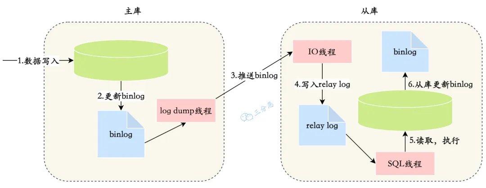

# 主从复制

## 原理

1. 主库将数据库中数据的变化写入到 binlog
2. 从库连接主库
3. 从库会创建一个 IO 线程向主库请求更新的 binlog
4. 主库会创建一个 binlog dump 线程来发送 binlog，从库中的 IO 线程负责接收
5. 从库的 IO 线程将接收的 binlog 写入到 relay log 中
6. 从库的 SQL 线程读取 relay log 同步数据本地



<small>[面渣逆袭：MySQL六十六问，两万字+五十图详解！有点六！ - 主从复制原理](https://mp.weixin.qq.com/s?__biz=MzkwODE5ODM0Ng==&mid=2247491831&idx=1&sn=ef4b4bfa81c00db71768dc6600a0916a&chksm=c0cf0852f7b88144460749605fbd6da0b34ca614a41cfec6315d5a61833a1ae0b5bcc1fb76b3&scene=178&cur_album_id=2041709347461709827#rd)</small>

## 复制模式

### 异步复制

MySQL 的默认复制方式

主库执行完事务会立即向客户端返回结果，不关心从库是否完成同步

- 性能好，但会有短暂的数据不一致现象，写完主库，立即访问从库，可能查询不到
- 如果主库提交完事务就宕机的话，可能 binlog 还未同步给从库，这时如果发生主从切换的话，就会出现数据丢失

### 全同步复制

主库执行完事务后，要求所有从库都必须同步完成后，才向客户端返回结果

- 可以保证数据的一致性，但性能较差

### 半同步复制

主库执行完事务后，要求至少一个从库同步完成后，就向客户端返回结果

- 折中的方案，性能和数据一致性都有保证
- 需引入第三方插件

#### 增强半同步复制

半同步复制的缺点

- 幻读：主库已提交事务，但需等待从库的响应，此时其他用户是可以读到这些数据，但自己是无法读取到的
- 数据丢失：如果在进行同步前，主库宕机了，就会出现数据丢失

为此，MySQL 在 5.7.2 版本对半同步复制做了改进

主库必须在收到从库的同步完成的响应后才能提交事务

- 解决幻读：需等待从库完成后才会提交事务，其他用户是读取不到修改的数据的
- 解决数据丢失：如果同步完成前，主库宕机了，由于事务还未提交，会进行回滚

## 主从不一致

- 网络延迟
- 从库机器性能较差
  - 没什么好说的，提升硬件即可，但一般来说从库的机器配置都是小于等于主库机器配置的
- 从库的读请求过多
  - 采用一主多从的架构，或者使用缓存等来降低请求量
- 大事务：大事务的执行时间较长，很容易造成主从延迟
  - 针对大事务进行优化
- 复制模式：MySQL 默认使用了异步复制的方式
- binlog 格式：如果主库的 binlog 使用了 statement 格式，在执行动态函数时，数据会出现不一致

### 如何发现主从延迟

可通过 `SHOW SLAVE STATUS` 的 Seconds_Behind_Master 参数检测主从延迟时间，单位为秒，值越大延迟越大

### 如何解决

#### 强制读主库

读和写都落到主库

- 可以制定一些规则，只有满足某些条件的数据才会强制读主库

#### 延迟操作

在完成写请求后，针对相关数据的操作会延迟一段时间，等待主从同步成功再执行

## 配置

- 主库

```bash
# 集群内唯一
server-id=1
# 必须开启 binlog 日志
log_bin=bin.log

# 可选
# 需要记录 binlog 的数据库
binlog_do_db=test
# 不需要记录 binlog 的数据库
binlog_ignore_db=mysql,sys
```

- 从库

```bash
# 集群内唯一
server-id=2
# 必须开启 binlog 日志
log_bin=bin.log

# 可选
# 需要同步的数据库
replicate_do_db=
# 忽略同步的数据库
replicate_ignore_db=
# 需要同步的表
replicate_do_table=
# 忽略同步的表
replicate_ignore_table=
```

- 同步不能使用 root 账号，所以需要在主库创建同步使用的用户

```sql
# 创建用户
create user 'sync_user'@'%' identified by '1234';

# 授予同步权限
grant replication slave on *.* to 'sync_user'@'%';

# 刷新权限
flush privileges;
```

- 查看主库状态，记录下 binlog 起始的文件名和位点
  - 从这步也可以看出主从之间并不是全量复制的，如需全量复制应搭配 mysqldump 使用

```sql
show master status;
+---------------+----------+--------------+------------------+-------------------+
| File          | Position | Binlog_Do_DB | Binlog_Ignore_DB | Executed_Gtid_Set |
+---------------+----------+--------------+------------------+-------------------+
| binlog.000002 |     1915 |              |                  |                   |
+---------------+----------+--------------+------------------+-------------------+
```

- 在从库开启同步

```sql
# 停止同步
# 在修改配置时需要执行
STOP SLAVE;

# 同步配置
# 注意区分逗号和分号
CHANGE MASTER TO
# 主库 IP
master_host = '127.0.0.1',
# 主库端口
master_port = 3306,
# 主库用于同步的用户
master_user = 'sync_user',
master_password = '1234',
# 填写从主库获取到的文件名
master_log_file = 'binlog.000002',
# 填写从主库获取到位点
master_log_pos = 1915;

# 开启同步
START SLAVE;
```

- 查看同步状态

```sql
# 如果 Slave_IO_Running 和 Slave_SQL_Running 都为 Yes 即为主从同步开启成功
SHOW SLAVE STATUS;
```

## 参考

- [MYSQL 主从不一致的原因分析](https://blog.csdn.net/qq_34675369/article/details/136681359)
- [MySQL 主从复制 —— 全同步复制、异步复制、半同步复制](https://juejin.cn/post/7269953746851266620)
- [读写分离和分库分表详解](https://javaguide.cn/high-performance/read-and-write-separation-and-library-subtable.html)
- [主从不一致解决方案 && 如何降低主从延迟](https://www.cnblogs.com/hi3254014978/p/17103899.html)
- [10分钟搞定Mysql主从部署配置](https://www.cnblogs.com/zer0Black/p/18196054)
- [MySQL主从同步报错排错结果及修复过程之：Slave_SQL_Running: No](https://blog.csdn.net/eagle89/article/details/105881752)
