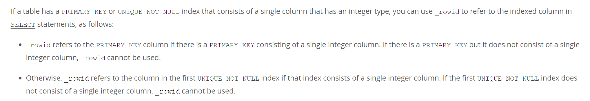

# 主键

## 如何选择一个主键

1. 优先使用 **用户自定义的主键**
2. 如果没有用户自定义主键，则选取 **第一个非空的唯一索引**
3. 如果没有非空的唯一索引，则 InnoDB 会为表自动创建一个 **隐藏列 row_id** 作为主键

其实很简单，只有非空的唯一列才能被作为主键

并且有些情况下，row_id 也会直接引用用户的自定义主键或第一个非空的唯一索引

- 存在用户自定义主键，且该主键是由单个整数类型的列组成的
- 存在非空的唯一索引，且第一个该索引是由单个整数类型的列组成的

<small>[15.1.15 CREATE INDEX Statement - Unique Indexes](https://dev.mysql.com/doc/refman/8.0/en/create-index.html)</small>

## 建议使用自定义的有序主键

- row_id 会占用 6 个字节，而自定义的主键使用 int 类型的话只占 4 个字节
  - 注意无论你把 int 类型设置为 `int(0)`、`int(1)`...int 类型始终都会占用固定的 4 个字节。因为 **整数类型** 括号中影响的只是数据需显示的长度，且只在类型被设置为 zerofill 才有作用
- 插入数据需要生成 row_id，而生成的 row_id 是整个表共享的（可以想象成你去银行或医院遇到的发号机），并发会导致锁竞争，影响性能

### 为什么建议使用有序的主键

- 数据是有序的存放在数据页上的，数据页满了会换一个新的页面进行插入。如果主键是乱序插入的，很有可能就会插入到一个已满的数据页上，进而产生 **页分裂**，造成不必要的性能损耗和碎片空间
- 写入的目标页很可能已经刷新到磁盘上并且从缓存上移除，或者还没有被加载到缓存中，InnoDB 在插入之前不得不先找到并从磁盘读取目标页到内存中，这将导致大量的 **随机 IO**
- 建立索引时也就是一个排序的过程，如果数据原本就是有序的话，可以省略一些交换位置的操作

为了保证主键的有序性，一般会将主键设置为 AUTO_INCREMENT，但最好使用第三方的 ID 生成器

- 自增主键容易暴露一些业务信息
- 分库分表场景下可能出现主键冲突
- 使用自增主键可能会产生 AUTO-INC 锁的争夺，造成性能损耗

## 自增主键

### 自增主键一定是连续的吗

- auto_increment_offset（自增的初始值）或 auto_increment_increment（自增的步长）不为 1
- 唯一键冲突导致插入失败，此时主键已完成自增
- 事务回滚时，已发生的自增不会回滚
- 批量插入时，MySQL 会批量申请自增主键，如果数据插入完，没使用的自增主键也就被浪费了

通常来说保证主键的有序性就已经足够了，连续性不必强求

### 自增主键用完了怎么办

- 修改字段类型，使用更大的数据类型，或将字段设置为 unsigned
- 如果表中数据量并没有达到主键的上限，可以考虑重新设置自增主键的起始值
- 使用分布式 ID 生成器
- 分库分表
- 如果是以 row_id 为主键的，达到最大值后会从 0 重新开始算；前面插入的数据就会被后插入的数据覆盖，且不会报错

## 参考

- [MySQL 是怎样运行的：从根儿上理解 MySQL](https://juejin.cn/book/6844733769996304392)
- [MySQL的表没有设置主键带来的问题](https://blog.csdn.net/user2025/article/details/115430396)
- [Mysql主键不要使用uuid或者不连续不重复雪花id](https://www.cnblogs.com/xiaobaicai12138/p/17833311.html)
- [MySql为什么不推荐使用UUID做主键](https://blog.csdn.net/chenwiehuang/article/details/123420278)
- [MySQL自增主键一定是连续的吗](https://javaguide.cn/database/mysql/mysql-auto-increment-primary-key-continuous.html)
- [面试官：数据库自增 ID 用完了会咋样？](https://juejin.cn/post/6984275678761844743)
- [MySQL 自增 ID 用完了怎么办？4 种解决方案！](https://xie.infoq.cn/article/2c7109ed4c4a82413ca43863e)
