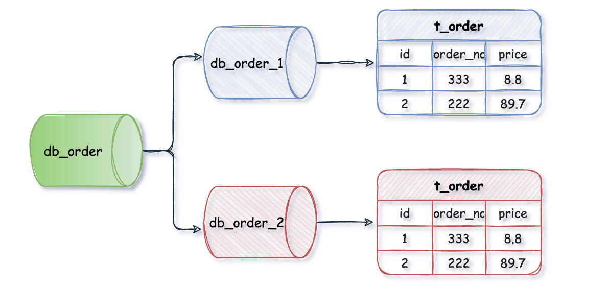

# 分库分表

- 分库：将数据库数据拆分到多个数据库中
- 分表：将表中的数据拆分到多个表中

## 何时使用

- 单表的数据量太大，影响数据库的读写性能
- 连接限制：数据库的连接是有限的，当连接过多时就会导致连接失败，虽然可以动态的调整连接数上限，但机器受限于硬件（内存、CPU、网络等），他的处理能力也是有限的

分库分表的成本较高，推荐在单表行数超过 500 万行或者单表容量超过 2GB 时使用

## 分片方式

### 垂直

- 垂直分库：一般按照业务逻辑划分，将不同的业务拆分到不同的数据库中

<small>[好好的系统，为什么要分库分表？ - 1、垂直分库](https://www.cnblogs.com/chengxy-nds/p/16924305.html)</small>

- 垂直分表：将表中的字段拆分到不同的表中

<small>[好好的系统，为什么要分库分表？ - 2、垂直分表](https://www.cnblogs.com/chengxy-nds/p/16924305.html)</small>

### 水平

- 水平分库：将一个表按照某种规则拆分到不同的数据库中

<small>[好好的系统，为什么要分库分表？ - 1、水平分库](https://www.cnblogs.com/chengxy-nds/p/16924305.html)</small>

- 水平分表：将表中的数据拆分到不同的表中

<small>[好好的系统，为什么要分库分表？ - 2、水平分表](https://www.cnblogs.com/chengxy-nds/p/16924305.html)</small>

水平分库一般和水平分表同时使用

## 分片算法

决定了数据被分片后该存放在哪个表中

### 取模

对某个字段（订单号、用户 ID 等）或者他的哈希值进行取模

- 实现简单，数据分布较为均匀
- 不适合范围查询
  - 数据随机分布
- 对伸缩容不友好
  - 数据的位置可能会发生改变，需要移动数据

### 范围限定

提前划分好范围区间（时间、地理位置、主键等），哪些表对应哪些区间，将数据放入对应的范围区间

- 单表数据量可控
- 适合范围查询
- 水平扩展简单，只需增加表
- 可能会发生数据倾斜，数据分布不均匀，某些区间的数据过多或过少

### 映射表

使用单独的表来存储数据和分片的对应关系

- 可以灵活的调整分片规则，不需要移动数据
- 需要维护额外的表，增加了查询的开销

### 一致性哈希

将哈希空间组织成一个环形结构，将分片键和节点（数据库或表）都映射到这个环上，然后根据顺时针的规则确定数据或请求应该分配到哪个节点上，解决了传统哈希对动态伸缩不友好的问题

## 使用问题

### 维护成本

分库分表需要额外编写逻辑或引入中间件，增加了系统的复杂度

### 主键

通常我们会将主键设置为自增，但分库分表后，使用自增主键可能会出现主键重复的情况，所以要保证主键全局唯一，一般通过分布式 ID 实现，或者为每个表设置不同的自增起始范围

### 跨库跨表查询

原本一个表中的数据现在分布在不同的表或数据库中，在进行某些查询时需要进行额外的操作

#### 关联查询

- 将关联查询拆分成多个单个查询，再进行组装
- 添加冗余字段或者中间表
- ER 分片：将关联的数据存放在同一个分片上

#### 分页

##### 全局视野法

每个分片查询同样数量的数据，汇总后再排序，并返回指定页数的数据

例如每页 100 条，查第五页的数据，先在分别在每个分片内查询 5 页的数据，即 `5 * 100 = 500` 条数据，汇总后，将结果集进行排序，返回第 5 页所在的第 400 条到第 500 条的数据

- 之所以每个分页都要查询 `页数 * 每页条数`，因为在极端情况，会出现数据都在同一个分片的情况

每个分片都要返回大量的数据，还要进行二次排序，且随着页数的上升，性能会急剧下降
  
##### 禁止跳页

对全局视野法的优化，只提供下一页的功能，不允许跳转到指定页数，这样就只需记录之前查询的的最大值，之后每个分片只需查询大于这个值的一页的数据，之后再汇总返回

##### 允许精度丢失

如果数据分布均匀的话（应当如此），且能接受一定的误差，每个分片取 `每页条数 / 分片数` 数量的数据，汇总排序后即可返回

#### 聚合操作

在执行 `GROUP BY`、`ORDER BY`、聚合函数等操作时，需要在多个分片上执行相同的操作，再将各个分片的结果集进行汇总并再次计算，才能返回结果

### 事务

由于数据可能分布在不同的数据库上，为了保证事务的原子性，需要引入分布式事务

### 迁移

最好是停机迁移，在系统访问量最低的时段进行

不能停机的话，可以先把数据库和表建好，将数据同步到分片表上，并将迁移期间的数据修改同步到新表上，直到新表与旧表的数据一致，在进行切换

### 伸缩容

## 参考

- [读写分离和分库分表详解](https://javaguide.cn/high-performance/read-and-write-separation-and-library-subtable.html)
- [好好的系统，为什么要分库分表？](https://www.cnblogs.com/chengxy-nds/p/16924305.html)
- [MySQL分库分表会带来哪些棘手的问题？](https://mp.weixin.qq.com/s?__biz=MzU3OTc1MDM1Mg==&mid=2247500792&idx=1&sn=7d6d688ce9cdb4f1a60b43f97163efe1&chksm=fd63d347ca145a51cbf42519a256ecbeafaaec40cc74c5ac96e481d747eaf094105e1db3fd72&scene=21)
- [分表分页/跨库分页 难玩却不代表没有玩法](https://juejin.cn/post/6981996965353488415)
- [分库分表必会-跨库分页查询看此一篇就够了](https://juejin.cn/post/7141194628472487972)
