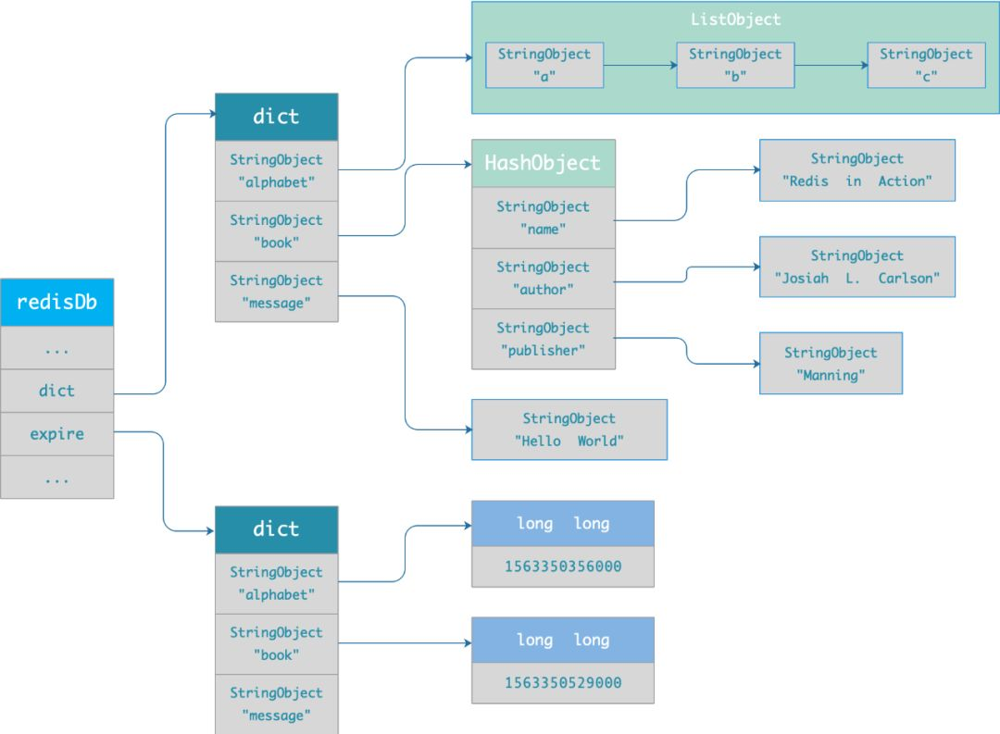
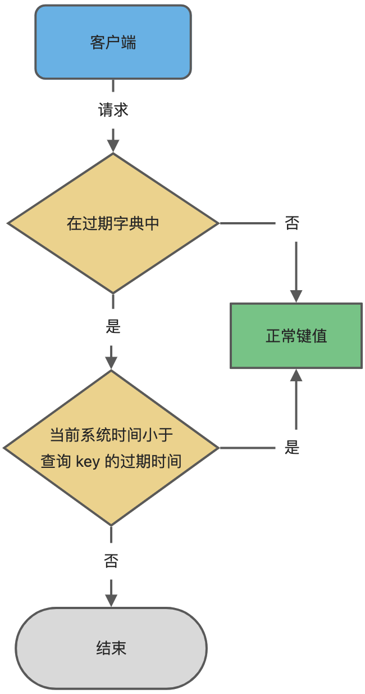
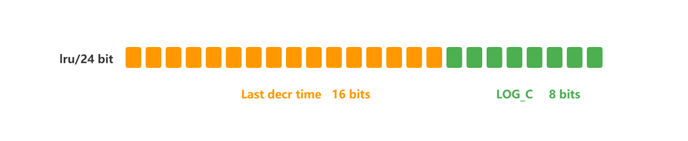

# 过期删除与内存淘汰策略

## 过期删除策略

在 Redis 中为 key 设置过期时间时，Redis 会将该 key 带上过期时间存储到一个过期字典（expires dict）中

```c
typedef struct redisDb {
    dict *dict;                 /* The keyspace for this DB */
    dict *expires;              /* Timeout of keys with a timeout set */
    ...
} redisDb;
```



<small>[Redis 过期删除策略和内存淘汰策略有什么区别？ - 如何判定 key 已过期了？](https://xiaolincoding.com/redis/module/strategy.html#%E5%A6%82%E4%BD%95%E5%88%A4%E5%AE%9A-key-%E5%B7%B2%E8%BF%87%E6%9C%9F%E4%BA%86)</small>

过期字典里保存了指向某个键对象的指针，和过期时间的时间戳



<small>[Redis 过期删除策略和内存淘汰策略有什么区别？ - 如何判定 key 已过期了？](https://xiaolincoding.com/redis/module/strategy.html#%E5%A6%82%E4%BD%95%E5%88%A4%E5%AE%9A-key-%E5%B7%B2%E8%BF%87%E6%9C%9F%E4%BA%86)</small>

### 删除策略

#### 定时删除（立即删除）

在设置 key 的过期时间时，Redis 会同时创建一个定时器，到了过期时间，定时器会立即执行 key 的删除操作，**对内存友好，对 CPU 不友好**

- 优点：保证过期 key 会被尽快删除，内存也可以被尽快地释放
- 缺点：在过期 key 比较多的情况下，删除过期 key 可能会占用相当一部分 CPU 时间，会对服务器的响应时间和吞吐量造成影响

#### 惰性删除

不主动删除过期键，每当访问该 key 时，都检测其是否过期，如果过期则删除该 key，**对 CPU 友好，对内存不友好**

- 优点：当真正访问该 key 时，才会检查 key 是否过期，只会使用很少的系统资源
- 缺点：key 过期了，仍会留在内存中，如果该 key 一直没有被访问，占用的内存也不会被释放

#### 定期删除

每隔一段时间 **随机** 从数据库中取出一定数量的 key 进行检查，并删除其中的过期 key，是定时删除与惰性删除的折中方案

- 优点：通过调整删除操作执行的时长和频率，来减少对 CPU 的影响，同时也能删除一部分过期的数据，减少了过期键对空间的无效占用
- 缺点：效率不如定时删除，资源占用比惰性删除多。难以确定删除操作执行的时长和频率，过多或过少都不好

##### 执行过程

1. 默认每隔 10 秒，从过期字典中随机抽取 20 个 key
2. 删除这 20 个 key 中已经过期的 key
3. 如果过期的 key 比率超过 1/4，重复步骤 1

为了保证定期删除不会出现循环过度，导致线程卡死现象，为此 Redis 增加了定期删除循环流程的时间上限，默认不会超过 25ms

#### Redis 的选择

Redis 采用的是 **惰性删除 + 定期删除** 策略，以求在合理使用 CPU 时间和避免内存浪费之间取得平衡，即在 Redis 中如果 key 过期了，**不一定会被马上删除**

## 内存淘汰策略

当 Redis 的运行内存已经超过 Redis 设置的最大内存之后，则会使用内存淘汰策略删除符合条件的 key，以此来保障 Redis 高效的运行

```bash
# 设置最大运行内存
# 64 位系统默认值为 0，没有内存大小限制
# 32 位系统默认值为 3G，因为 32 位最大只支持 4G 的内存
maxmemory <bytes>

# 设置内存淘汰策略
maxmemory-policy <policy>
```

### 淘汰策略

#### 不进行数据淘汰

- noeviction：默认的内存淘汰策略，当运行内存超过最大设置内存时，不淘汰任何数据，而是不再提供服务，直接返回错误

#### 在设置了过期时间的数据中进行淘汰

- volatile-random：随机淘汰
- volatile-lru：淘汰最近最少使用的
- volatile-lfu：淘汰最不常用的
- volatile-ttl：淘汰将要过期的

#### 在所有数据范围内进行淘汰

- allkeys-random：随机淘汰
- allkeys-lru：淘汰最近最少使用的
- allkeys-lfu：淘汰最不常用的

### 最近最少使用（LRU，Least Recently Used）

注重时间，最长时间未被使用的会被选择出来

#### 传统实现

基于链表结构，链表中的元素按照操作顺序从前往后排列，最新操作的键会被移动到表头，当需要内存淘汰时，只需要删除链表尾部的元素即可，因为链表尾部的元素就代表最久未被使用的元素

- 需要使用链表管理数据，会带来额外的空间开销
- 如果有大量的数据被访问，链表的移动也会增多，会很耗时，进而会降低 Redis 缓存性能

但 LRU 无法解决 **缓存污染** 问题，如果一个数据被访问的次数很少，甚至只有一次，但仍可能留存在缓存中很长时间

#### Redis 实现

Redis 在对象结构体中添加了一个用于记录该数据最后访问时间的字段 lru。当 Redis 进行内存淘汰时，默认会随机取 5 条数据，淘汰其中最久没用过的

- 近似 LRU 的算法，不用维护一个链表，可以更好的节约内存
- 不用在每次数据访问时都移动链表，提升了缓存的性能

### 最不常用（LFU，Least Frequently Used）

注重频率，一段时间内使用最少的会被选择出来

在 Redis 中 LRU 与 LFU 共用了一个字段，LRU 用来保存了最后访问的时间戳，而 LFU 将字段拆成了两份



- ldt（高 16 位）：记录 key 的访问时间戳，单位分钟
- logc（低 8 位）：记录 key 的访问频率，值越小频率越低，初始值为 5

logc 最大值为 255，随便访问几次就到达最大值了，而且在淘汰时，如果两个键都达到了最大值，一个被访问次数更多，但离上次被访问时间较长，另一个被访问次数更少，但刚刚被访问过，就会出现被访问次数多的反而被淘汰了

为此，Redis 采用了非线性递增的方式，每次 key 被访问时，会先对 logc 做一个衰减操作，与之前的访问时间作比较，时间差距越大，衰减的值也就越大。之后再做增加操作，增加操作并不是单纯的直接加 1，而是根据概率增加，logc 越大就越难再增加

## 参考

- [Redis系列--数据过期清除策略&缓存淘汰策略](https://blog.csdn.net/weixin_42972832/article/details/131410757)
- [LRU和LFU 算法（页面置换算法）](https://blog.csdn.net/weixin_43240734/article/details/123159387)
- [别再搞混了！](https://mp.weixin.qq.com/s?__biz=MzUxODAzNDg4NQ==&mid=2247515536&idx=1&sn=2a9b1d82338516976105ae9342c011a6&chksm=f98df93acefa702cda29c86d77d6116adf812c4e15978dc916447e0f68e42a002520787f66a8&scene=178&cur_album_id=1790401816640225283#rd)
- [深入解析Redis的LRU与LFU算法实现](https://www.cnblogs.com/vivotech/p/17531827.html)
