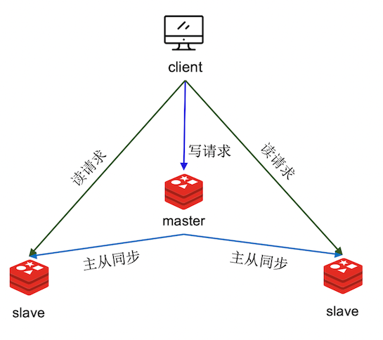
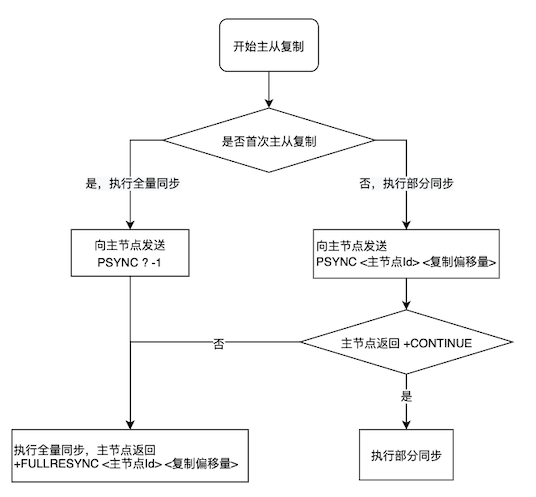

# 主从复制

将主节点的数据复制到从节点中，并尽最大的可能来保证主节点与从节点的数据一致性

主从复制是 Redis 分布式的基石，也是 Redis 高可用的保障，还实现了读写分离，提高的系统的并发量



<small>[Redis 主从复制的原理及演进 - 什么是主从复制？](https://developer.baidu.com/article/detail.html?id=294748)</small>

- 读操作：主从节点都可以接收
- 写操作：先到主节点执行，然后主节点再将写操作同步给从节点

## 实现原理

主从复制主要分为两个阶段：全量数据同步、命令传播



<small>[Redis 主从复制的原理及演进 - Redis 主从复制原理](https://developer.baidu.com/article/detail.html?id=294748)</small>

### 全量数据同步

1. 从节点和主节点建立连接，并向主节点发送 **`psync`** 命令（`psync ? -1`），表示要进行同步。该命令包含两个参数：runid 和 offset
    - runid：服务器运行 ID，每个节点在启动时都会自动生成一个 runid，作为节点的唯一标识
      - 由于是第一次复制，从节点不知道主节点的 runid，所以用 `?` 表示
    - offset：复制偏移量
      - `-1` 表示第一次复制
2. 主节点收到命令，会用 **`FULLRESYNC`** 命令响应，并带上两个参数：**主节点 runid 和主节点目前的复制进度 offset**。从节点收到响应会将这两个参数记录下来
3. 然后主节点会执行 `bgsave` 命令，生成一份 RDB 文件，发送给从节点。从节点接收到文件，会先清空当前数据库，然后再加载
    - 从节点在主从同步前，可能保存了其他数据，为了避免之前数据的影响，从节点需要先把当前数据库清空
4. 主节点在生成 RDB 文件的同时，主节点会将新接收到的写命令记录起来（replication buffer），在 RDB 文件发送完成后，再将这些命令发送给从节点，从节点再执行后续接收到的这些命令
    - 保证了主从节点的数据一致性

#### 为什么使用 RDB 而不是 AOF

RDB 文件是二进制文件，无论是写入磁盘，还是要通过网络传输，IO 效率都比 AOF 高，并且 RDB 的恢复效率要高于用 AOF

### 命令传播

相当于增量复制。全量数据同步完成后，主从节点会建立一个长连接，主节点将所有执行过的写命令源源不断地发送给从节点

### 2.8 版本引入部分同步

2.8 版本前如果主从节点间出现网络波动，断开连接，主从节点重新连接后还需要进行全量复制，因为连接断开时的数据变动从节点是不知道的，主从节点也没有对数据进度进行记录

虽然生成 RDB 文件时不会阻塞主线程，但仍会占用大量的 CPU 和内存资源，如果生成时发生了写时复制，占用的内存会更大，所以应尽量避免全量复制，为了解决这个问题，Redis 2.8 引入了部分同步

#### repl_backlog_buffer（复制积压缓冲区）

repl_backlog_buffer 是一个 **环形缓冲区**，由主节点维护，主节点在进行命令传播时，会同时将写命令记录到缓冲区中

- 缓冲区的长度有限（默认大小 1 MB），缓冲区写满之后，继续写入就会覆盖之前的数据，如果之前的数据未完成同步，就会造成主从之间的数据不一致
  - 可通过 repl_backlog_size 设置缓冲区的大小

主从节点重连时，从节点会将自身的 offset 发给主节点（`psync <主节点 runid> <自己的 offset>`），主节点就可以通过参数判断是否可以进行部分同步

- 主节点的 runid：在主从同步时，主节点会将自身的 runid 传给从节点，从节点将其保存起来，当主从节点断开重连时，就可判断当前的主节点是否是之前同步过的节点
  - 与当前主节点 runid 相同，说明之前同步的节点就是该节点，可以尝试部分复制
  - 与当前主节点 runid 不同，说明当前的主节点并不是断线前同步的主节点，只能进行全量复制
- 从节点的 offset：主从节点内都会维护一个 offset
  - offset 之后的数据在缓冲区中，执行部分复制
  - offset 之后的数据不在缓冲区中，执行全量复制

### 同源增量复制

虽然通过 runid 和 offset 在大部分场景下，可以保证主从之间采用部分复制，但在某些场景下，即便主从数据都是一致的，但还是会采用全量复制

- 从节点重启会丢失主节点的 runid 和自身的 offset
- 主从切换后，主节点改变，从节点保存的 runid 和 offset 都对不上了

为此，4.0 版本引入了同源增量复制

- 主节点的信息会被持久化到 RDB 中
  - 从节点重启后就仍可以根据这些信息判断是否可以进行部分复制
- 发生主从切换时，新的主节点会记录之前的主节点信息

```shell
> info replication
# Replication
role:master
connected_slaves:2
slave0:ip=172.17.0.3,port=6380,state=online,offset=324,lag=1
slave1:ip=172.17.0.4,port=6381,state=online,offset=324,lag=0
master_failover_state:no-failover
master_replid:d523fdc43295e9b4a17d2886f3fee690e669ca20
master_replid2:0000000000000000000000000000000000000000
master_repl_offset:324
second_repl_offset:-1
repl_backlog_active:1
repl_backlog_size:1048576
repl_backlog_first_byte_offset:1
repl_backlog_histlen:324
```

- master_replid：主节点 ID，即当前节点的 ID
- master_replid2
  - 没有发生主从切换时为空
  - 发生主从切换后，存储之前主节点的 ID
- master_repl_offset：当前节点的复制偏移量
- second_repl_offset
  - 没有发生主从切换时为 -1
  - 发生主从切换后，存储之前主节点 offset

### 无盘复制

Redis 2.8.18 引入了无盘复制，可通过 `repl-diskless-sync` 配置开启，默认是开启的

通常主从间需要全量复制时，主节点会创建一个子进程来生成 RDB 文件，生成完后会存储到磁盘中，再发送给从节点

无盘复制就是不生成 RDB 文件，不经过磁盘，直接通过网络传输数据

在需要全量复制时，与生成 RDB 类似的，主节点会创建一个子进程，并生成一个快照，但不会写入到 RDB 文件和磁盘中，而是直接通过网络将数据传输给从节点

## 主从数据不一致

客户端从主节点和从节点读取到的值不一致，主要有两个原因

- 网络传输延迟：从节点无法及时的收到主节点发送的命令
- 从节点正在执行耗时的命令：从节点需处理完当前的命令，才能去执行新收到的命令，甚至会滚雪球，导致从节点的数据越来越滞后

## 过期键

- 3.2 版本之前：从节点并不会判断数据是否过期，有可能返回过期数据
- 3.2 版本之后：从节点会先判断数据是否过期，如果过期的话，就会删除对应的数据并返回空值

## 主从切换

- 主节点

```shell
> info replication
# Replication
role:master
connected_slaves:2
slave0:ip=172.17.0.3,port=6380,state=online,offset=324,lag=1
slave1:ip=172.17.0.4,port=6381,state=online,offset=324,lag=0
master_failover_state:no-failover
master_replid:d523fdc43295e9b4a17d2886f3fee690e669ca20
master_replid2:0000000000000000000000000000000000000000
master_repl_offset:324
second_repl_offset:-1
repl_backlog_active:1
repl_backlog_size:1048576
repl_backlog_first_byte_offset:1
repl_backlog_histlen:324
```

- 从节点

```shell
> info replication
# Replication
role:slave
master_host:172.17.0.2
master_port:6379
master_link_status:up
master_last_io_seconds_ago:10
master_sync_in_progress:0
slave_read_repl_offset:324
slave_repl_offset:324
slave_priority:100
slave_read_only:1
replica_announced:1
connected_slaves:0
master_failover_state:no-failover
master_replid:d523fdc43295e9b4a17d2886f3fee690e669ca20
master_replid2:0000000000000000000000000000000000000000
master_repl_offset:324
second_repl_offset:-1
repl_backlog_active:1
repl_backlog_size:1048576
repl_backlog_first_byte_offset:15
repl_backlog_histlen:212
```

开始主从切换，首先模拟主节点停机，直接关闭该节点即可

在其中一个从节点执行 `replicaof no one`，该节点就从一个从节点变更为了主节点

```shell
> info replication
# Replication
role:master
connected_slaves:0
master_failover_state:no-failover
master_replid:51c02a46f57933b6093925c057b05fd2f08d6340
master_replid2:d523fdc43295e9b4a17d2886f3fee690e669ca20
master_repl_offset:338
second_repl_offset:339
repl_backlog_active:1
repl_backlog_size:1048576
repl_backlog_first_byte_offset:15
repl_backlog_histlen:324
```

再修改原主节点的配置，将 `replicaof <host> <port>` 指向刚刚变更的新主节点，并注释掉新主节点中的该行配置，修改完成后重启

也可直接执行该命令，但该节点之后再次重启时仍会读取配置文件中的参数

- 新主节点

```shell
> info replication
# Replication
role:master
connected_slaves:2
slave0:ip=172.17.0.2,port=6379,state=online,offset=618,lag=1
slave1:ip=172.17.0.4,port=6381,state=online,offset=618,lag=1
master_failover_state:no-failover
master_replid:51c02a46f57933b6093925c057b05fd2f08d6340
master_replid2:d523fdc43295e9b4a17d2886f3fee690e669ca20
master_repl_offset:618
second_repl_offset:339
repl_backlog_active:1
repl_backlog_size:1048576
repl_backlog_first_byte_offset:15
repl_backlog_histlen:604
```

- 旧主节点

```shell
> info replication
# Replication
role:slave
master_host:172.17.0.3
master_port:6380
master_link_status:up
master_last_io_seconds_ago:10
master_sync_in_progress:0
slave_read_repl_offset:618
slave_repl_offset:618
slave_priority:100
slave_read_only:1
replica_announced:1
connected_slaves:0
master_failover_state:no-failover
master_replid:51c02a46f57933b6093925c057b05fd2f08d6340
master_replid2:0000000000000000000000000000000000000000
master_repl_offset:618
second_repl_offset:-1
repl_backlog_active:1
repl_backlog_size:1048576
repl_backlog_first_byte_offset:353
repl_backlog_histlen:266
```

## 参考

- [彻底搞懂 Redis 主从复制机制](https://zhuanlan.zhihu.com/p/151740247)
- [Redis 主从复制的原理及演进](https://developer.baidu.com/article/detail.html?id=294748)
- [redis 主从备份（手动切换）](https://www.cnblogs.com/alexlv/p/15010358.html)
- [Redis进阶 - 高可用：主从复制详解](https://pdai.tech/md/db/nosql-redis/db-redis-x-copy.html)
- [Redis高可用之主从复制原理演进分析](https://www.cnblogs.com/jiujuan/p/16784964.html)
- [Redis集群(一)主从复制](https://www.cnblogs.com/ciel717/p/16654510.html)
- [redis 主从复制常见的一些坑](https://my.oschina.net/u/3371837/blog/1789452)
- [Redis主节点的Key已过期，但从节点依然读到过期数据？？](https://cloud.tencent.com/developer/article/1943298)
