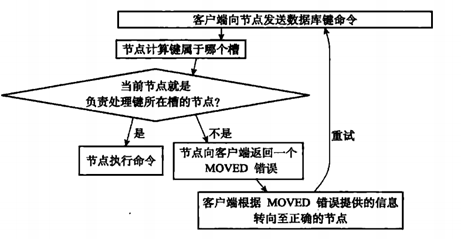

# Cluster

Redis 3.0 推出的 Cluster 结合主从复制和 Sentinel 的优点，它是 Redis 真正的分布式实现，提供了高可用、读写和容量的扩展性

- 多主多从：集群内可以部署多个主节点，同时对外提供读写服务，数据是以分片的方式均匀的存储在这些实例上
- 具备主从复制和自动故障转移功能，无需再部署 Sentinel 集群
- 分片存储：每个节点存储的不再是全部的数据，而是数据分片，每个节点存储整体数据的一部分，这样就可以很方便的进行横向扩展
  - 纵向扩展：升级单个实例的资源配置
    - 简单方便，但受制于硬件成本
  - 横向扩展：增加实例个数
- 支持动态扩容和缩容

为了保证高可用性，一个 Cluster 集群至少需要 6 个节点，3 个主节点与各自对应的 1 个从节点。主节点故障时，直接使用从节点替换，如果有多个从节点，选择一个数据最完整的从节点替代。如果某个主节点及其所有从节点都不可用的话，整个集群也将不可用，因为数据不完整了

也可修改配置 `cluster-require-full-coverage no` 让集群在数据不完整时仍能提供服务，只是该节点上的数据就无法使用了

## 分片

Cluster 采用了哈希槽（Hash Slot）概念，一个 Cluster 有 16384 个哈希槽，每个键值对对应一个槽，一个槽位可以存多个数据

- 槽位计算方式：`CRC(key) mod 16383`

在初始化 Cluster 时，Redis 会自动分配这些槽位到各个节点，也可以手动分配。默认使用 3 个节点的集群，会以以下方式进行分配

- 节点 1：0 ~ 5500
- 节点 2：5501 ~ 11000
- 节点 3：11001 ~ 16383

在集群刚刚创建时，每个实例只知道自己被分配了哪些槽位，但不知道其他实例的槽位信息。所以在实例互相连接时，每个实例会将自己的槽位信息发送给别的实例，这样每个实例就有了所有的槽位信息

客户端在与集群连接后，实例就会把槽位信息发给客户端

### 重新分片

在集群中，实例和哈希槽的对应关系并不是一成不变的，集群在扩容和缩容、负载均衡时会进行重新分片，动态迁移哈希槽，在此期间依然能正常对外提供服务

虽然实例之间仍可以通过通信获取最新的槽位信息，但客户端是无法主动感知的。所以当客户端向集群发送命令时，实例需要根据要处理的 key，计算出属于哪个槽，并判断该槽位是否由当前节点负责

- 如果是，该节点就执行命令并返回结果
- 如果不是，就会返回 MOVED 错误，并告知客户端该槽位是由其他哪个节点负责，客户端再向目标节点发送请求

<small>[认识Redis集群——Redis Cluster - 5. MOVED错误与ASK错误](https://www.cnblogs.com/jian0110/p/14002555.html)</small>

如果请求的 key 对应的槽位，正在迁移过程，还未完全迁移完成

- 请求的 key 还在原来的槽位，就执行命令并返回结果
- 请求的 key 移迁移至新的槽位，就会返回 ASK 错误，并告知客户端该槽位是由哪个节点负责，客户端再向目标节点发送请求，并更新槽位信息

MOVED 是永久性的，客户端收到 MOVED 错误之后，所有关于该槽位的的命令都可直接将请求发送给 MOVED 指向的节点。而 ASK 是临时性的，客户端收到 ASK 错误，之后关于该槽位的的命令还会再进行判断

- MOVED 错误表示槽的负责权已经从一个节点转移到另外的节点
- ASK 错误则是表示两个节点在迁移槽过程中对 key 处理的负责权

## 数据倾斜

- 数据量倾斜：实例上的数据分布不均衡
  - 某个实例上的数据特别多
- 数据访问倾斜：实例上的数据访问量不均衡
  - 某个实例上数据的访问量特别大

出现数据倾斜的实例，通常内存和 CPU 的压力都很大，会导致执行速度变慢，并且影响整个集群的处理速度，甚至还可能会引起这个实例的内存资源耗尽，从而引发崩溃

### 引发数据倾斜的原因

- bigkey：某个实例保存了 bigkey
  - 应避免将过多的数据保存在同一个键中
- 槽位分配不均衡
  - 应避免将过多的槽位分配到一个实例上，并且分配时应考虑实例的硬件配置
- Hash Tag：指加 key 中的一对花括号 `{}`，一般在计算 key 的 CRC16 的值时，计算的是整个 key，而加了 Hash Tag，就只会对花括号里面的部分进行计算
  - 好处是不同的 key 可以被映射到同一槽位上，因为分片集群是不支持跨实例的事务操作和范围查询的
  - 坏处就是会导致数据倾斜，所以最好还是不要使用，可以考虑在客户端内执行跨实例事务操作和范围查询的
- hotkey：某个实例存在 hotkey
  - 针对 hotkey 存放不同的副本，使其能均匀的分散在集群中

## 实例间通信

为了让每个实例都能够知道其他所有实例的状态信息，实例之间会进行一定的通信，并且通信的开销会随着实例规模增加而增大，一般受制于通信消息大小和通信频率，为了降低通信开销，Redis 采用了 Gossip 协议

- 每个实例会按照一定的频率（默认每秒）从集群中挑选一些实例（默认 5 个），向他们发送 PING 消息（12KB），检测这些实例是否在线，并交换彼此的状态信息
- 每个实例在接收到 PING 消息后，会返回一个 PONG 消息，包含的内容与 PING 消息相同

在一段时间后，集群内的每一个实例都能获得其它所有实例的状态信息，当节点上线、下线、槽位变化时，也可以通过 PING、PONG 消息的传递，完成集群状态在每个实例上的同步

## 故障检测

集群中每个节点都会定期地向集群中的其他节点发送 PING 消息，以此检测对方是否在线。如果没有在规定的时间内返回 PONG 消息，那么就会将该节点标记为疑似下线（possible fail，PFAIL）

如果集群内过半数的节点将该节点标记为 PFAIL，某个主节点就会将其标记为已下线，并向整个集群广播消息

## 故障转移

1. 从节点发现主节点下线
2. 在该主节点下的所有从节点选一个新的主节点
    - 如果只有一个从节点，该节点直接成为新的主节点
    - 如果有多个从节点，则进行选举
3. 新的主节点会接管之前主节点负责的所有槽位
4. 新的主节点向集群广播一条 PONG 消息，通知其他节点自己已变成主节点
5. 新主节点开始接收和自己负责处理的槽有关的命令请求，故障转移完成

### 主节点选举

1. 集群中设立一个自增计数器，初始值为 0，每次执行故障转移选举，计数就会自增 1
2. 集群内每个主节点都有一次投票机会，并会投给第一个申请投票的从节点
    - 只有实际有负责哈希槽的主节点才有投票权
3. 收到过半票数的从节点则被选举为新的主节点
4. 如果票数不够，则再进行一轮选举，计数器加 1，直至选举出新的主节点

## 参考

- [高手过招， 为什么 Redis Cluster 是16384个槽位?](https://blog.csdn.net/itomge/article/details/122075246)
- [Redis系列5：深入分析Cluster 集群模式](https://www.cnblogs.com/wzh2010/p/15886799.html)
- [认识Redis集群——Redis Cluster](https://www.cnblogs.com/jian0110/p/14002555.html)
- [redis ASK 和 MOVED 的区别](https://blog.csdn.net/qinxinhe7/article/details/136160514)
- [redis集群（总体第四篇）](https://blog.csdn.net/weixin_46635575/article/details/124079480)
