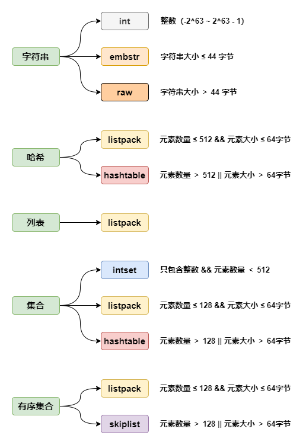

# 底层数据结构概览

## 数据结构与底层数据结构的关系演变

### Redis 3.2 之前

| String | Hash      | List       | Set       | Zset     |
|:------:|:---------:|:----------:|:---------:|:--------:|
| SDS    | ziplist   | ziplist    | intset    | ziplist  |
|        | hashtable | linkedlist | hashtable | skiplist |

### Redis 3.2 之后

| String | Hash      | List      | Set       | Zset     |
|:------:|:---------:|:---------:|:---------:|:--------:|
| SDS    | ziplist   | quicklist | intset    | ziplist  |
|        | hashtable |           | hashtable | skiplist |

### Redis 7.0

| String | Hash      | List     | Set       | Zset     |
|:------:|:---------:|:--------:|:---------:|:--------:|
| SDS    | listpack  | listpack | intset    | listpack |
|        | hashtable |          | hashtable | skiplist |

### Redis 7.2

| String | Hash      | List     | Set       | Zset     |
|:------:|:---------:|:--------:|:---------:|:--------:|
| SDS    | listpack  | listpack | intset    | listpack |
|        | hashtable |          | listpack  | skiplist |
|        |           |          | hashtable |          |
