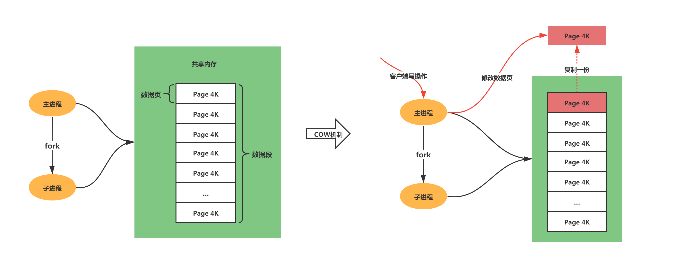
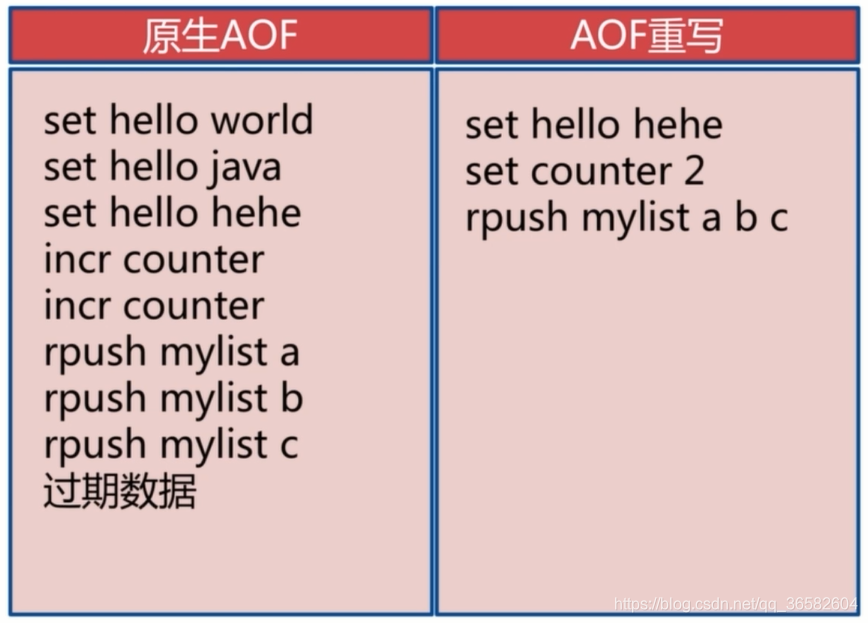

# 持久化

Redis 是基于内存的，如果没有进行持久化操作，一旦 Redis 重启或者发生故障，存储的数据将会全部丢失

## RDB（Redis DataBase）

通过创建快照把 **某一时间点的所有数据** 都存放到硬盘上，生成的 RDB 文件是一个 **经过压缩的二进制文件**

Redis 服务器启动时，如果发现有 RDB 文件，就会 **自动载入 RDB** 文件，在载入期间服务器会处于阻塞状态，直到载入工作完成

### 1. 触发方式

#### 1.1 手动触发

- 执行 `save` 命令：在主进程生成 RDB 文件，会阻塞主进程
- 执行 `bgsave` 命令：会创建一个子进程来生成 RDB 文件，避免主进程的阻塞

#### 1.2 自动触发

可以通过修改配置文件，满足了设定的条件会自动执行 `bgsave` 命令，默认是关闭状态

```bash
# 每多少秒内，对数据进行了多少次修改
# 因为Redis每个时段的读写请求肯定不是均衡的，为了平衡性能与数据安全，所以需要配置多条规则触发备份
save <seconds> <changes> [<seconds> <changes> ...]
# 例
save 3600 1 300 100 60 10000
```

- 关闭 Redis 时触发：Redis 在关闭服务时会自动触发一次 RDB 持久化
  - 执行 `save` 命令
- 主从同步时触发：当从节点连接到主节点时，主节点会触发一次 RDB 持久化，并将生成的 RDB 文件发送给从节点进行同步
  - 执行 `bgsave` 命令

### 2. 优点

#### 非常适合备份恢复

RDB 是一个经过压缩的二进制文件，体积小，方便拷贝。保存了某一时间点的所有的数据，可以将文件复制到其他服务器上从而创建具有相同数据的副本

#### 恢复大数据集时速度快

直接解析还原数据即可，不需要一条一条地执行命令，速度非常快

### 3. 缺点

#### 数据安全性不够

没法实时持久化数据，一旦发生宕机，可能会损失几分钟的数据

#### 数据量很大时，效率低

RDB 虽然会创建一个子进程出来避免主进程的阻塞，但当数据量很大时，还是会对机器的 CPU 资源和内存资源产生影响，可能会非常耗时，甚至可能发生宕机。而且创建子进程的过程中也会阻塞主进程

### 4. 工作机制


<small>[Redis持久化AOF与RDB全面解析（大厂面试必问，看完之后offer直接到手，你学废了吗？）](https://blog.csdn.net/qq_41125219/article/details/118740888)</small>

1. 主进程 fork 一个子进程
2. 子进程将数据集写入到一个临时 RDB 文件中
3. 当子进程完成对新 RDB 文件的写入时，用新 RDB 文件覆盖旧的 RDB 文件

#### 子进程

使用多线程时，多线程之间是共享内存数据的，在修改共享内存数据的时候，需要通过加锁来保证数据的安全，而这样就会降低性能

使用子进程时，父子进程是共享内存数据的，不过这个共享的内存只能以只读的方式，而当父子进程任意一方修改了该共享内存，就会发生 **写时复制**，这样父子进程就有了独立的数据副本，就不用加锁来保证数据安全

#### 写时复制（Copy On Write, COW）

Redis 利用了写时复制技术，使得执行 `bgsave` 时，主进程仍可以处理新的操作请求



通过 fork 创建子进程时，此时子进程和父进程是共享同一片内存数据的，当主线程需要修改共享内存里的某块数据时，就会发生写时复制，复制一份副本交给主进程进行修改，子进程仍可以把原先的数据继续写入到 RDB 中

- 发生写时复制时，RDB 保存的仍是修改前的内存数据
- 极端情况下，如果所有的共享内存都被修改，则此时的内存占用会是原先的 2 倍

## AOF（Append Only File）

通过保存 Redis 所执行的 **写命令** 来记录数据库的数据

- Redis 默认是没有开启 AOF 的，可以通过修改配置文件 `appendonly yes` 开启

### 1. 优点

#### 数据安全性

AOF 默认的策略为每秒同步一次，并且 Redis 仍可保持良好的性能，即便发生宕机，也最多只会丢失 1 秒钟的数据

#### 有序的保存了所有的写操作

AOF 以一种易于理解和解析的格式包含所有操作的日志，可以轻松地导出 AOF 文件进行分析，也可以利用 AOF 解决一些问题

- 例如不小心执行了 flushall 操作，只要 AOF 文件未被重写，就可以删除文件中的 flushall 命令并重启，即可恢复之前的状态

#### AOF 重写

当 AOF 文件的体积变得过大时，可以通过 AOF 重写机制，来压缩 AOF 文件

### 2. 缺点

#### 体积较大

AOF 的体积通常要大于 RDB 文件的体积，恢复速度也更慢

#### 性能较低

一般情况下，每秒同步的性能仍然很高，但还是不如 RDB。关闭同步时 AOF 的速度可以达到 RDB 的水平

### 3. 工作机制


<small>[宕机了，缓存数据没了。。。 - 三种写回策略](https://mp.weixin.qq.com/s?__biz=MzUxODAzNDg4NQ==&mid=2247493808&idx=1&sn=588d318ec6e72844841d566f16acaf30&chksm=f98dac1acefa250ce40060899a4030bb7678c45befea408162360db4ef4fa2785feb1544e719&scene=178&cur_album_id=1790401816640225283#rd)</small>

1. Redis 先 **执行完写操作命令**
2. 将写命令写入到 aof_buf 缓冲区中
3. 通过 write() 系统调用将缓冲区的的数据写入到 AOF 文件中，但此时数据并没有写入到硬盘中，而是拷贝到了内核缓冲区中
4. 根据同步策略，调用 fsync() 系统调用将内核缓冲区的数据写入到 AOF 文件中

#### write 函数

将数据写入系统内核缓冲区之后直接返回，不会立即同步到硬盘

虽然提高了效率，但也带来了数据丢失的风险

#### fsync 函数

用于强制刷新系统内核缓冲区（同步到到磁盘），确保写磁盘操作结束才会返回

### 4. 为何在执行完命令后才记录日志

#### 避免额外的检查开销

如果执行的命令有问题时，该错误命令记录到了日志里，再恢复的话可能会出错，所以需要对执行的命令进行检查操作

能执行完的命令肯定是合法的，再进行 AOF 日志记录时就不需要额外的命令检查操作了

#### 不会阻塞当前写操作的执行

当写操作命令执行成功后，才会将命令记录到 AOF 日志

#### 风险

- 数据丢失
  - 执行写操作命令和记录日志是两个过程，如果执行完命令就宕机了，就会有数据丢失的风险
- 可能会阻塞后续的命令
  - 不会阻塞当前的写操作命令的执行，但会给下一条命令带来阻塞的风险，因为将命令写入到日志的这个操作也是在主进程完成的

### 5. 同步策略

Redis 提供了三种配置用来强制的将缓冲区的内容刷新到磁盘中，即 fsync() 函数的调用时机

- `appendfsync always`：每次有数据修改时都进行同步
  - 非常耗性能，基本上不会使用
- `appendfsync everysec`：每秒同步一次
  - 默认的同步方式，兼顾了性能和数据完整性
  - 可能会有 1 秒钟的数据丢失
- `appendfsync no`：不主动同步，由操作系统决定何时进行同步
  - 丢失数据的可能性很大

### 6. AOF 重写

随着执行的写操作命令越来越多，AOF 文件的大小会越来越大，占用的磁盘空间也就越大，恢复过程也会更长

AOF 重写机制会根据键值对的当前状态，生成一条相应的操作指令，去除冗余的命令



<small>[高可用Redis(七)：Redis持久化](https://www.cnblogs.com/renpingsheng/p/9786806.html)</small>

#### 触发方式

- 手动触发：执行 `bgrewriteaof` 命令
- 自动触发：可以通过修改配置文件，满足了设定的条件会自动执行 `bgrewriteaof` 命令

```bash
# 当文件的体积比上一次重写之后的体积增长了100%时
# 当文件体积大于64MB时
# 两个配置需同时满足
auto-aof-rewrite-percentage 100
auto-aof-rewrite-min-size 64mb
```

#### 工作机制

与 RDB 类似的，AOF 重写也使用了子进程和写时复制


<small>[Redis持久化AOF与RDB全面解析（大厂面试必问，看完之后offer直接到手，你学废了吗？）](https://blog.csdn.net/qq_41125219/article/details/118740888)</small>

1. 判断是否有 `bgsave` 或 `bgrewriteaof` 指令正在执行，如若存在则等其执行完成后再执行
    - 防止两个的后台进程同时对磁盘进行大量的 IO 操作
2. fork 出一个子进程，对 AOF 进行重写，并写入到临时 AOF 文件中
3. 如果重写期间有新的写命令，Redis 会先执行完写操作命令，再将写命令追加到 AOF 缓冲区和 AOF 重写缓冲区中
4. 子进程完成临时 AOF 文件的写入后，通知主进程
5. 主进程会将 AOF 重写缓冲区中的数据写入到临时 AOF 文件中
6. 主进程使用临时 AOF 文件替换旧的 AOF 文件，完成重写操作

## 混合持久化（RDB + AOF）

RDB 与 AOF 的方案各有千秋，所以 Redis 4.0 开始支持 RDB 和 AOF 的混合持久化，默认开启，可修改配置文件 `aof-use-rdb-preamble yes`

- 高数据安全性：结合了 AOF 持久化的高数据安全性
- 快速恢复：利用 RDB 持久化的快速数据恢复速度
- 需要同时维护 RDB 文件和 AOF 文件，可能占用较多的磁盘空间，不过 AOF 文件的大小也会相应减少
- 当 Redis 重启时，**优先使用 AOF 文件** 还原数据集，因为 AOF 文件保存的数据集通常是最完整的
- AOF 重写的时候会直接把 RDB 的内容写到 AOF 文件开头，前半部分是 RDB 格式的全量数据，后半部分是 AOF 格式的增量数据
  - 结合 RDB 和 AOF 的优点，快速加载同时避免丢失过多的数据
  - 缺点是 AOF 里面的 RDB 部分是压缩格式，不再是 AOF 格式，可读性较差

## 如何恢复数据

将 RDB 文件或 AOF 文件存放到对应的目录中，重启 Redis 即可恢复数据，优先加载 AOF 文件

## flushall 命令

- RDB：会清空 RDB 文件
- AOF：没触发重写的话，之前保存的写操作都还存在

## 过期键

### RDB

#### 生成 RDB 文件

在生成 RDB 文件的过程中，如果一个键已经过期，那么其不会被保存到 RDB 文件中

#### 载入 RDB 文件

- 主节点会对 RDB 中的键进行 **时间检查**，过期的键不会被恢复
- 从节点会载入 RDB 中所有的键，忽略时间检查，在主从同步时，从服务器的数据会先被清空，所以载入过期键不会有问题

### AOF

如果一个键过期了，不会立刻对 AOF 文件造成影响。因为 Redis 使用的是惰性删除和定期删除，只有这个键被删除了，才会往 AOF 文件中追加一条删除命令。在 **重写 AOF** 的过程中，程序会检查数据库中的键，已经过期的键不会被保存到 AOF 文件中

#### 主从复制

- 如果是主节点，一个过期的键被删除后，会向从节点发送删除指令
- 如果是从节点，即使键已经过期，也不会删除，直到接受到了主节点的删除指令，才会删除对应的过期键

保证了数据的一致性，一个键值对存在于主节点，也必然存在于从节点

## 参考

- [宕机了，缓存数据没了。。。](https://mp.weixin.qq.com/s?__biz=MzUxODAzNDg4NQ==&mid=2247493808&idx=1&sn=588d318ec6e72844841d566f16acaf30&chksm=f98dac1acefa250ce40060899a4030bb7678c45befea408162360db4ef4fa2785feb1544e719&scene=178&cur_album_id=1790401816640225283#rd)
- [咔擦，不就是快照嘛](https://mp.weixin.qq.com/s?__biz=MzUxODAzNDg4NQ==&mid=2247494677&idx=1&sn=53f60870b66c731aa6ec5b6e70697eff&chksm=f98da8bfcefa21a9ad7b4d564238931f8457bafb08698301e9672dbc366a034890429fdc1ff1&scene=178&cur_album_id=1790401816640225283#rd)
- [Redis持久化AOF与RDB全面解析（大厂面试必问，看完之后offer直接到手，你学废了吗？）](https://blog.csdn.net/qq_41125219/article/details/118740888)
- [一起看懂 Redis两种持久化方式的原理](https://segmentfault.com/a/1190000015983518)
