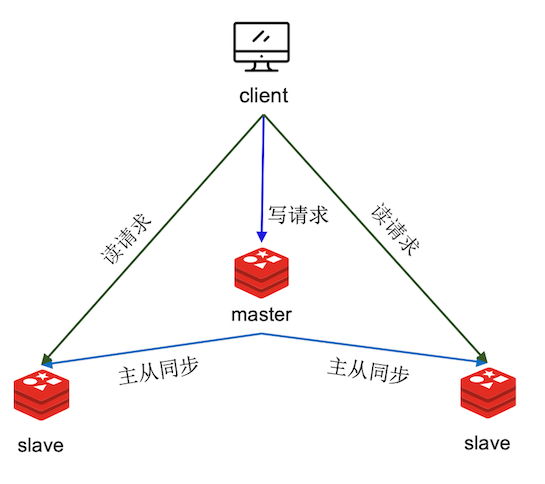
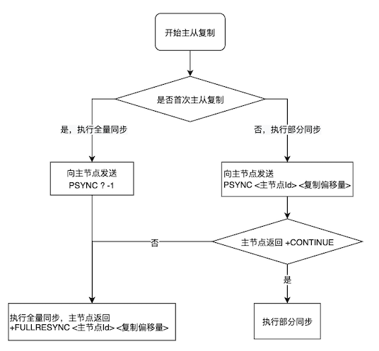

# 主从复制

将主节点的数据复制到从节点中，并尽最大的可能来保证主节点与从节点的数据一致性

主从复制是 Redis 分布式的基石，也是 Redis 高可用的保障，还实现了读写分离，提高的系统的并发量



<small>[Redis 主从复制的原理及演进 - 什么是主从复制？](https://developer.baidu.com/article/detail.html?id=294748)</small>

主服务器可以进行读写操作，当发生写操作时自动将写操作同步给从服务器，而从服务器一般是只读，并接受主服务器同步过来写操作命令

## 实现原理

主从复制主要分为两个阶段：全量数据同步、命令传播

### 全量数据同步

主节点生成一份全量数据的快照，即 RDB 文件，发送给从节点。在主节点开始生成快照时，新接收到的写命令会被记录起来，在向从节点发送 RDB 文件时一并发送。从节点先恢复快照中的数据，再执行后续接收到的命令

### 命令传播

相当于增量复制。全量数据同步完成后，主节点将所有执行过的写命令不断地发送给从节点，从节点执行这些命令，以保证主从节点中数据的一致性

### 2.8 版本引入部分同步

如果主从节点间出现网络波动，断开连接，重新连接后还需要进行全量复制，因为连接断开时的数据变动从节点是不知道的，主从节点也没有对数据进度进行记录

虽然生成 RDB 文件时不会阻塞主线程，但仍会占用大量的 CPU 和内存资源，如果生成时发生了写时复制，占用的内存会更大，所以应尽量避免全量复制

所以为了解决这个问题，Redis 2.8 引入了部分同步



<small>[Redis 主从复制的原理及演进 - Redis 主从复制原理](https://developer.baidu.com/article/detail.html?id=294748)</small>

#### runid（服务器运行 ID）

每个节点在启动时都会自动生成一个 runid。在主从同步时，主节点会将自身的 runid 传给从节点，从节点将其保存起来

当主从节点断开重连时就可判断当前的主节点是否是之前同步过的节点

- 与当前主节点 runid 相同，说明之前同步的节点就是该节点，可以尝试部分复制
- 与当前主节点 runid 不同，说明当前的主节点并不是断线前同步的主节点，就只能进行全量复制了

#### offset（复制偏移量）

主从节点内都会维护一个 offset

- 主节点每次向从节点发送 n 个字节的数据，主节点的 offset 就会被修改为 `offset + n`
- 从节点每次接收 n 个字节的数据，从节点的 offset 就会被修改为 `offset + n`

以此就可以判断哪些数据是从节点缺失的

#### backlog（复制积压缓冲区）

主节点会维护一个固定长度的队列作为复制积压缓冲区默认大小 1 MB，由于长度有限，只能存储最近执行的一些命令。主节点在进行命令传播时，会同时将写命令记录到缓冲区中

主从节点重连时，从节点会将自身的 offset 发给主节点，主节点通过 offset 与 backlog 就可判断是否可以进行部分同步

- offset 之后的数据在缓冲区中，执行部分复制
- offset 之后的数据不在缓冲区中，执行全量复制
- offset 之后的数据已超过缓冲区的大小，也要执行全量复制

### 同源增量复制

虽然通过 runid 和 offset 在大部分场景下，可以保证主从之间采用部分复制，但在某些场景下，即便主从数据都是一致的，但还是会采用全量复制

- 从节点重启会丢失主节点的 runid 和自身的 offset
- 主从切换后，主节点改变，从节点保存的 runid 和 offset 都对不上了

为此，4.0 版本引入了同源增量复制

- 主节点的信息会被持久化到 RDB 中
  - 从节点重启后就仍可以根据这些信息判断是否可以进行部分复制
- 发生主从切换时，新的主节点会记录之前的主节点信息

```shell
> info replication
# Replication
role:master
connected_slaves:2
slave0:ip=172.17.0.3,port=6380,state=online,offset=324,lag=1
slave1:ip=172.17.0.4,port=6381,state=online,offset=324,lag=0
master_failover_state:no-failover
master_replid:d523fdc43295e9b4a17d2886f3fee690e669ca20
master_replid2:0000000000000000000000000000000000000000
master_repl_offset:324
second_repl_offset:-1
repl_backlog_active:1
repl_backlog_size:1048576
repl_backlog_first_byte_offset:1
repl_backlog_histlen:324
```

- master_replid：主节点 ID，即当前节点的 ID
- master_replid2
  - 没有发生主从切换时为空
  - 发生主从切换后，存储之前主节点的 ID
- master_repl_offset：当前节点的复制偏移量
- second_repl_offset
  - 没有发生主从切换时为 -1
  - 发生主从切换后，存储之前主节点 offset

### 无盘复制

Redis 2.8.18 引入了无盘复制，可通过 `repl-diskless-sync` 配置开启，默认是开启的

通常主从间需要全量复制时，主节点会创建一个子进程来生成 RDB 文件，生成完后会存储到磁盘中，再发送给从节点

无盘复制就是不生成 RDB 文件，不经过磁盘，直接通过网络传输数据

在需要全量复制时，与生成 RDB 类似的，主节点会创建一个子进程，并生成一个快照，但不会写入到 RDB 文件和磁盘中，而是直接通过网络将数据传输给从节点

## 过期键

- 3.2 版本之前：从库并不会判断数据是否过期，有可能返回过期数据
- 3.2 版本之后：从库会先判断数据是否过期，如果过期的话，就会删除对应的数据并返回空值

## 主从切换

- 主节点

```shell
> info replication
# Replication
role:master
connected_slaves:2
slave0:ip=172.17.0.3,port=6380,state=online,offset=324,lag=1
slave1:ip=172.17.0.4,port=6381,state=online,offset=324,lag=0
master_failover_state:no-failover
master_replid:d523fdc43295e9b4a17d2886f3fee690e669ca20
master_replid2:0000000000000000000000000000000000000000
master_repl_offset:324
second_repl_offset:-1
repl_backlog_active:1
repl_backlog_size:1048576
repl_backlog_first_byte_offset:1
repl_backlog_histlen:324
```

- 从节点

```shell
> info replication
# Replication
role:slave
master_host:172.17.0.2
master_port:6379
master_link_status:up
master_last_io_seconds_ago:10
master_sync_in_progress:0
slave_read_repl_offset:324
slave_repl_offset:324
slave_priority:100
slave_read_only:1
replica_announced:1
connected_slaves:0
master_failover_state:no-failover
master_replid:d523fdc43295e9b4a17d2886f3fee690e669ca20
master_replid2:0000000000000000000000000000000000000000
master_repl_offset:324
second_repl_offset:-1
repl_backlog_active:1
repl_backlog_size:1048576
repl_backlog_first_byte_offset:15
repl_backlog_histlen:212
```

开始主从切换，首先模拟主节点停机，直接关闭该节点即可

在其中一个从节点执行 `replicaof no one`，该节点就从一个从节点变更为了主节点

```shell
> info replication
# Replication
role:master
connected_slaves:0
master_failover_state:no-failover
master_replid:51c02a46f57933b6093925c057b05fd2f08d6340
master_replid2:d523fdc43295e9b4a17d2886f3fee690e669ca20
master_repl_offset:338
second_repl_offset:339
repl_backlog_active:1
repl_backlog_size:1048576
repl_backlog_first_byte_offset:15
repl_backlog_histlen:324
```

再修改原主节点的配置，将 `replicaof <host> <port>` 指向刚刚变更的新主节点，并注释掉新主节点中的该行配置，修改完成后重启

也可直接执行该命令，但该节点之后再次重启时仍会读取配置文件中的参数

- 新主节点

```shell
> info replication
# Replication
role:master
connected_slaves:2
slave0:ip=172.17.0.2,port=6379,state=online,offset=618,lag=1
slave1:ip=172.17.0.4,port=6381,state=online,offset=618,lag=1
master_failover_state:no-failover
master_replid:51c02a46f57933b6093925c057b05fd2f08d6340
master_replid2:d523fdc43295e9b4a17d2886f3fee690e669ca20
master_repl_offset:618
second_repl_offset:339
repl_backlog_active:1
repl_backlog_size:1048576
repl_backlog_first_byte_offset:15
repl_backlog_histlen:604
```

- 旧主节点

```shell
> info replication
# Replication
role:slave
master_host:172.17.0.3
master_port:6380
master_link_status:up
master_last_io_seconds_ago:10
master_sync_in_progress:0
slave_read_repl_offset:618
slave_repl_offset:618
slave_priority:100
slave_read_only:1
replica_announced:1
connected_slaves:0
master_failover_state:no-failover
master_replid:51c02a46f57933b6093925c057b05fd2f08d6340
master_replid2:0000000000000000000000000000000000000000
master_repl_offset:618
second_repl_offset:-1
repl_backlog_active:1
repl_backlog_size:1048576
repl_backlog_first_byte_offset:353
repl_backlog_histlen:266
```

## 参考

- [彻底搞懂 Redis 主从复制机制](https://zhuanlan.zhihu.com/p/151740247)
- [Redis 主从复制的原理及演进](https://developer.baidu.com/article/detail.html?id=294748)
- [redis 主从备份（手动切换）](https://www.cnblogs.com/alexlv/p/15010358.html)
- [Redis进阶 - 高可用：主从复制详解](https://pdai.tech/md/db/nosql-redis/db-redis-x-copy.html)
- [Redis高可用之主从复制原理演进分析](https://www.cnblogs.com/jiujuan/p/16784964.html)
- [Redis集群(一)主从复制](https://www.cnblogs.com/ciel717/p/16654510.html)
- [redis 主从复制常见的一些坑](https://my.oschina.net/u/3371837/blog/1789452)
- [Redis主节点的Key已过期，但从节点依然读到过期数据？？](https://cloud.tencent.com/developer/article/1943298)
