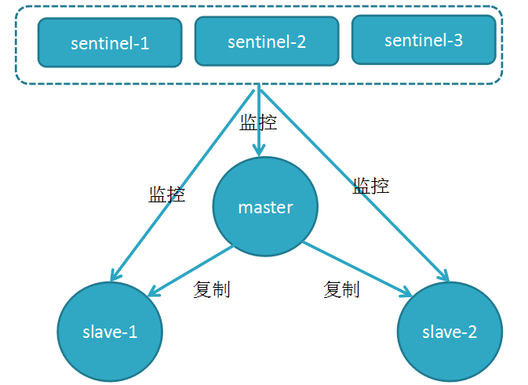
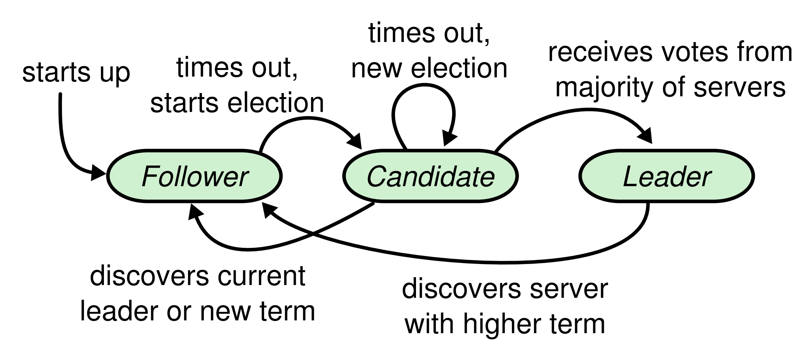
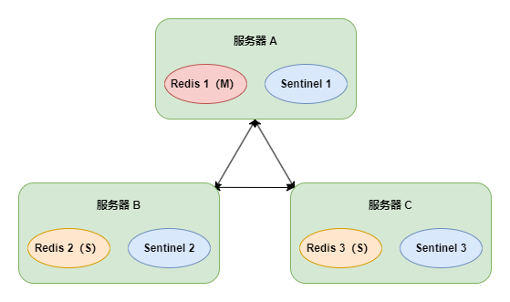
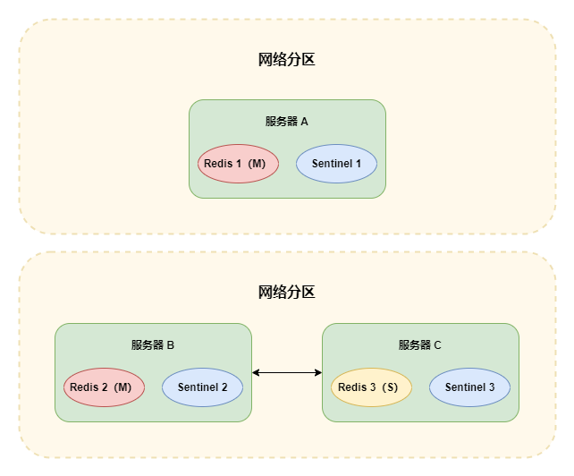

# Sentinel

在主从复制模式下，需要手动进行主从切换，并修改相应配置，不止消耗时间，甚至可能会出现新的问题

Redis 2.8 发布了 Redis Sentinel，能够对 Redis 节点进行监控和故障自动转移

- Sentinel 是 Redis 的一种运行模式，也就是说他也是一个 Redis 服务，只是内部实现有差别，并且默认端口改为了 26379



<small>[Redis进阶 - 高可用：哨兵机制（Redis Sentinel - 哨兵机制（Redis Sentinel））详解](https://pdai.tech/md/db/nosql-redis/db-redis-x-sentinel.html)</small>

## 节点下线

- 主观下线：任一 Sentinel 节点自己认为某个节点下线
- 客观下线：由 Sentinel 集群判断某个节点是否下线

每个 Sentinel 节点都会向其他节点以每秒一次的频率发送请求，如果在超时时间内没有收到响应，该节点就会被该 Sentinel 节点认为是主观下线

如果是从库下线，其实对整个集群影响不大，Redis 集群仍会正常提供服务。如果是主库下线，就需要 Sentinel 集群再去核实一下，确认是否真正下线了，因为故障转移的代价也很大

所有的 Sentinel 节点都会向主库发送请求，当法定数量（通常是过半）的 Sentinel 节点认为主库下线了，主库就会被判定为客观下线。此时会由 Sentinel 集群中的 Leader 进行故障转移

## 选出新主库

1. 首先过滤掉所有不健康的从节点
2. 选择配置文件中 `salve-priority` 优先级最高的
3. 优先级相同，选择从节点中数据最完整的，即复制偏移量最大的
4. 数据进度相同，选择 runid 最小的

## 选举 Leader

Redis 使用了 Raft 算法。每个节点会在三种状态中转换 Leader、Follower、Candidate



<small>[一文彻底搞懂Raft算法，看这篇就够了！！！ - 子问题1：Leader选举](https://juejin.cn/post/7218915344130359351)</small>

Leader 会向所有 Follower 定时发送心跳，来确保自己的 Leader 地位。如果 Follower 在超时时间内没有收到 Leader 的消息，就会认为 Leader 已死或不存在。此时就会触发选举，该节点就会转换成 Candidate

Raft 算法将时间划分为一个个 Term（任期），每个 Term 的开始都是 Leader 选举。每个节点都会保存一个 Term，并且在接收到更大的 Term 时会更新自己保存的 Term


<small>[一文彻底搞懂Raft算法，看这篇就够了！！！ - 子问题1：Leader选举](https://juejin.cn/post/7218915344130359351)</small>

Candidate 节点会先给自己投一票，并将自身的 Term 加 1，再发送请求给其他节点投票给自己。如果自己得到的票数超过一半，则成为 Leader

- 一个节点在一个任期内只可以投票给一个其他节点，优先投给 Term 大于自身的节点

如果有多个 Candidate，先得到超半数的投票成为 Leader。如果票数相同且都没超半数，此时会暂停发送投票请求，等待节点心跳超时出现新的 Candidate，由于他的 Term 再经过加 1，其他节点都会投票给他，从而被选举为 Leader

## 脑裂问题

脑裂问题常出现在网络分区场景中，是指一个集群内出现了多个主节点，会产生数据不一致的情况



发生网络故障出现网络分区，Redis 2 被选为新的主节点



如果客户端仍与旧的主节点（Redis 1）交互，当网络分区问题解决时，旧的主节点发现有了新的主节点（Redis 2），就会将自身切换为从节点，这样在发生网络分区期间修改的数据都会丢失

脑裂问题无法避免，只能缓解，可以修改如下配置

```shell
# 主节点执行写命令时，最少要有多少个健康的从节点
# 不建议设置太高，可能会出现只有一个从节点挂掉，就停止写命令的请求
min-replicas-to-write 1

# 主节点与从节点的连接超时时间，超时未响应，就认为该从节点失联
min-replicas-max-lag 10
```

## 参考

- [一文彻底搞懂Raft算法，看这篇就够了！！！](https://juejin.cn/post/7218915344130359351)
- [Redis进阶 - 高可用：哨兵机制（Redis Sentinel）详解](https://pdai.tech/md/db/nosql-redis/db-redis-x-sentinel.html)
- [深入浅出Redis Sentinel](https://wiyi.org/redis-sentinel.html)
