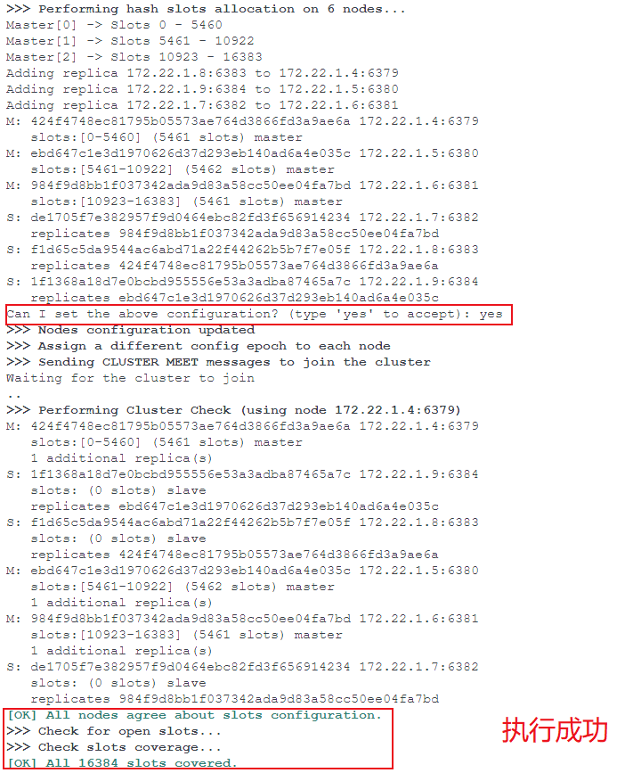
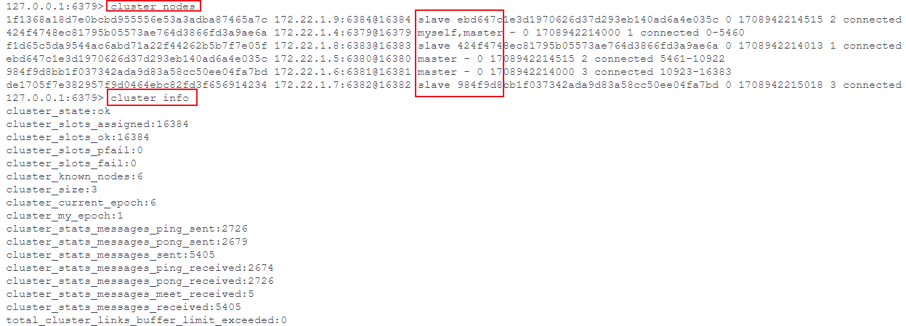

# Docker 搭建 Redis 集群

## 1. 搭建主从复制

至少创建一主一从

### 1.1 配置文件

- 主节点

```shell
port 6379
# 允许任何主机都可连接到该节点
bind 0.0.0.0
# 保护模式，默认开启
# 开启保护模式，如果没有设置密码的话，只允许本地进行访问
protected-mode no
```

- 从节点

```shell
port 6380
bind 0.0.0.0
# 可通过 docker inspect 容器ID 查看主节点的IP
replicaof 172.17.0.2 6379
# 从节点是否具有只读的功能，默认开启
# 如果关闭，从节点也可以写入数据，但发生主从同步时会被删除
replica-read-only yes
```

### 1.2 启动

```shell
# 启动主节点
docker run -d -p 6379:6379 -v D:/conf/6379.conf:/usr/local/etc/redis/redis.conf --name redis-6379 redis redis-server /usr/local/etc/redis/redis.conf

# 启动从节点
docker run -d -p 6380:6380 -v D:/conf/6380.conf:/usr/local/etc/redis/redis.conf --name redis-6380 redis redis-server /usr/local/etc/redis/redis.conf
```

可通过 `info replication` 命令查看主从信息

- 主节点

```shell
> info replication
# Replication
role:master
connected_slaves:1
slave0:ip=172.17.0.3,port=6380,state=online,offset=686,lag=1
master_failover_state:no-failover
master_replid:53a54498fe67544c6b28a44cc03d70620cc29fff
master_replid2:0000000000000000000000000000000000000000
master_repl_offset:700
second_repl_offset:-1
repl_backlog_active:1
repl_backlog_size:1048576
repl_backlog_first_byte_offset:1
repl_backlog_histlen:700
```

- 从节点

```shell
> info replication
# Replication
role:slave
master_host:172.17.0.2
master_port:6379
master_link_status:up
master_last_io_seconds_ago:8
master_sync_in_progress:0
slave_read_repl_offset:784
slave_repl_offset:784
slave_priority:100
slave_read_only:1
replica_announced:1
connected_slaves:0
master_failover_state:no-failover
master_replid:53a54498fe67544c6b28a44cc03d70620cc29fff
master_replid2:0000000000000000000000000000000000000000
master_repl_offset:784
second_repl_offset:-1
repl_backlog_active:1
repl_backlog_size:1048576
repl_backlog_first_byte_offset:15
repl_backlog_histlen:770
```

## 2. 搭建 Sentinel 集群

至少需要 1 个主节点，2 个从节点，3 个 Sentinel 节点

### 2.1 配置文件

创建主从节点的配置与上面相同，不再赘述

- 创建 Sentinel 配置

```shell
# 端口号，不同的节点修改不同的端口号
port 26379
# sentinel monitor <master-name> <master-redis-ip> <master-redis-port> <quorum>
# 依次传入主节点名称（使用默认的即可）、主节点IP、主节点端口号、最小投票数
sentinel monitor mymaster 172.17.0.2 6379 2
```

### 2.2 启动

```shell
docker run -d -p 26379:26379 -v D:/conf/26379.conf:/usr/local/etc/redis/sentinel.conf --name sentinel-26379 redis redis-sentinel /usr/local/etc/redis/sentinel.conf

docker run -d -p 26380:26380 -v D:/conf/26380.conf:/usr/local/etc/redis/sentinel.conf --name sentinel-26380 redis redis-sentinel /usr/local/etc/redis/sentinel.conf

docker run -d -p 26381:26381 -v D:/conf/26381.conf:/usr/local/etc/redis/sentinel.conf --name sentinel-26381 redis redis-sentinel /usr/local/etc/redis/sentinel.conf
```

可进入任一 Sentinel 节点中执行 `info sentinel` 命令查看 Sentinel 集群信息

```shell
> info sentinel
# Sentinel
sentinel_masters:1
sentinel_tilt:0
sentinel_tilt_since_seconds:-1
sentinel_running_scripts:0
sentinel_scripts_queue_length:0
sentinel_simulate_failure_flags:0
master0:name=mymaster,status=ok,address=172.17.0.2:6379,slaves=2,sentinels=3
```

## 3. 搭建 Cluster 集群

至少要有 3 个主节点，所以需要创建 6 个节点，3 个主节点，3 个从节点

### 3.1 创建虚拟网卡

```shell
docker network create --driver bridge --subnet 172.22.1.0/24 --gateway 172.22.1.1 myredis

# 查看Docker网卡信息
docker network ls

# 查看网卡详细信息
docker network inspect myredis

# 删除指定网卡
docker network rm myredis
```

### 3.2 配置文件

不同的节点修改端口号与集群节点 IP 即可

```shell
# 端口号
port 6379
# 密码，必须设置
requirepass 996icu
# 集群模式改为0.0.0.0
bind 0.0.0.0
# 关闭保护模式
protected-mode no
# 开启集群模式
cluster-enabled yes
# 集群节点信息文件，不重要
cluster-config-file nodes.conf
# 集群节点连接超时时间，不重要
cluster-node-timeout 5000
# 集群节点IP
# 服务器填公网IP，或者内部对应容器的IP
cluster-announce-ip  172.22.1.4
# 集群节点映射端口
cluster-announce-port 6379
# 集群节点总线端口
cluster-announce-bus-port 16379
```

#### 3.2.1 Shell 脚本

```shell
for port in $(seq 6379 6384); 
do 
touch ${port}.conf
cat  << EOF > ${port}.conf
port ${port}
requirepass 996icu
bind 0.0.0.0
protected-mode no
daemonize no
appendonly yes
cluster-enabled yes 
cluster-config-file nodes.conf
cluster-node-timeout 5000
# 需修改
cluster-announce-ip 
cluster-announce-port ${port}
cluster-announce-bus-port 1${port}
EOF
done
```

### 3.3 启动

不同的节点修改端口号与集群节点 IP 即可

```shell
# --ip用来指定内网IP地址，与配置文件中相同
docker run -d -p 6379:6379 -p 16379:16379 -v D:/conf/6379.conf:/usr/local/etc/redis/redis.conf --restart always --name redis-6379 --net myredis --ip=172.22.1.4 redis redis-server /usr/local/etc/redis/redis.conf
```

#### 3.3.1 Shell 脚本

```shell
for port in $(seq 6379 6384);
do 
  docker run -d -p ${port}:${port} -p 1${port}:1${port} \
  -v D:/conf/redis_${port}.conf:/usr/local/etc/redis/redis.conf \
  --restart always --name redis-${port} --net myredis \
  redis redis-server /usr/local/etc/redis/redis.conf
done
```

### 3.4 创建集群

```bash
# 进入任一节点内执行
# --cluster-replicas：一个主节点有多少个从节点
redis-cli -a 996icu --cluster create 172.18.0.2:6379 172.18.0.3:6380 172.18.0.4:6381 172.18.0.5:6382 172.18.0.6:6383 172.18.0.7:6384 --cluster-replicas 1
```



```shell
# 查看集群信息
cluster info

# 查看节点信息
cluster nodes
```



## 参考

- [docker安装redis主从复制模式](https://blog.csdn.net/weixin_43789073/article/details/125748732)
- [Docker搭建Redis主从复制](https://zhuanlan.zhihu.com/p/647155496)
- [基于Docker的Redis高可用集群搭建（redis-sentinel）](https://developer.aliyun.com/article/641766)
- [docker部署redis一主二从三哨兵模式](https://blog.csdn.net/weixin_44953227/article/details/126049476)
- [Docker搭建Redis哨兵模式](https://zhuanlan.zhihu.com/p/647382777)
- [Docker 搭建 Redis Cluster集群 每一步都带有操作图、命令！！！](https://juejin.cn/post/6992872034065727525)
