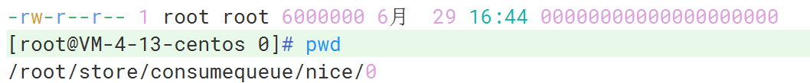
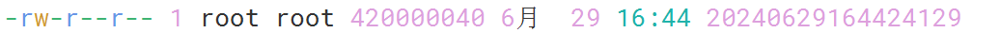

# 存储机制

消息到达 Broker，会先存放在内存中，然后再根据刷盘策略（同步或异步）刷到磁盘中

- RocketMQ 消息被存储在 `/root/store` 目录中，Windows 为 `C:\Users\用户\store`

消息存储架构主要由三个文件组成：CommitLog、ConsumeQueue、IndexFile

## CommitLog

消息主体以及元数据的存储主体

- 默认单个文件大小为固定的 1 G
- 文件名长度为 20 位，左边补零，剩余为起始偏移量
  - 1 G 的大小为 1073741824 字节，所以第二个文件名为 `00000000001073741824`，以此类推
- 消息按照顺序写入日志文件，当文件满了，写入下一个文件

## ConsumeQueue

消息消费索引，引入的目的主要是提高消息消费的性能

RocketMQ 采用的是基于主题的订阅模式，消息消费是针对主题进行的，如果要以遍历的方式，从 CommitLog 文件中查找特定主题的消息是非常低效的

<small>[设计(design) - 1 消息存储](https://github.com/apache/rocketmq/blob/develop/docs/cn/design.md)</small>

消费者可根据 ConsumeQueue 来查找待消费的消息，ConsumeQueue 作为消费消息的索引，保存了指定主题下的队列消息在 CommitLog 中的相关信息

- commitLogOffset：物理偏移量，消息在 CommitLog 中的位置
- msgSize：消息长度
- tagsCode：消息 Tag 的 HashCode 值

ConsumeQueue 文件可以看成是基于 Topic 的 CommitLog 索引文件，所以 ConsumeQueue 文件在 `store/consumequeue` 是以 `{topic}/{queueId}/{fileName}` 三层组织结构存储的

ConsumeQueue 中每个条目为固定的 20 字节

- commitLogOffset：8 字节
- msgSize：4 字节
- tagsCode: 8 字节

单个文件由 30 万个条目组成，可以像数组一样随机访问每一个条目，每个 ConsumeQueue 文件大小为固定的 600 万字节，也就是 5.72 M

## IndexFile

索引文件，提供了一种可以通过 key 或时间区间来查询消息的方法，存储在 `store/index` 中

文件名以创建时的时间戳命名，每个文件为固定的 400 M，可以保存 2000 万个索引

- IndexFile 的底层存储设计为在文件系统中实现的 HashMap 结构，所以 RocketMQ 的索引文件底层实现为哈希索引

## 参考

- [设计(design)](https://github.com/apache/rocketmq/blob/develop/docs/cn/design.md)
