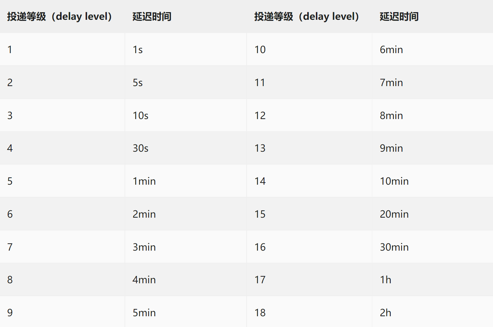
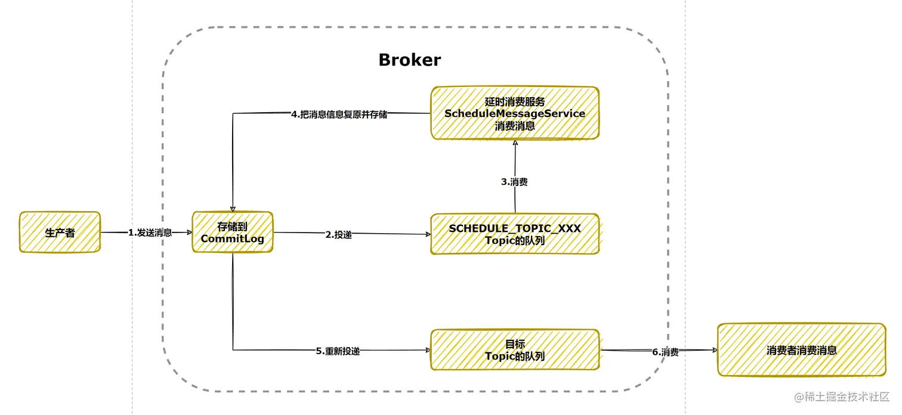

# 延时消息与事务消息

## 延时消息

消息发送到 Broker 后，不会被立即消费，在等待特定的时间后，消费者才能获取这个消息

```java
Message msg = new Message(topic, message.getBytes());
// 延时 1 秒
msg.setDelayTimeSec(1);
// 延时 1 毫秒
msg.setDelayTimeMs(1);
// 延时级别
msg.setDelayTimeLevel(1);
```



<small>[延迟消息发送 - 延时消息约束](https://rocketmq.apache.org/zh/docs/4.x/producer/04message3/)</small>

### 工作原理



<small>[深入RocketMQ-消息原理篇 - 延时消息在 Broker 的流转过程](https://juejin.cn/post/7145293880861130766)</small>

延时消息会被暂存在名为 `SCHEDULE_TOPIC_XXXX` 的主题中，该主题内有 18 个写队列，消息会根据延迟级别写入对应的队列中。另外 Broker 内有一个定时任务，会不断地轮询这些队列，查看这些消息是否到达了延迟时间，并将消息投递到目标主题的队列中，消费者就可以正常消费这些消息了

> 先把消息存在别的地方，然后开个定时任务查看这些消息是否到达了延迟的时间，到达时间后，就将这些消息投递给真正的主题

## 事务消息

事务消息是一种确保消息在分布式系统中被完整发送或完全失败的消息传递机制。在普通消息基础上，将二阶段提交和本地事务绑定，保证本地事务与消息生产的最终一致性，特别适用于关键业务场景，如订单处理、支付操作等

### 工作流程


<small>[事务消息 - 交互流程](https://help.aliyun.com/zh/apsaramq-for-rocketmq/cloud-message-queue-rocketmq-5-x-series/developer-reference/transactional-messages)</small>

1. 生产者向 Broker 发送半事务消息（暂不能进行投递的消息）
2. Broker 收到消息返回确认信息
3. 生产者执行本地事务
4. 生产者根据本地事务的执行结果，向 Broker 发送二次确认结果
    - Commit：Broker 将半事务消息标记为可投递，并投递给消费者
    - Rollback：Broker 则会丢弃该半事务消息
5. 在异常情况（断网等）下，Broker 长时间未收到生产者发送的二次确认信息，或者收到的二次确认结果为 Unknown 状态，经过固定时间后，Broker 会向生产者发起消息回查，默认最多尝试 15 次，间隔 30 秒，超过次数就会丢弃本次事务消息
6. 生产者收到回查请求，检查本地事务的执行状态
7. 生产者根据本地事务的执行状态，再次发送二次确认结果，Broker 按照步骤 4 处理，以此类推

```java
public class BrokerConfig extends BrokerIdentity {
    ...

    // 默认触发回查的最短时间间隔
    private long transactionTimeOut = 6 * 1000;

    // 默认最大回查次数
    private int transactionCheckMax = 15;

    // 默认回查间隔时间
    private long transactionCheckInterval = 30 * 1000;

    ...
}
```

### 简单使用

```java
@Component
public class TransactionProducer implements ApplicationRunner {

    @Value("${rocketmq.name-server}")
    private String nameServer;

    @Value("${rocketmq.producer.group}")
    private String producerGroup;

    private final TransactionMQProducer transactionMQProducer = new TransactionMQProducer();

    // 需要添加一个线程池，用来检查本地事务状态
    ExecutorService executorService = new ThreadPoolExecutor(2, 5, 100, TimeUnit.SECONDS, new ArrayBlockingQueue<Runnable>(2000));

    public void init() throws MQClientException {
        transactionMQProducer.setProducerGroup(producerGroup);
        transactionMQProducer.setNamesrvAddr(nameServer);
        // 添加事务监听器
        transactionMQProducer.setTransactionListener(new TestListener());
        // 添加检查本地事务状态的线程池
        transactionMQProducer.setExecutorService(executorService);
        transactionMQProducer.start();
        System.out.println("启动");
    }

    public void send(String topic, String message) throws MQClientException {
        Message msg = new Message(topic, message.getBytes());
        // 发送事务消息
        TransactionSendResult sendResult = transactionMQProducer.sendMessageInTransaction(msg, null);
        System.out.println(sendResult);
    }

    @Override
    public void run(ApplicationArguments args) throws Exception {
        init();
    }
}
```

```java
// 本地事务监听器
public class TestListener implements TransactionListener {

    // 执行本地事务
    @Override
    public LocalTransactionState executeLocalTransaction(Message msg, Object arg) {
        System.out.println("executeLocalTransaction");
        System.out.println(new String(msg.getBody()));
        System.out.println(arg);
        return LocalTransactionState.UNKNOW;
    }

    // 检查本地事务状态
    @Override
    public LocalTransactionState checkLocalTransaction(MessageExt msg) {
        System.out.println("checkLocalTransaction");
        System.out.println(msg);
        System.out.println(new String(msg.getBody()));
        LocalTransactionState state = this.getState();
        System.out.println(state);
        return state;
    }

    // 模拟本地事务
    private LocalTransactionState getState() {
        int i = RandomUtil.randomInt(6);
        switch (i) {
            case 0:
                return LocalTransactionState.COMMIT_MESSAGE;
            case 1:
                return LocalTransactionState.ROLLBACK_MESSAGE;
        }
        return LocalTransactionState.UNKNOW;
    }
}
```

## 参考

- [事务消息](https://help.aliyun.com/zh/apsaramq-for-rocketmq/cloud-message-queue-rocketmq-5-x-series/developer-reference/transactional-messages)
- [ROCKETMQ的事务消息详解](https://www.ryujung.com/?p=214)
- [关于 RocketMQ 事务消息的正确打开方式 → 你学废了吗](https://www.cnblogs.com/youzhibing/p/15354713.html)
