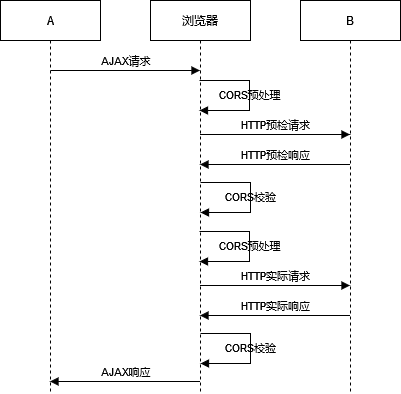
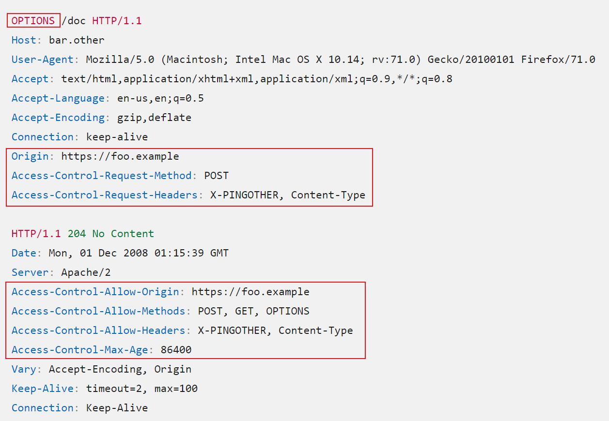

# CORS（Cross-Origin Resource Sharing，跨域资源共享）

首先我们先来了解一下 **同源策略（Same-origin policy）**，他是一个非常重要的安全策略，是浏览器安全的基石，要求 **两个网页必须具有相同的协议、域名、端口**，就可被视为同源，否则就是不同源

例如 `https://www.baidu.com`

- `https://www.baidu.com/test`：同源
- `http://www.baidu.com`：不同源，协议不同
- `http://fuck.baidu.com`：不同源，域名不同
- `http://www.baidu.com:8080`：不同源，端口不同

同源策略能有效的保护用户的信息安全，防止恶意脚本窃取敏感信息，同源就允许访问，不同源就无法进行交互

如果没有同源策略，假如 A 网站里有你的裸照，这时你再去访问 B 网站，B 网站可以获取到你在 A 网站的数据，那么 B 网站上的人如果动了坏心思，就可以通过你的裸照来勒索你

## CORS 的作用

根据同源策略，不同源的网站无法进行交互，那么互联网不就成了局域网了？为什么我们看到的网页中还会有不同源的访问呢？这就靠 CORS 了


<small>[跨源资源共享（CORS）](https://developer.mozilla.org/zh-CN/docs/Web/HTTP/CORS)</small>

CORS 是一种允许当前域的资源被其他域访问的机制，浏览器会将请求分为简单请求和非简单请求

- 简单请求
  - 请求方法为 GET、HEAD、POST
  - 只能使用允许的请求头 Accept、Accept-Language、Content-Type 等
  - 不能使用自定义的请求头
  - Content-Type 只能是 `text/plain`、`multipart/form-data`、`application/x-www-form-urlencoded`
- 复杂请求：**不满足以上任一条件的请求**
  - 例如 PUT、DELETE 等请求方法
  - 例如 Content-Type 使用了 `Content-Type`

对于简单请求，浏览器会直接将请求发送给服务器，对于复杂请求，浏览器会先发送一个 **预检请求**，询问目标网站是否允许访问，如果允许才会发送实际的请求



<small>[轻松理解CORS协议规范 - 3.2 复杂请求](https://www.cnblogs.com/Xianhuii/p/17026781.html)</small>

## 预检请求（Preflight request）

- 请求方法：OPTIONS
- 请求头
  - Origin：当前网站
  - Access-Control-Request-Method：实际请求的请求方法
  - Access-Control-Request-Headers：实际请求的请求头

如果发送给目标网站的预检请求不符合要求，浏览器的控制台会输出 CORS 错误，并终止实际请求的发送。如果符合要求，才会对这个预检请求进行响应

响应消息可能包括以下部分请求头

- Access-Control-Allow-Origin：允许访问的源
- Access-Control-Max-Age：预检请求的响应结果能够缓存多久，单位秒
- Access-Control-Allow-Credentials：是否允许携带身份凭证（例如 Cookie 和 HTTP 认证相关数据）
- Access-Control-Allow-Methods：允许使用的请求方法
- Access-Control-Allow-Headers：允许携带的请求头



<small>[跨源资源共享（CORS） - 预检请求](https://developer.mozilla.org/zh-CN/docs/Web/HTTP/CORS)</small>

## Spring Security 中如何处理

可以考虑在 Controller 的类或方法上使用 `@CrossOrigin` 注解

```java
@Target({ElementType.TYPE, ElementType.METHOD})
@Retention(RetentionPolicy.RUNTIME)
@Documented
public @interface CrossOrigin {
    /** @deprecated */
    @Deprecated
    String[] DEFAULT_ORIGINS = new String[]{"*"};
    /** @deprecated */
    @Deprecated
    String[] DEFAULT_ALLOWED_HEADERS = new String[]{"*"};
    /** @deprecated */
    @Deprecated
    boolean DEFAULT_ALLOW_CREDENTIALS = false;
    /** @deprecated */
    @Deprecated
    long DEFAULT_MAX_AGE = 1800L;

    @AliasFor("origins")
    String[] value() default {};

    @AliasFor("value")
    String[] origins() default {};

    String[] originPatterns() default {};

    String[] allowedHeaders() default {};

    String[] exposedHeaders() default {};

    RequestMethod[] methods() default {};

    String allowCredentials() default "";

    long maxAge() default -1L;
}
```

不过我们一般都会定义一个全局统一的跨域处理

```java
@Bean
CorsConfigurationSource corsConfigurationSource() {
    CorsConfiguration corsConfiguration = new CorsConfiguration();
    // 允许访问的源
    corsConfiguration.setAllowedOrigins(Collections.singletonList("*"));
    // 是否允许携带身份凭证（例如 Cookie 和 HTTP 认证相关数据）
    corsConfiguration.setAllowCredentials(true);
    // 预检请求的响应结果能够缓存多久
    corsConfiguration.setMaxAge(86400L);
    // 允许携带的请求头
    corsConfiguration.setAllowedHeaders(Collections.singletonList("*"));
    // 允许使用的请求方法
    corsConfiguration.setAllowedMethods(Collections.singletonList("*"));

    UrlBasedCorsConfigurationSource source = new UrlBasedCorsConfigurationSource();
    source.registerCorsConfiguration("/**", corsConfiguration);
    return source;
}
```

## Nginx 中如何处理

```nginx
location / {
    root   /home/web;
    index  index.html index.htm;
    # 允许访问的源
    add_header 'Access-Control-Allow-Origin' *;
    # 是否允许携带身份凭证（例如 Cookie 和 HTTP 认证相关数据）
    add_header 'Access-Control-Allow-Credentials' 'true';
    # 允许使用的请求方法
    add_header 'Access-Control-Allow-Methods' *;
    # 允许携带的请求头
    add_header 'Access-Control-Allow-Headers' *;

    # 预检请求处理，必须添加，否则 POST 请求无法跨域
    if ($request_method = 'OPTIONS') {
        add_header 'Access-Control-Max-Age' 1728000;
        add_header 'Content-Type' 'text/plain; charset=utf-8';
        add_header 'Content-Length' 0;
        # 对于 OPTIONS 方式的请求返回 204，表示接受跨域请求
        return 204;
    }
}
```

## 参考

- [轻松理解CORS协议规范](https://www.cnblogs.com/Xianhuii/p/17026781.html)
- [簡單弄懂同源政策 (Same Origin Policy) 與跨網域 (CORS)](https://medium.com/starbugs/%E5%BC%84%E6%87%82%E5%90%8C%E6%BA%90%E6%94%BF%E7%AD%96-same-origin-policy-%E8%88%87%E8%B7%A8%E7%B6%B2%E5%9F%9F-cors-e2e5c1a53a19)
- [Preflight request](https://developer.mozilla.org/zh-CN/docs/Glossary/Preflight_request)
- [跨源资源共享（CORS）](https://developer.mozilla.org/zh-CN/docs/Web/HTTP/CORS)
- [什么时候会发送options请求](https://juejin.cn/post/6844903821634699277)
- [同源策略是怎么预防攻击的？跨域的代码实现、原理和漏洞？](https://juejin.cn/post/7208018784073629752)
