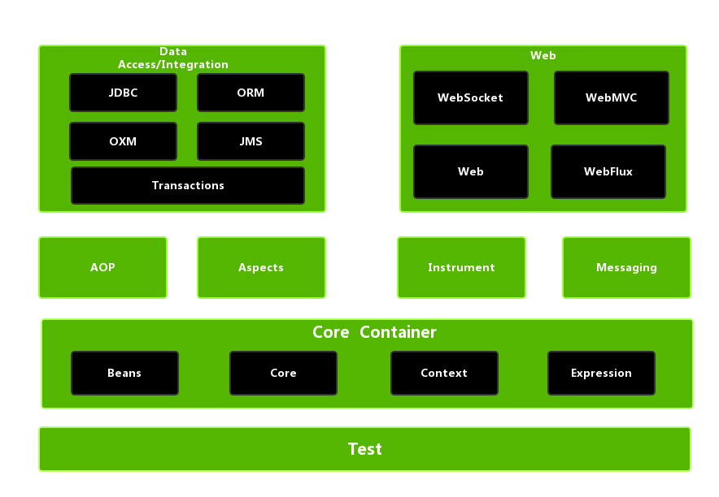
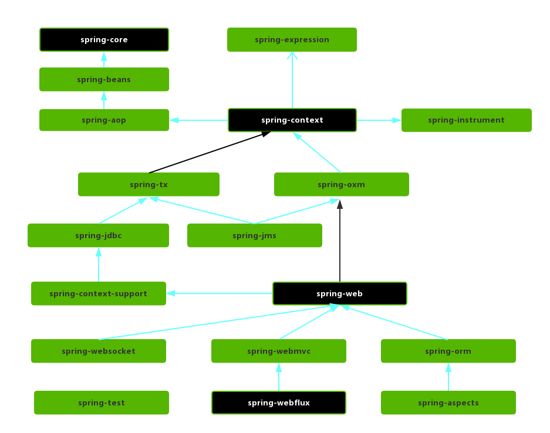

# Spring 概述

Spring 是一个开源的 Java 应用框架，目标是为开发者提供一个 **一站式的轻量级的应用开发平台**，**简化 Java 应用的开发**，特别是企业级应用的开发。开发人员可以更专注于业务逻辑的实现，而无需过多的关注底层的实现

## 优缺点

### 优点

> 关于 Spring 的优点，有位网友说得很好：jobs

- 简化开发：提供了丰富的功能来简化 Java 应用的开发，并且对于一些常用的或复杂的功能（JDBC、远程调用等）都进行了封装
- 模块化：Spring 将各个功能点抽象为独立的模块，每个模块都有特定的职责功能，开发人员可以按需选择，提高了程序的灵活性和可维护性
- 非侵入性设计：不需要开发者修改现有的代码来适配框架，并且可以通过配置和注解来减少以往需要硬编码的实现（声明式事务等）
- 控制反转（IoC）与依赖注入（DI）：Spring 的核心之一，将对象交由 Spring 容器管理，降低了代码之间的耦合度
- 面向切面编程（AOP）：允许开发者将某些功能（权限校验、日志等）从业务逻辑中抽离出来，提高代码的可重用性和可维护性

> Spring 框架的优点其实就一个，也是他的目标，简化开发，提升效率就是节省时间，有了更多的时间，开发人员可以写出更优质的代码，也可以多摸摸鱼，当然也可以多干些活

### 缺点

- 有一定的学习门槛，初学者可能需要花费一定的时间来学习和掌握
- 某些功能的配置较为复杂，而且过多的配置选项也会导致配置文件的复杂性和维护成本的增加
- Spring 虽然集成了很多优秀的其他框架，但在某些情况下需要进行额外的配置与调试
- 与一些轻量级的框架相比，Spring 框架相对较重

> Spring Boot：你在想我吗

## 模块

Spirng 由大约 20 个模块组成

<small>[Spring Framework 5.0.x 模块组成、体系结构、整体架构](https://blog.jacian.com/2020/09/03/8639a326bbf8/)</small>

### Core Container（核心容器）

- spring-core：提供了 Spring 的基础功能，如 IoC 与 DI
- spring-beans：提供对 Bean 的创建、配置和管理等功能的支持
- spring-context：在 spring-core 与 spring-beans 的基础上，提供了一个框架式的对象访问方式，是访问定义和配置的任意对象的媒介
  - ApplicationContext 是该模块的核心
- spring-expression：提供对 SpEL（Spring Expression Language）的支持

### Data Access / Integration（数据访问与集成）

- spring-jdbc：提供了对 JDBC 的抽象和简化
- spring-orm：提供了对 ORM 框架的支持
- spring-oxm：提供一个抽象层支撑 OXM（Object-to-XML-Mapping）
- spring-jms：提供了 Java 消息传递服务，能够发送和接收信息
- spring-tx：支持声明式和编程式事务管理

### Web

- spring-web：提供了基础的 Web 功能
- spring-websocket：提供了对 WebSocket 的支持
- spring-webmvc：Spring MVC 的核心
- spring-webflux：提供对 WebFlux 的支持
  - 与 Spring MVC 不同的是他不需要 Srevlet API，是完全异步的

### AOP、Aspect、Instrument

- spring-aop：提供了 AOP 的实现
- spring-aspects：提供了与 AspectJ 的集成功能
- spring-instrument：提供了为 JVM 添加代理（agent）的功能

### Messaging

- spring-messaging：为 Spring 集成一些基础的报文传送应用

### Test

- spring-test：提供了对 Spring 应用的测试支持

## 参考

- [Spring Framework Overview](https://docs.spring.io/spring-framework/reference/overview.html)
- [Spring框架的设计目标，设计理念，和核心是什么](https://blog.csdn.net/m0_59902592/article/details/128162180)
- [Spring常见面试题总结](https://javaguide.cn/system-design/framework/spring/spring-knowledge-and-questions-summary.html)
- [面渣逆袭：Spring三十五问，四万字+五十图详解！建议收藏！](https://mp.weixin.qq.com/s/Y17S85ntHm_MLTZMJdtjQQ)
- [Spring简介、框架核心、优缺点、应用场景](https://blog.csdn.net/ThinkWon/article/details/102810748)
- [2. Introduction to Spring Framework](https://docs.spring.io/spring-framework/docs/4.0.x/spring-framework-reference/html/overview.html)
- [Spring Framework 5.0.x 模块组成、体系结构、整体架构](https://blog.jacian.com/2020/09/03/8639a326bbf8/)
- [spring 如何实现模块化](https://worktile.com/kb/ask/838736.html)
