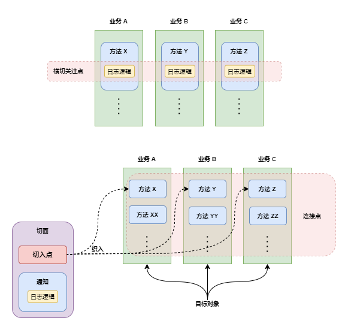
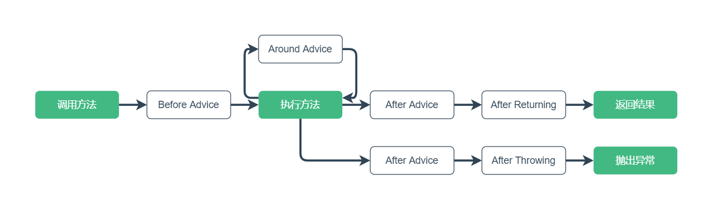

# AOP

AOP（Aspect Oriented Programming，面向切面编程）通过 **预编译和运行期动态代理** 的方式，实现 **程序功能的统一维护**

通过 AOP 能够将那些与业务无关，却为业务模块所共同调用的逻辑或责任（例如事务处理、日志管理、权限控制等）封装起来，便于减少系统的重复代码，降低模块间的耦合度，并有利于未来的可拓展性和可维护性

Spring AOP 是基于 **动态代理** 实现的，如果要代理的对象，实现了某个接口，那么 Spring AOP 会使用 JDK 动态代理，去创建代理对象，而对于没有实现接口的对象，就无法使用 JDK 动态代理了，这时候 Spring AOP 会使用 cglib 生成一个被代理对象的子类来作为代理

## Spring AOP 与 AspectJ AOP

- Spring AOP 属于 **运行时增强**，**基于代理**，功能少，使用简单，性能稍差
- AspectJ AOP 是 **编译时增强**，**基于字节码操作**，功能强大，使用较复杂，但性能很好


<small>[面渣逆袭：Spring三十五问，四万字+五十图详解！建议收藏！ - 22.说说Spring AOP 和 AspectJ AOP 区别?](https://mp.weixin.qq.com/s/Y17S85ntHm_MLTZMJdtjQQ)</small>

## 核心概念



- 横切关注点（cross-cutting concerns）：多个类或对象中的 **公共行为**（例如事务处理、日志管理、权限控制等）
  - 日志功能往往横跨系统中的多个业务模块，即横切所有需要日志功能的类和方法体，所以日志就成为了横切整个系统对象结构的关注点，也就是横切关注点
- 切面（Aspect）：一个切面就是一个类，切面中可以定义多个通知，用来实现具体的功能，也可以理解为 `切点 + 通知`
- 通知（Advice）：也被称作增强，切面在某个连接点要执行的操作
- 目标对象（Target）：被通知的对象
- 连接点（JoinPoint）：方法调用或者方法执行时的某个特定时刻，目标对象的所属类中，定义的所有方法均为连接点
- 切点（Pointcut）：一个切点就是一个表达式，用来匹配哪些连接点需要被切面所增强
- 织入（Weaving）：将通知应用到目标对象，进而生成代理对象的过程动作

### 通知类型



<small>[Spring AOP通知（Advice）详解](https://developer.aliyun.com/article/928943)</small>

- 前置通知（Before）：在连接点之前执行
- 后置通知（After）：连接点方法执行结束后执行，无论是正常退出还是异常退出
- 环绕通知（Around）：围绕连接点前后执行，也能捕获异常处理
- 返回通知（AfterReturning）：在连接点 **正常执行** 结束后执行
- 异常通知（AfterThrowing）：连接点方法 **抛出异常** 时执行

## Spring AOP 自调用失效

使用 Spring AOP 时，调用某个方法时，该方法同时调用了同一个类中的其他方法，会导致 Spring AOP 失效

例如使用 `@Transactional` 时，直接调用方法 a，会导致事务失效

```java
@Service
public class TestService {

    @Transactional
    public void a() {
    }

    public void b() {
        this.a();
    }
}
```

Spring AOP 是使用动态代理来实现的，他在操作的其实是 **代理对象**，并不是本身的对象。而自调用是使用本身的对象进行调用的，没有使用到代理对象，自然也就无法进行 AOP 操作

- 直接调用方法 a


可以看出是通过代理对象调用的方法 a

- 通过同类的方法 b 去调用方法 a


可以看出也是通过代理对象调用的方法 b，但方法 b 调用方法 a 并不是通过代理对象调用的

### 如何解决

最好的办法就是将两个方法拆分成两个类，或是合并为一个方法，当然也可以通过 AopContext 获取当前上下文的代理对象

需引入 aspectj 包，并在启动类上加入 `@EnableAspectJAutoProxy(exposeProxy = true)` 注解

```java
@Service
public class TestService {

    @Transactional
    public void a() {
    }

    public void b() {
        ((TestService) AopContext.currentProxy()).a();
    }
}
```

通过同类的方法 b 去调用方法 a


方法 b 调用方法 a 也变成了通过代理对象调用了

## 使用

```java
/**
 * 切面
 */
@Aspect
@Component
public class AopTest {

    /**
     * 切点
     */
    @Pointcut("execution(* com.test.aop.Test.m2*(..))")
    public void pointCut() {
    }

    /**
     * 环绕通知
     */
    @Around("pointCut()")
    public Object around(ProceedingJoinPoint jp) throws Throwable {
        // 横切关注点
        System.out.println("before!!!");
        Object proceed = jp.proceed();
        System.out.println("after!!!");
        return proceed;
    }
}
```

```java
@Service
public class Test {

    /**
     * 连接点
     */
    public void m1() {
        System.out.println("m1");
    }

    /**
     * 连接点
     */
    public void m2() {
        System.out.println("m2");
    }

    /**
     * 连接点
     */
    public void m3() {
        System.out.println("m3");
    }
}
```

```java
@RestController
public class TestController {

    /**
     * 目标对象
     */
    @Autowired
    private Test test;

    @GetMapping("test")
    public String test() {
        test.m1();
        test.m2();
        test.m3();
        return "done";
    }
}
```

> m1
before!!!
m2
after!!!
m3

## 参考

- [Spring常见面试题总结](https://javaguide.cn/system-design/framework/spring/spring-knowledge-and-questions-summary.html)
- [面渣逆袭：Spring三十五问，四万字+五十图详解！建议收藏！](https://mp.weixin.qq.com/s/Y17S85ntHm_MLTZMJdtjQQ)
- [面向对象困境之：横切关注点](https://juejin.cn/post/6844904017340940296)
- [IoC & AOP详解（快速搞懂）](https://javaguide.cn/system-design/framework/spring/ioc-and-aop.html)
- [第15章-Spring AOP切点表达式（Pointcut）详解](https://blog.csdn.net/weixin_43793874/article/details/124753521)
- [有关AOP术语（织入、增强等）的个人理解](https://blog.csdn.net/qq_26558047/article/details/115601666)
- [AOP设计与原理(连接点，切入点与代理模式)——Spring AOP（二）](https://blog.csdn.net/qq_34598667/article/details/83352227)
- [Spring AOP 切点表达式args与@args区别](https://blog.csdn.net/qq_19922839/article/details/117412231)
- [What is the difference between @Before @After and @AfterExecution in Spring aop](https://stackoverflow.com/questions/31294698/what-is-the-difference-between-before-after-and-afterexecution-in-spring-aop)
- [Spring AOP通知（Advice）详解](https://developer.aliyun.com/article/928943)
