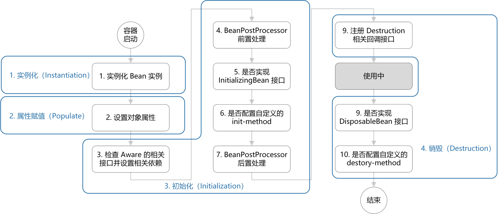

# Bean

被 IoC 容器管理的对象

## 作用域

可使用 `@Scope` 注解设置作用域，可加在类上或方法上

```java
@Service
@Scope(ConfigurableBeanFactory.SCOPE_SINGLETON)
public class Test {
}
```

```java
@Bean
@Scope(value = ConfigurableBeanFactory.SCOPE_PROTOTYPE)
public Person personPrototype() {
    return new Person();
}
```

### singleton

默认作用域，容器中只存在一个 Bean 实例

```java
ConfigurableBeanFactory.SCOPE_SINGLETON
```

### prototype

每次获取都会创建一个新的 Bean 实例

```java
ConfigurableBeanFactory.SCOPE_SINGLETON
```

### request

仅 Web 应用可用，每一次 HTTP 请求都会产生一个新的 Bean 实例，且该实例只在当前请求内有效

```java
WebApplicationContext.SCOPE_REQUEST
```

### session

Web 应用可用，同一个 session 共享一个 Bean 实例，且该实例只在当前 session 内有效

```java
WebApplicationContext.SCOPE_SESSION
```

### application（global-session）

仅 Web 应用可用，每个 Web 应用在启动时创建一个 Bean 实例，且该实例只在当前应用内有效

```java
WebApplicationContext.SCOPE_APPLICATION
```

## 生命周期

1. 实例化一个 Bean 对象
2. 设置对象属性
3. 检查该 Bean 是否实现了 Aware 的相关接口，并设置相关依赖
    - 如果实现了 BeanNameAware 接口，调用 setBeanName 方法，传入 Bean 的名称
    - 如果实现了 BeanClassLoaderAware 接口，调用 setBeanClassLoader 方法，传入 ClassLoader 对象
    - 如果实现了 setBeanFactory 接口，传入 BeanFactory 实例
4. 调用 BeanPostProcessor 的 postProcessBeforeInitialization 方法进行前置处理
5. 检查该 Bean 是否实现了 InitializingBean 接口，执行 afterPropertiesSet 方法
6. 检查该 Bean 是否配置了 init-method，执行指定方法
7. 调用 BeanPostProcessor 的 postProcessAfterInitialization 方法进行后置处理
8. Bean 完成初始化，可以进行使用
9. 如需销毁 Bean，检查该 Bean 是否实现了 DisposableBean 接口，执行 destroy 方法
10. 检查该 Bean 是否配置了 destroy-method，执行指定方法



<small>[面渣逆袭：Spring三十五问，四万字+五十图详解！建议收藏！ - 9.能说一下Spring Bean生命周期吗？](https://mp.weixin.qq.com/s/Y17S85ntHm_MLTZMJdtjQQ)</small>

### Aware 相关接口

```java
@Service
public class Test implements BeanNameAware, BeanClassLoaderAware, BeanFactoryAware {

    @Override
    public void setBeanName(String name) {
    }

    @Override
    public void setBeanClassLoader(ClassLoader classLoader) {
    }

    @Override
    public void setBeanFactory(BeanFactory beanFactory) throws BeansException {
    }
}
```

### BeanPostProcessor 接口

```java
@Service
public class Test implements BeanPostProcessor {

    @Override
    public Object postProcessBeforeInitialization(Object bean, String beanName) throws BeansException {
        System.out.println("before");
        return BeanPostProcessor.super.postProcessBeforeInitialization(bean, beanName);
    }

    @Override
    public Object postProcessAfterInitialization(Object bean, String beanName) throws BeansException {
        System.out.println("after");
        return BeanPostProcessor.super.postProcessAfterInitialization(bean, beanName);
    }
}
```

### InitializingBean 接口

```java
@Service
public class Test implements InitializingBean {

    @Override
    public void afterPropertiesSet() throws Exception {
    }
}
```

### init-method

可以使用 `@Bean` 注解中的 initMethod 参数定义，或者使用 `@PostConstruct`，`@PostConstruct` 是 JDK 自带的注解，优先级更高

```java
public class Test implements InitializingBean {

    @Override
    public void afterPropertiesSet() throws Exception {
        System.out.println("InitializingBean");
    }

    @PostConstruct
    public void postConstruct() {
        System.out.println("PostConstruct");
    }

    public void initMethod() {
        System.out.println("initMethod");
    }
}
```

```java
@Configuration
public class Config {

    @Bean(initMethod = "initMethod")
    public Test test() {
        return new Test();
    }
}
```

> PostConstruct
InitializingBean
initMethod

### DisposableBean 接口

```java
@Service
public class Test implements DisposableBean {

    @Override
    public void destroy() throws Exception {
    }
}
```

### destroy-method

可以使用 `@Bean` 注解中的 destroyMethod 参数定义，或者使用 `@PreDestroy`，`@PreDestroy` 是 JDK 自带的注解，优先级更高

```java
public class Test implements DisposableBean {

    @Override
    public void destroy() throws Exception {
        System.out.println("DisposableBean");
    }

    @PreDestroy
    public void preDestroy() {
        System.out.println("PreDestroy");
    }

    public void destroyMethod() {
        System.out.println("destroyMethod");
    }
}
```

```java
@Configuration
public class Config {

    @Bean(destroyMethod = "destroyMethod")
    public Test test() {
        return new Test();
    }
}
```

> PreDestroy
DisposableBean
destroyMethod

## 线程安全

Spring 中的 Bean 是否线程安全取决于作用域和状态

大部分 Bean 实际上都是无状态（没有定义可变的成员变量）的（例如 Controller、Service、Dao），这种情况下， Bean 是线程安全的

- 在 singleton 作用域下，容器中只有唯一的 Bean 实例，且如果 Bean 是有状态的，可能会存在资源竞争问题
- 在 prototype 作用域下，每次获取都会创建一个新的 Bean 实例，不会有资源竞争的问题

### 如何解决

- 在 Bean 实例中尽量避免定义可变的成员变量
- 使用 prototype 作用域（不推荐）
- 将 Bean 中的成员变量保存在 ThreadLocal 中

## 参考

- [Spring常见面试题总结](https://javaguide.cn/system-design/framework/spring/spring-knowledge-and-questions-summary.html)
- [面渣逆袭：Spring三十五问，四万字+五十图详解！建议收藏！](https://mp.weixin.qq.com/s/Y17S85ntHm_MLTZMJdtjQQ)
- [谈谈Spring中的BeanPostProcessor接口](https://www.cnblogs.com/tuyang1129/p/12866484.html)
- [InitializingBean、initMethod和@PostConstruct的比较](https://blog.csdn.net/m0_48480302/article/details/129198346)
- [Spring中实现init-method 和 destroy-method的四种方式](https://juejin.cn/post/7101683978121248799)
