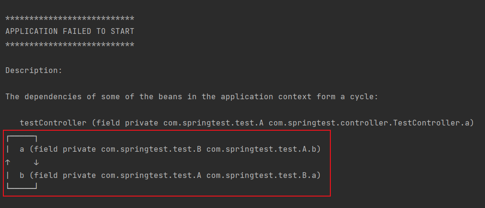
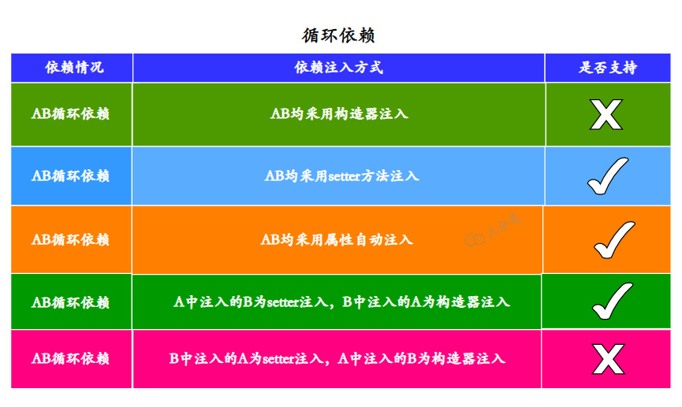
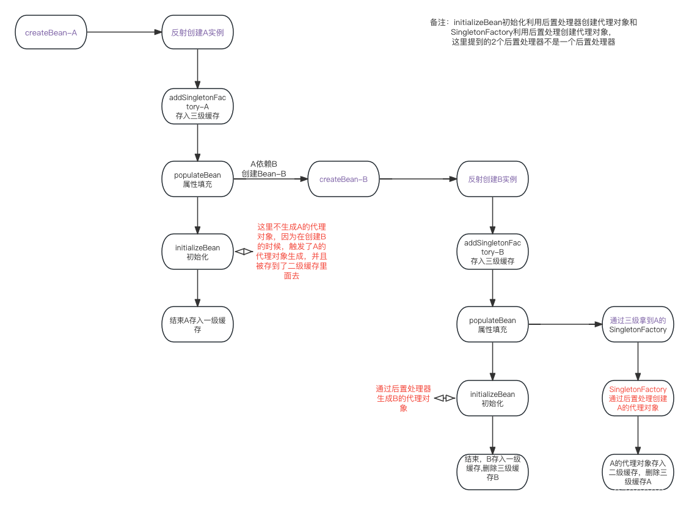

# 循环依赖

自己依赖自己，或者多个类之间相互依赖，形成循环的依赖关系，可能会导致程序编译失败或运行时出现异常


<small>[循环依赖详解及解决方案](https://blog.csdn.net/qq_43135259/article/details/130134970)</small>

```java
public class Test {

    public static void main(String[] args) {
        Test t = new Test();
    }

    private Test test = new Test();
}
```

## Spring 中的循环依赖

在 Spring 中只有 singleton 作用域会存在依赖注入问题，在 prototype 作用域下，会直接抛出异常，因为 A、B 循环依赖，在实例化 A 时，发现依赖 B，于是又去实例化 A，依此无限循环下去

```java
@Service
@Scope(scopeName = ConfigurableBeanFactory.SCOPE_PROTOTYPE)
public class A {

    @Autowired
    private B b;
}
```

```java
@Service
@Scope(scopeName = ConfigurableBeanFactory.SCOPE_PROTOTYPE)
public class B {

    @Autowired
    private A a;
}
```



## Spring 自己可以解决的循环依赖



<small>[面渣逆袭：Spring三十五问，四万字+五十图详解！建议收藏！ - Spring可以解决哪些情况的循环依赖？](https://mp.weixin.qq.com/s/Y17S85ntHm_MLTZMJdtjQQ)</small>

使用构造器注入时，如果代码中存在循环依赖，在 Spring 启动时就会提醒出现循环依赖，并且启动失败，使用其他方式注入时不会提醒

- 使用构造器注入，应用启动失败，报循环依赖

```java
@Service
public class A {

    private B b;

    @Autowired
    public A(B b) {
        this.b = b;
    }
}

@Service
public class B {

    private A a;

    @Autowired
    public B(A a) {
        this.a = a;
    }
}
```

- A 中使用构造器注入，B 中使用 setter 注入，应用启动失败，报循环依赖

```java
@Service
public class A {

    private B b;

    @Autowired
    public A(B b) {
        this.b = b;
    }
}

@Service
public class B {

    private A a;

    @Autowired
    public void setA(A a) {
        this.a = a;
    }
}
```

Spring 在创建 Bean 时默认会根据自然排序进行创建，所以 A 会先于 B 进行创建。而当 Spring 采用构造方法注入时，Spring 是无法自己解决循环依赖问题的

## 其他情况如何解决

### 重构代码

出现循环依赖，说明代码的结构设计有问题，在条件允许下，重构代码是最优的解决方法

### `@Lazy` 注解

`@Lazy` 注解的作用是将 Bean 的初始化延迟到第一次使用时，而不是在在容器启动时立即初始化

当一个 Bean 依赖于被 `@Lazy` 注解修饰的 Bean 时，Spring 会返回一个代理对象，而不是实际的 Bean 实例，当代理对象需要被调用时，才会去初始化 Bean

### 使用 setter 注入或属性注入

Bean 只会在被调用时才会被注入

## 三级缓存

Spring 中的三级缓存是针对 Bean 的加载和创建过程而设计的，可以有效的解决循环依赖

- 三级缓存只适用于单例 Bean，而非单例 Bean 是不需要缓存的

Spring 会将已实例化但未初始化完全的对象，**提前暴露** 出来，以满足其他对象对他的依赖

```java
// 一级缓存
private final Map<String, Object> singletonObjects = new ConcurrentHashMap<>(256);

// 二级缓存
private final Map<String, Object> earlySingletonObjects = new ConcurrentHashMap<>(16);

// 三级缓存
private final Map<String, ObjectFactory<?>> singletonFactories = new HashMap<>(16);
```

- **singletonObjects**：一级缓存，也被称作单例池。存放 **已完全初始化好的单例 Bean**
  - 每次请求获取一个 Bean 时，会先检查一级缓存中是否已存在该 Bean，如果存在则直接返回，不存在才会去创建
- **earlySingletonObjects**：二级缓存，存放 **正在创建** 过程中的 Bean，**已实例化，但尚未完成属性注入、初始化**
- **singletonFactories**：三级缓存，存放用以 **创建 Bean 的对象工厂**

### 引入三级缓存前

| 类 A | 类 B |
| :-: | :-: |
| 实例化 A，发现 A 依赖于 B |  |
|  | 实例化 B，发现 B 依赖于 A |
| A 早已实例化，发现依赖于 B |  |
|  | B 早已实例化，发现依赖于 A |
| ... | ... |

### 引入三级缓存后



<small>[Spring三级缓存流程再梳理](https://blog.csdn.net/weixin_37862824/article/details/133785861)</small>

| 类 A | 类 B |
| :-: | :-: |
| 实例化 A，放入三级缓存 |  |
| 属性注入时，发现 A 依赖于 B |  |
| 依次查询一级、二级、三级缓存，都发现没有实例 B |  |
|  | 实例化 B，放入三级缓存 |
|  | 属性注入时，发现 B 依赖于 A |
|  | 依次查询一级、二级缓存，都发现没有实例 A |
|  | 在三级缓存中查找到实例 A，将其添加到二级缓存中，并删除三级缓存 |
|  | 继续执行初始化，并注入实例 A |
|  | 初始化完成，加入到一级缓存，并删除三级缓存 |
| 继续执行初始化，并注入从一级缓存中获取到的实例 B  |  |
| 初始化完成，加入到一级缓存，并删除三级缓存  |  |

### 为什么不能解决构造器注入的循环依赖

Spring 解决循环依赖的方式，是先创建一个实例，再为其注入其他实例。而通过构造方法注入，需要同时完成实例化与注入

### 一级缓存足够吗

在不使用 Spring 的情况下，一级缓存其实足够能解决循环依赖，甚至都不需要缓存

- 一个典型的循环依赖例子

```java
public class Test {

    static class A {
        private B b = new B();

        void say() {
            System.out.println("I am A");
        }
    }

    static class B {
        private A a = new A();

        void say() {
            System.out.println("I am B");
        }
    }

    public static void main(String[] args) {
        A a = new A();
        a.say();

        B b = new B();
        b.say();
    }
}
```

- 改为延迟加载

```java
public class Test {

    static class A {
        private B b;

        void say() {
            this.b = this.b != null ? this.b : new B();
            System.out.println("I am A");
        }
    }

    static class B {
        private A a;

        void say() {
            this.a = this.a != null ? this.a : new A();
            System.out.println("I am B");
        }
    }

    public static void main(String[] args) {
        A a = new A();
        a.say();

        B b = new B();
        b.say();
    }
}
```

> I am A
> I am B

- 使用缓存

```java
public class Test {

    static class Father {
        static final Map<String, Object> CACHE = new HashMap<>();
    }

    static class A extends Father {

        private B b = init();

        B init() {
            CACHE.put("a", this);
            return (B) CACHE.computeIfAbsent("b", k -> new B());
        }

        void say() {
            System.out.println("I am A");
        }
    }

    static class B extends Father {

        private A a = init();

        A init() {
            CACHE.put("b", this);
            return (A) CACHE.computeIfAbsent("a", k -> new A());
        }

        void say() {
            System.out.println("I am B");
        }
    }

    public static void main(String[] args) {
        A a = new A();
        a.say();

        B b = new B();
        b.say();
    }
}
```

> I am A
> I am B

### 二级缓存足够吗

在使用 Spring 的情况下，就无法只用一级缓存解决循环依赖，必须再加一级缓存，因为 Spring 在单例模式下会把所有创建并初始化完成的 Bean 加入到缓存中，缓存中存放的是完成状态的 Bean，需要加一个缓存，用以存放处在中间状态的 Bean

### 为什么需要三级缓存

Spring 为了避免在 singleton 作用域下重复创建 Bean，会将初始化完成后的 Bean 放入缓存中，这也就有了一级缓存。为了能存放已实例化后但未初始化完全的 Bean，使用了二级缓存。在不使用代理的情况下，二级缓存已是能有效的避免循环依赖的

三级缓存与前两级不同，他存放的不是 Bean，而是创建工厂，还是个函数式接口

```java
@FunctionalInterface
public interface ObjectFactory<T> {

    T getObject() throws BeansException;

}
```

```java
public abstract class AbstractAutowireCapableBeanFactory extends AbstractBeanFactory
    implements AutowireCapableBeanFactory {

    ...

    protected Object doCreateBean(String beanName, RootBeanDefinition mbd, @Nullable Object[] args)
            throws BeanCreationException {

        // 实例化
        BeanWrapper instanceWrapper = null;
        if (instanceWrapper == null) {
            instanceWrapper = createBeanInstance(beanName, mbd, args);
        }

        boolean earlySingletonExposure = (mbd.isSingleton() && this.allowCircularReferences &&
                isSingletonCurrentlyInCreation(beanName));
            if (earlySingletonExposure) {
            if (logger.isTraceEnabled()) {
                logger.trace("Eagerly caching bean '" + beanName +
                        "' to allow for resolving potential circular references");
            }
            // 添加三级缓存
            addSingletonFactory(beanName, () -> getEarlyBeanReference(beanName, mbd, bean));
        }

        Object exposedObject = bean;
        try {
            // 属性赋值
            populateBean(beanName, mbd, instanceWrapper);
            // 初始化
            exposedObject = initializeBean(beanName, exposedObject, mbd);
        }

        return exposedObject;
    }

    ...

}
```

```java
// 对提前暴露的Bean进行处理
protected Object getEarlyBeanReference(String beanName, RootBeanDefinition mbd, Object bean) {
    Object exposedObject = bean;
    if (!mbd.isSynthetic() && hasInstantiationAwareBeanPostProcessors()) {
        // 遍历Bean后处理器
        for (BeanPostProcessor bp : getBeanPostProcessors()) {
            if (bp instanceof SmartInstantiationAwareBeanPostProcessor) {
                SmartInstantiationAwareBeanPostProcessor ibp = (SmartInstantiationAwareBeanPostProcessor) bp;
                // 如果使用了AOP，就会调用AbstractAutoProxyCreator中的getEarlyBeanReference方法
                exposedObject = ibp.getEarlyBeanReference(exposedObject, beanName);
            }
        }
    }
    return exposedObject;
}
```

```java
public abstract class AbstractAutoProxyCreator extends ProxyProcessorSupport
        implements SmartInstantiationAwareBeanPostProcessor, BeanFactoryAware {
    
    ...

    public Object getEarlyBeanReference(Object bean, String beanName) {
        Object cacheKey = getCacheKey(bean.getClass(), beanName);
        this.earlyProxyReferences.put(cacheKey, bean);
        return wrapIfNecessary(bean, beanName, cacheKey);
    }

    // 判断是否需要生成代理对象，否则返回原对象
    protected Object wrapIfNecessary(Object bean, String beanName, Object cacheKey) {
        if (StringUtils.hasLength(beanName) && this.targetSourcedBeans.contains(beanName)) {
            return bean;
        }
        if (Boolean.FALSE.equals(this.advisedBeans.get(cacheKey))) {
            return bean;
        }
        if (isInfrastructureClass(bean.getClass()) || shouldSkip(bean.getClass(), beanName)) {
            this.advisedBeans.put(cacheKey, Boolean.FALSE);
            return bean;
        }

        // 判断是否需要生成代理对象
        // Create proxy if we have advice.
        Object[] specificInterceptors = getAdvicesAndAdvisorsForBean(bean.getClass(), beanName, null);
        if (specificInterceptors != DO_NOT_PROXY) {
            this.advisedBeans.put(cacheKey, Boolean.TRUE);
            // 生成代理对象
            Object proxy = createProxy(
                    bean.getClass(), beanName, specificInterceptors, new SingletonTargetSource(bean));
            this.proxyTypes.put(cacheKey, proxy.getClass());
            return proxy;
        }

        // 返回原对象
        this.advisedBeans.put(cacheKey, Boolean.FALSE);
        return bean;
    }
    
    ...
    
}
```

在使用 AOP 时，会在 Bean 初始化过程中，通过 BeanPostProcessor 去⽣成代理对象，所以二级缓存可能存的是普通的对象，也可能是代理对象，那么可能就导致取到的 Bean 对象不一致了，缓存就没有意义了

## 参考

- [@Lazy注解解决循环依赖原理](https://zhuanlan.zhihu.com/p/658671735)
- [循环依赖如何避免和解决](https://juejin.cn/post/6844904039231012878)
- [Spring使用三级缓存解决循环依赖](https://juejin.cn/post/7099745254743474212)
- [Spring三级缓存流程再梳理](https://blog.csdn.net/weixin_37862824/article/details/133785861)
- [什么是Spring三级缓存 对象在三级缓存中的创建流程 【三级缓存 循环依赖】](https://blog.csdn.net/wang121213145/article/details/124876507)
- [Spring的3级缓存和循环引用的理解](https://segmentfault.com/a/1190000041727092)
- [Spring循环依赖那些事儿（含Spring详细流程图）](https://mp.weixin.qq.com/s/cqkZEvmmh7jnNt2K5r_lXg)
- [高频面试：Spring 如何解决循环依赖？](https://mp.weixin.qq.com/s/VrEfTVQJXO88WrA0Nvmdrw)
- [Spring的3级缓存和循环引用的理解](https://segmentfault.com/a/1190000041727092)
