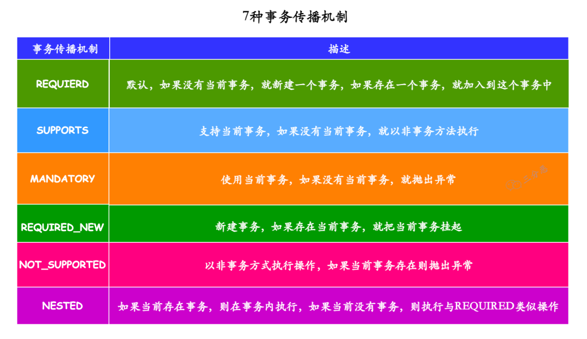

# 事务

事务是逻辑上的一组操作，要么都执行，要么都不执行

Spring 事务是由数据库的事务支持的，Spring 本身是无法提供事务功能的。Spring 事务的提交和回滚是通过数据库的事务机制实现

## 事务隔离级别

- ISOLATION_DEFAULT：使用后端数据库默认的隔离级别
- ISOLATION_READ_UNCOMMITTED：读未提交
- ISOLATION_READ_COMMITTED：读已提交
- ISOLATION_REPEATABLE_READ：可重复读
- ISOLATION_SERIALIZABLE：串行化

如果与数据库的隔离级别不同，以 Spring 为准

## 事务传播机制

一个事务方法被另一个事务方法调用时，事务如何被传播和处理



<small>[面渣逆袭：Spring三十五问，四万字+五十图详解！建议收藏！ - 7种事务传播机制](https://mp.weixin.qq.com/s/Y17S85ntHm_MLTZMJdtjQQ)</small>

- PROPAGATION_REQUIRED：默认事务传播机制
  - 如果当前存在事务，则加入该事务
  - 如果当前没有事务，则创建一个新的事务
- PROPAGATION_SUPPORTS
  - 如果当前存在事务，则加入该事务
  - 如果当前没有事务，则以非事务的方式继续运行
- PROPAGATION_MANDATORY
  - 如果当前存在事务，则加入该事务
  - 如果当前没有事务，则抛出异常
- PROPAGATION_REQUIRES_NEW
  - 创建一个新的事务
  - 如果当前存在事务，则挂起当前事务
- PROPAGATION_NOT_SUPPORTED
  - 以非事务方式运行
  - 如果当前存在事务，则挂起当前事务
- PROPAGATION_NEVER
  - 以非事务方式运行
  - 如果当前存在事务，则抛出异常
- PROPAGATION_NESTED
  - 如果当前存在事务，就在嵌套事务内执行
  - 如果当前没有事务，则创建一个新的事务

### 嵌套事务

在外部方法开启事务的情况下，在内部开启一个新的事务，作为嵌套事务存在

MySQL 中是没有嵌套事务或者父子事务的概念的，但是有个 SAVEPOINT 的概念

从字面意思也可以看出，这是一个保存点，可以暂存当前事务的修改，如有需要可以回滚到该保存点

> 玩过单机的都知道，游戏通常都会有个存档点，可以暂存你当前的游戏进度，后续游戏不顺时，就可以通过存档回到对应的游戏进度

通过 SAVEPOINT，Spring 事务就可以实现一个嵌套事务，外部事务是一个真正的事务，而内部事务，就是一个个 SAVEPOINT，可以单独进行回滚，但只能随着外部事务的提交一起提交

### 事务挂起

事务挂起与线程挂起类似，将当前尚未提交的事务暂时保存起来（通过 ThreadLocal），等待事务恢复，以完成其提交、回滚或关闭等操作

事务挂起到恢复期间，如果有其他事务对该事务涉及到的资源进行了修改并提交，该事务恢复后即便发生了回滚，也不会回滚其他事务提交的修改

| 时间 | 事务 A | 事务 B |
| :-: | :-: | :-: |
| T1 | 开启 |  |
| T2 | 读取 X 值为 100 |  |
| T3 | 修改 X 值为 99 |  |
| T4 | 挂起 |  |
| T5 |  | 开启 |
| T6 |  | 读取 X 值为 100 |
| T7 |  | 修改 X 值为 101 |
| T8 |  | 提交 |
| T9 | 恢复 |  |
| T10 | 读取 X 值为 99 |  |
| T11 | 回滚 |  |
| T12 | 读取 X 值为 101 |  |

## Spring 事务管理

### 编程式事务管理

代码侵入性大，自由度高，可以手动提交或回滚

- 使用 TransactionTemplate

```java
@Autowired
private TransactionTemplate transactionTemplate;

public void test() {
    transactionTemplate.execute(new TransactionCallbackWithoutResult() {
        @Override
        protected void doInTransactionWithoutResult(TransactionStatus transactionStatus) {
            try {

                ...

            } catch (Exception e) {
                // 回滚
                transactionStatus.setRollbackOnly();
            }
        }
    });
}
```

- 使用 PlatformTransactionManager

```java
@Autowired
private PlatformTransactionManager transactionManager;

public void test() {
    TransactionStatus status = transactionManager.getTransaction(new DefaultTransactionDefinition());
    try {

        ...

        // 手动提交
        transactionManager.commit(status);
    } catch (Exception e) {
        // 回滚
        transactionManager.rollback(status);
    }
}
```

### 声明式事务管理

使用 `@Transactional` 注解，代码侵入性小，使用方便，通过 AOP 实现

- 默认在方法执行结束后自动提交事务

## `@Transactional` 注解

```java
@Target({ElementType.TYPE, ElementType.METHOD})
@Retention(RetentionPolicy.RUNTIME)
@Inherited
@Documented
public @interface Transactional {

    @AliasFor("transactionManager")
    String value() default "";

    @AliasFor("value")
    String transactionManager() default "";

    // 事务传播机制
    Propagation propagation() default Propagation.REQUIRED;

    // 事务隔离级别
    Isolation isolation() default Isolation.DEFAULT;

    // 事务超时时间
    // 事务所允许执行的最长时间，如果超过该时间限制但事务还没有完成，则自动回滚事务
    // 默认-1
    int timeout() default TransactionDefinition.TIMEOUT_DEFAULT;

    // 只读事务
    // 只读事务不涉及数据的修改，数据库会提供一些优化手段
    boolean readOnly() default false;

    // 指定哪些异常会触发回滚
    Class<? extends Throwable>[] rollbackFor() default {};

    String[] rollbackForClassName() default {};

    Class<? extends Throwable>[] noRollbackFor() default {};

    String[] noRollbackForClassName() default {};
}
```

## 原理

基于 Spring AOP 实现。如果一个类使用了 `@Transactional` 注解的话，Spring 容器就会在启动的时候为其创建一个代理对象。当通过代理对象调用 Bean 方法的时候，会触发对应的 AOP 增强拦截器，声明式事务是一种环绕增强

## 注意事项

### 只能作用于 public 修饰的方法

源码中有对方法访问权限的判断

```java
if (allowPublicMethodsOnly() && !Modifier.isPublic(method.getModifiers())) {
  return null;
}
```

### 避免自调用

Spring 事务是基于 Spring AOP 实现的，被操作的其实是 **代理对象**，并不是本身的对象。而自调用是使用本身的对象进行调用的，没有使用到代理对象，自然也就无法进行 AOP 操作

### 作用方法不能被 final 或 static 修饰

Spring 事务是基于 Spring AOP 实现的，Spring AOP 又是使用动态代理实现的

动态代理，特别是 cglib 动态代理，是通过动态生成被代理类的子类来工作的，在子类中重写父类的方法以实现代理功能，而被 final 修饰的方法是不能被重写的

动态代理需要通过代理的方式获取到代理的具体对象，而 static 修饰的方法是属于类的，不属于对象，而且不能被重写

### 正确的设置 rollbackFor 属性

发生异常时，根据设置的异常类型进行回滚，默认为 RuntimeException 和 Error

- 建议使用 `Exception.class` 或 `Throwable.class`
- 业务中如果捕获了异常，是不会触发 rollbackFor 回滚的
- 对于预期可能会出现的场景建议使用编程式事务

### 正确的设置 propagation 属性

部分传播机制不会使用事务，建议使用默认值即可

### 多线程调用

在进行数据批量导入时，常使用多线程优化导入效率

Spring 实现事务时，通过 ThreadLocal 把事务和当前线程进行了绑定，包含了数据库连接、Session 管理的对象以及当前事务运行的其他必要信息，而开启的新线程是获取不到这些变量和对象的，也就是说不同的线程对应着不同的事务

建议使用分布式事务，或使用编程式事务 + CompleteFuture + CountdownLatch，并设置好重试、回滚等操作

### 长事务

长事务往往会造成大量的阻塞和锁超时，更快的耗尽数据库连接池，且回滚时需要的时间也更长

尽量不要在一个事务中处理大量的数据或者耗时的操作，考虑将一个大事务拆分为多个小事务，甚至在某些操作上关闭事务，建议使用编程式事务

## 参考

- [Spring常见面试题总结](https://javaguide.cn/system-design/framework/spring/spring-knowledge-and-questions-summary.html)
- [面渣逆袭：Spring三十五问，四万字+五十图详解！建议收藏！](https://mp.weixin.qq.com/s/Y17S85ntHm_MLTZMJdtjQQ)
- [Spring 事务详解](https://javaguide.cn/system-design/framework/spring/spring-transaction.html)
- [Spring事务隔离级别与数据库隔离级别不一致时，该以谁为准？](https://cloud.tencent.com/developer/article/2090828)
- [【spring】spring 的事务(transaction) 四 嵌套事务PROPAGATION_NESTED](https://blog.csdn.net/m0_45406092/article/details/119518594)
- [Spring事务传播规则——嵌套事务NESTED详解](https://www.cnblogs.com/yifanSJ/p/16330741.html)
- [what does suspending a transaction means?](https://stackoverflow.com/questions/33729810/what-does-suspending-a-transaction-means)
- [深入理解Spring事务: Spring如何实现挂起事务](https://wiyi.org/how-does-transaction-suspension-in-spring.html)
- [8个Spring事务失效的场景，你碰到过几种？](https://juejin.cn/post/7179080622504149029)
- [static方法能被AOP动态代理吗？](https://blog.csdn.net/sdmanooo/article/details/122467797)
- [要我说，多线程事务它必须就是个伪命题！](https://www.cnblogs.com/thisiswhy/p/13948055.html)
- [详解多线程与Spring事务](https://www.51cto.com/article/709483.html)
- [使用@Transactional出现了长事务，导致生产事故](https://www.cnblogs.com/SparkMore/p/16106378.html)
