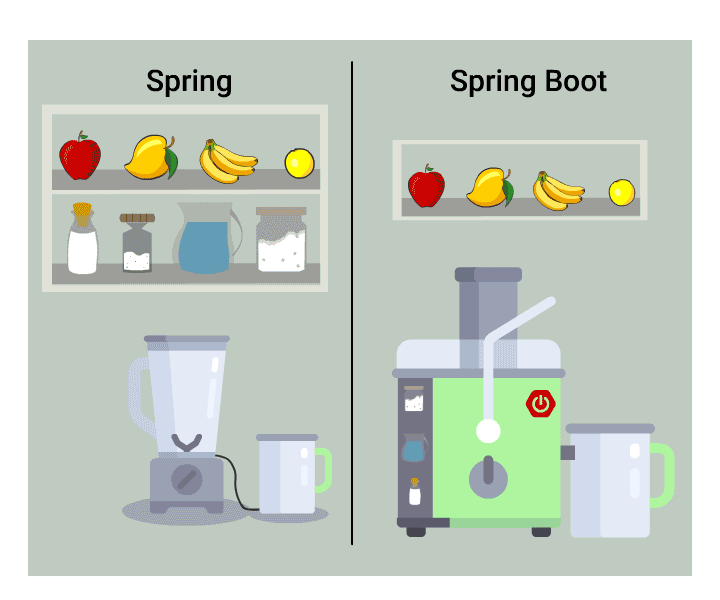

# Spring Boot

SpringBoot 是一个开源的框架，旨在简化 Spring 应用的初始化和开发过程。不仅继承了 Spring 框架原有的优秀特性，而且还通过 **约定优于配置** 的方式简化了 Spring 应用的开发



<small>[Spring vs Spring Boot](https://devrant.com/rants/1867059/spring-vs-spring-boot)</small>

> Spring 简化 Java 应用的开发，Spring Boot 简化 Spring 开发

## 优点

- 快速构建应用、简化开发流程：不需要编写大量样板代码、XML 配置等
- **遵循约定优于配置**
- **自动化配置**：可以根据添加的依赖自动配置项目，省去了大量手动配置的时间
- **内嵌了 HTTP 服务器**（Tomcat、Jetty），可以轻松地开发和测试 Web 应用程序
- 内置了监控和健康检查功能
- 简化 Maven 配置：引入 starter 时，会自动引入其他所需的依赖，而不需要我们手动的一个个添加

## 约定优于配置

约定优于配置是一种软件设计范式，在减少软件开发人员需做决定的数量，开发人员仅需规定应用中不符合约定的部分

例如 Spring Boot 会默认加载 application 命名的 yaml 或 properties 文件，但你也可以配置多个配置文件，通过 `spring.profiles.active` 参数切换

## 核心注解

### `@SpringBootApplication`

用在启动类上

```java
@SpringBootApplication
public class TestApplication {

    public static void main(String[] args) {
        SpringApplication.run(TestApplication.class, args);
    }

}
```

`@SpringBootApplication` 其实就是 `@SpringBootConfiguration`、`@EnableAutoConfiguration`、`@ComponentScan` 的组合

```java
@Target(ElementType.TYPE)
@Retention(RetentionPolicy.RUNTIME)
@Documented
@Inherited
@SpringBootConfiguration
@EnableAutoConfiguration
@ComponentScan(excludeFilters = { @Filter(type = FilterType.CUSTOM, classes = TypeExcludeFilter.class),
        @Filter(type = FilterType.CUSTOM, classes = AutoConfigurationExcludeFilter.class) })
public @interface SpringBootApplication {

    @AliasFor(annotation = EnableAutoConfiguration.class)
    Class<?>[] exclude() default {};

    @AliasFor(annotation = EnableAutoConfiguration.class)
    String[] excludeName() default {};

    @AliasFor(annotation = ComponentScan.class, attribute = "basePackages")
    String[] scanBasePackages() default {};

    @AliasFor(annotation = ComponentScan.class, attribute = "basePackageClasses")
    Class<?>[] scanBasePackageClasses() default {};

    @AliasFor(annotation = ComponentScan.class, attribute = "nameGenerator")
    Class<? extends BeanNameGenerator> nameGenerator() default BeanNameGenerator.class;

    @AliasFor(annotation = Configuration.class)
    boolean proxyBeanMethods() default true;
}
```

### `@SpringBootConfiguration`

表示当前类是一个 Spring 配置类，他的核心其实是 `@Configuration`

```java
@Target({ElementType.TYPE})
@Retention(RetentionPolicy.RUNTIME)
@Documented
@Configuration
@Indexed
public @interface SpringBootConfiguration {
    @AliasFor(
        annotation = Configuration.class
    )
    boolean proxyBeanMethods() default true;
}
```

#### `@Configuration`

标记一个类为配置类

```java
@Target(ElementType.TYPE)
@Retention(RetentionPolicy.RUNTIME)
@Documented
@Component
public @interface Configuration {

    @AliasFor(annotation = Component.class)
    String value() default "";

    boolean proxyBeanMethods() default true;
}
```

### `@EnableAutoConfiguration`

启用 SpringBoot 的自动配置机制

```java
@Target(ElementType.TYPE)
@Retention(RetentionPolicy.RUNTIME)
@Documented
@Inherited
@AutoConfigurationPackage
@Import(AutoConfigurationImportSelector.class)
public @interface EnableAutoConfiguration {

    String ENABLED_OVERRIDE_PROPERTY = "spring.boot.enableautoconfiguration";

    Class<?>[] exclude() default {};

    String[] excludeName() default {};
}
```

### `@ComponentScan`

扫描被 `@Component`、`@Service`、`@Controller` 注解标记的 Bean，注解默认会扫描启动类所在的包下所有的类，可以自定义不扫描某些 Bean

```java
@Retention(RetentionPolicy.RUNTIME)
@Target(ElementType.TYPE)
@Documented
@Repeatable(ComponentScans.class)
public @interface ComponentScan {

    @AliasFor("basePackages")
    String[] value() default {};

    @AliasFor("value")
    String[] basePackages() default {};

    Class<?>[] basePackageClasses() default {};

    Class<? extends BeanNameGenerator> nameGenerator() default BeanNameGenerator.class;

    Class<? extends ScopeMetadataResolver> scopeResolver() default AnnotationScopeMetadataResolver.class;

    ScopedProxyMode scopedProxy() default ScopedProxyMode.DEFAULT;

    String resourcePattern() default ClassPathScanningCandidateComponentProvider.DEFAULT_RESOURCE_PATTERN;

    boolean useDefaultFilters() default true;

    Filter[] includeFilters() default {};

    Filter[] excludeFilters() default {};

    boolean lazyInit() default false;

    @Retention(RetentionPolicy.RUNTIME)
    @Target({})
    @interface Filter {

        FilterType type() default FilterType.ANNOTATION;

        @AliasFor("classes")
        Class<?>[] value() default {};

        @AliasFor("value")
        Class<?>[] classes() default {};

        String[] pattern() default {};
    }
}
```

## 自动配置

通过注解或者一些简单的配置就能在 Spring Boot 的帮助下实现某块功能

`@EnableAutoConfiguration` 注解中引入的 **AutoConfigurationImportSelector** 就是自动配置实现的核心

```java
public class AutoConfigurationImportSelector implements DeferredImportSelector, BeanClassLoaderAware,
        ResourceLoaderAware, BeanFactoryAware, EnvironmentAware, Ordered {

    protected AutoConfigurationEntry getAutoConfigurationEntry(AnnotationMetadata annotationMetadata) {
        // 判断是否开启了自动装配
        if (!isEnabled(annotationMetadata)) {
            return EMPTY_ENTRY;
        }
        
        // 获取注解属性
        AnnotationAttributes attributes = getAttributes(annotationMetadata);

        // 获取需要自动装配的所有配置类
        // 读取META-INF/spring.factories，获取自动配置类路径
        List<String> configurations = getCandidateConfigurations(annotationMetadata, attributes);

        // 去重
        configurations = removeDuplicates(configurations);

        // 处理需要排除的配置，在@EnableAutoConfiguration中定义
        Set<String> exclusions = getExclusions(annotationMetadata, attributes);
        checkExcludedClasses(configurations, exclusions);
        configurations.removeAll(exclusions);

        // 筛选满足@ConditionalOn*注解条件
        // 不满足条件则不会装配
        configurations = getConfigurationClassFilter().filter(configurations);
        fireAutoConfigurationImportEvents(configurations, exclusions);
        return new AutoConfigurationEntry(configurations, exclusions);
    }

    ...

}
```

## 配置文件

Spring Boot 支持两种配置文件格式：yaml 与 properties

总体来说，二者在性能上没有明显的差异，yaml 的结构层次更清晰些，配置数组时更方便些，但不支持 `@PropertySource` 注解导入自定义配置

- 相同目录下 properties 格式的配置文件的加载优先级更高

```properties
fuck.you[0]="one"
fuck.you[1]="two"
```

```yaml
fuck:
  you:
    - "one"
    - "two"
```

### 读取自定义配置

```yaml
fuck:
  you: 好的
```

#### `@Value`

```java
@Value("${fuck.you}")
String saySomething;
```

#### `@ConfigurationProperties`

```java
@ConfigurationProperties(prefix = "fuck")
public class SaySomething {

    private String you;

    public String say() {
        return you;
    }
}
```

#### `@PropertySource`

读取指定的 properties 文件

```properties
fuck.you=deep dark fantasy
```

```java
@PropertySource("classpath:application.properties")
@Component
public class SaySomething {

    @Value("${fuck.you}")
    private String fuckYou;

    public String say() {
        return fuckYou;
    }
}
```

## 自定义 Spring Boot Starter

### 引入依赖

```xml
<dependency>
    <groupId>org.springframework.boot</groupId>
    <artifactId>spring-boot-configuration-processor</artifactId>
    <optional>true</optional>
</dependency>
```

### 命名

- 官方定义 starter 的命名规则：`spring-boot-starter-*`
- 自定义 starter 命名规则：`*-spring-boot-starter`

### 功能实现

```java
@Data
// @Component
@ConfigurationProperties(prefix = "hello")
public class SaySomething {

    private String word;

    public String say() {
        return "你说什么：" + word;
    }
}
```

- 可以不加 `@Component` 注解，但配置类需加 `@EnableConfigurationProperties` 注解
- 同理加了 `@Component` 注解，配置类可以不加 `@EnableConfigurationProperties` 注解

如果不需要使用配置文件，添加完 `@Component` 注解即可

### 配置类

```java
@Configuration
@EnableConfigurationProperties(value = SaySomething.class)
public class MyConfiguration {
}
```

### 配置文件

需在 resources 文件夹下创建 META-INF 目录，并新建 spring.factories 文件

```properties
org.springframework.boot.autoconfigure.EnableAutoConfiguration=com.test.config.MyConfiguration
```

### 打包

运行 `mvn install`

### 使用

- 引入依赖

```xml
<dependency>
    <groupId>com.example</groupId>
    <artifactId>mystarter-spring-boot-starter</artifactId>
    <version>0.0.1-SNAPSHOT</version>
</dependency>
```

- 添加配置

```java
hello:
  world: 我是你大爷
```

之后即可使用了

```java
@Service
public class Test {

    @Autowired
    private SaySomething saySomething;

    public String test() {
        return saySomething.say();
    }
}
```

> 我是你大爷

## 全局异常处理

Spring Boot 可以通过 `@RestControllerAdvice` 和 `@ExceptionHandler` 实现全局统一异常处理

```java
@RestControllerAdvice
public class GlobalHandler {

    @ExceptionHandler(Exception.class)
    public String handler(Exception e) {
        System.out.println("出现异常了" + e.getMessage());
        return e.getMessage();
    }
}
```

`@RestControllerAdvice` 其实是 `@ControllerAdvice` 与 `@ResponseBody` 的组合

`@ControllerAdvice` 从名字也可知道这是个用于增强 Controller 的注解，与 `@ExceptionHandler` 搭配就可以捕获指定的异常

## 参考

- [约定优于配置](https://zh.wikipedia.org/zh-cn/%E7%BA%A6%E5%AE%9A%E4%BC%98%E4%BA%8E%E9%85%8D%E7%BD%AE)
- [如何理解 Spring Boot 中的约定优于配置](https://juejin.cn/post/7024854083223683085)
- [一文搞懂🔥SpringBoot自动配置原理](https://juejin.cn/post/7046554366068654094)
- [application.yml vs application.properties for Spring Boot](https://stackoverflow.com/questions/47462950/application-yml-vs-application-properties-for-spring-boot)
- [Externalized Configuration](https://docs.spring.io/spring-boot/reference/features/external-config.html)
- [浅析PropertySource 基本使用](https://blog.csdn.net/qq_36894974/article/details/90237628)
- [SpringBoot中@ControllerAdvice结合@InitBinder、@ModelAttribute、@ExceptionHandler的使用](https://blog.csdn.net/backbug/article/details/105317630)
- [Spring Boot项目优雅的全局异常处理方式（全网最新）](https://juejin.cn/post/6959520793063587848)
