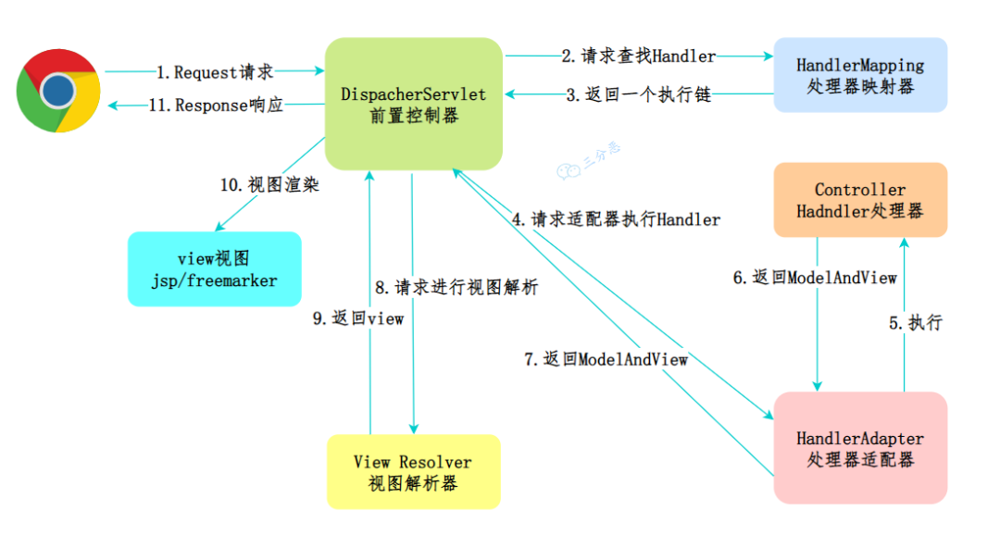

# Spring MVC

## MVC

MVC（Model-View-Controller）是一种软件架构模式，把软件系统分为三个基本部分：模型（Model）、视图（View）、控制器（Controller）

MVC 模式强调 **职责分离**，将应用程序中业务逻辑、数据和界面显示分离出来，以便于独立开发和维护，提高了系统的扩展性和可维护性，当然也提升了系统的复杂度

- Model：数据访问和逻辑处理
- View：数据展示
- Controller：接收用户的输入，调用模型和视图去完成用户的请求

## 核心组件

### DispatcherServlet

**前端控制器**，Spring MVC 的核心控制器，**是整个请求处理流程的入口**，相当于一个中转站，负责接收请求、分发，并给予客户端响应

### HandlerMapping

**处理器映射器**，根据用户请求查找能处理的 Handler

### HandlerAdapter

**处理器适配器**，根据 HandlerMapping 找到的 Handler，执行对应的 Handler

### Handler

**请求处理器**，处理实际请求的处理器，也就是我们平常说的 Controller 控制器

### ViewResolver

**视图解析器**，根据 Handler 返回的逻辑视图，解析并渲染真正的视图，并传递给 DispatcherServlet 响应客户端

## 工作流程

<small>[面渣逆袭：Spring三十五问，四万字+五十图详解！建议收藏！ - Spring MVC的工作流程](https://mp.weixin.qq.com/s/Y17S85ntHm_MLTZMJdtjQQ)</small>

1. 客户端向服务端发送一次请求，这个请求会先到前端控制器 DispatcherServlet
2. DispatcherServlet 根据请求信息调用 HandlerMapping。HandlerMapping 根据 URL 去匹配查找能处理的 Handler，并会将请求涉及到的拦截器和 Handler 一起封装
3. DispatcherServlet 调用 HandlerAdapter 执行 Handler
4. Handler 完成对用户请求的处理后，会返回一个 ModelAndView 对象给 DispatcherServlet，包含了数据模型以及相应的视图的信息
    - Model 是返回的数据对象，View 是逻辑上的 View
5. DispatcherServlet 将 ModelAndView 交给 ViewReslover 视图解析器解析，然后返回真正的视图
6. DispatcherServlet 将模型数据填充到视图中
7. DispatcherServlet 将结果响应给客户端

Spring MVC 虽然整体流程复杂，但在实际开发中很简单，大部分的组件不需要开发人员创建和管理，只需要通过配置文件的方式完成配置即可，真正需要开发人员进行处理的只有 Handler（Controller）、View、Model

当然我们现在大部分的开发都是前后端分离，Restful 风格接口，后端只需要返回 JSON 数据就行了

## 参考

- [MVC 模式](https://www.runoob.com/design-pattern/mvc-pattern.html)
- [MVC](https://zh.wikipedia.org/wiki/MVC)
- [面渣逆袭：Spring三十五问，四万字+五十图详解！建议收藏！](https://mp.weixin.qq.com/s/Y17S85ntHm_MLTZMJdtjQQ)
