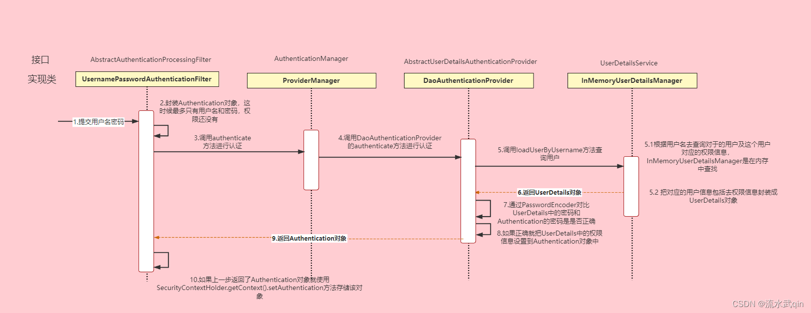
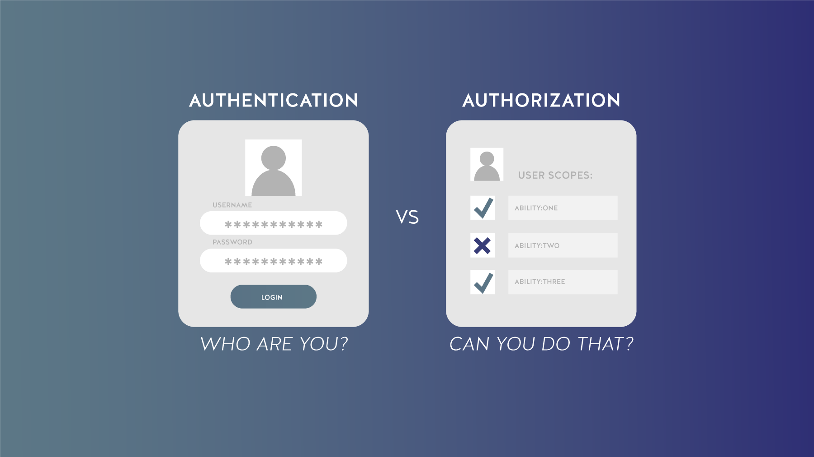

# Spring Security

Spring Security 是一个基于 Spring 的安全框架，提供了认证、授权、攻击防护等功能

- 认证：提供了多种认证方式，如表单、HTTP Basic、OAuth2 等
- 授权：支持基于角色和基于权限的授权方式
- 攻击防护：内置了对 XSS、CSRF 等攻击的防御机制
- 会话管理：提供了会话超时处理、会话失效等会话管理

## 与 Shiro 的对比

Shiro 是一个轻量级的框架，简单灵活，容易上手，功能丰富度上不如 Spring Security，但也能满足大部分的需求

Spring Security 相比而言更重，与 Spring 框架的集成更方便紧密，功能更丰富，性能稍差些，需要一定的学习成本，社区更活跃些，遇到问题时能更容易获得解决方案

## 核心组件

### SecurityContextHolder

SecurityContext 的持有者

```java
public class SecurityContextHolder {

    ...

    private static SecurityContextHolderStrategy strategy;

    public static SecurityContext getContext() {
        return strategy.getContext();
    }

    public static void setContext(SecurityContext context) {
        strategy.setContext(context);
    }

    ...

}
```

默认使用 ThreadLocal 策略存储，意味着 Spring Security 在用户登录时会自动绑定认证信息到当前线程，在用户退出时，自动清除当前线程的认证信息

```java
final class ThreadLocalSecurityContextHolderStrategy implements SecurityContextHolderStrategy {

    private static final ThreadLocal<SecurityContext> contextHolder = new ThreadLocal<>();

    @Override
    public void clearContext() {
        contextHolder.remove();
    }

    @Override
    public SecurityContext getContext() {
        SecurityContext ctx = contextHolder.get();
        if (ctx == null) {
            ctx = createEmptyContext();
            contextHolder.set(ctx);
        }
        return ctx;
    }

    @Override
    public void setContext(SecurityContext context) {
        Assert.notNull(context, "Only non-null SecurityContext instances are permitted");
        contextHolder.set(context);
    }

    @Override
    public SecurityContext createEmptyContext() {
        return new SecurityContextImpl();
    }

}
```

### SecurityContext

安全上下文，主要持有 Authentication 对象

```java
public interface SecurityContext extends Serializable {

    Authentication getAuthentication();

    void setAuthentication(Authentication authentication);
}
```

### Authentication

认证信息，包含用户的主要信息（用户名等）、拥有的权限等

```java
public interface Authentication extends Principal, Serializable {

    // 权限信息
    Collection<? extends GrantedAuthority> getAuthorities();

    // 证明凭证，通常是密码密码
    Object getCredentials();

    // 关于身份验证的其他信息，可能是IP地址、证书序列号等
    Object getDetails();

    // 身份信息，大部分情况下返回的是UserDetails接口的实现类
    Object getPrincipal();

    // 是否通过认证
    boolean isAuthenticated();

    // 设置认证状态
    void setAuthenticated(boolean isAuthenticated) throws IllegalArgumentException;
}
```

### UserDetails

Spring Security 封装的用户信息

```java
public interface UserDetails extends Serializable {

    // 获取权限信息
    Collection<? extends GrantedAuthority> getAuthorities();

    // 获取密码
    String getPassword();

    // 获取用户名
    String getUsername();

    // 判断用户的账户是否过期，过期的账户是无法进行验证的
    // 账户有效（未过期）返回true，无效（已过期）返回false
    boolean isAccountNonExpired();

    // 判断用户的账户是否被锁定，锁定的账户是无法进行验证的
    // 未被锁定返回true，被锁定返回false
    boolean isAccountNonLocked();

    // 判断用户的凭证（密码）是否过期，过期的凭证是无法进行验证的
    // 凭证有效（未过期）返回true，无效（已过期）返回false
    boolean isCredentialsNonExpired();

    // 判断用户是否处于启动状态，被禁用的用户是无法进行验证的
    // 用户处于启用状态返回true，处于禁用状态返回false
    boolean isEnabled();
}
```

### UserDetailsService

定义加载用户信息的策略，通过这个接口获取我们的用户信息，也可以对用户信息进行一些验证，但真正的校验是由 AuthenticationManager 和 AuthenticationProvider 负责的

- 如果用户不存在不应返回 null，而是要抛出异常

```java
public interface UserDetailsService {

    UserDetails loadUserByUsername(String username) throws UsernameNotFoundException;
}
```

在实际开发中我们需要实现 UserDetailsService 接口，重写 loadUserByUsername 方法，通过传入的用户名（也可是手机号、邮箱等），在我们的系统中获取到相应的用户，并封装为 UserDetails 对象

### AuthenticationManager

认证的核心接口，也是发起认证的出发点，返回一个已认证的对象，认证失败则会抛出异常

```java
public interface AuthenticationManager {

    Authentication authenticate(Authentication authentication) throws AuthenticationException;
}
```

在实际需求中可能会有各种认证方式，如用户名、手机号、邮箱等，所以 AuthenticationManager 一般不直接认证，而是会维护一个 `List<AuthenticationProvider>` 列表，存放多种认证方式

### AuthenticationProvider

负责身份验证逻辑，每个 AuthenticationProvider 组件对应一个身份验证机制

```java
public interface AuthenticationProvider {

    // 身份验证
    Authentication authenticate(Authentication authentication) throws AuthenticationException;

    // 判断当前的Provider是否适用于该类型的验证
    boolean supports(Class<?> authentication);
}
```

## 原理

Spring Security 本质上就是一连串用于安全验证的 Filter，根据功能的不同划分成不同的 Filter，并将他们链接在一起，也就是 **过滤器链（Filter Chain）**

每个过滤器链会匹配一些 URL，匹配成功则会执行对应的过滤器链，一个请求只会执行第一条匹配的过滤链


<small>[Spring Security 基本原理](https://lingmoumou.github.io/p/2020/01/31/4d513018/)</small>

## 认证（Authentication）

认证就是验证用户身份的过程，用户提供凭据（用户名、密码等），系统通过校验这些凭据来确认用户的身份

- 在 Spring Security 中认证主要通过 AuthenticationManager 接口实现

### 认证流程

1. 用户提交用户名、密码等进行认证请求
2. UsernamePasswordAuthenticationFilter 拦截到请求，将用户名和密码封装成一个 Authentication 对象
3. 系统通过用户名、密码等，找到对应的用户信息，并封装成一个 UserDetails 对象
4. 将请求中的密码与系统存储的密码做比对
5. 如果用户认证成功，会将 UserDetails 对象中的信息（用户名、权限等）设置到 Authentication 对象中，并设置为已认证状态，存入 SecurityContext 中



<small>[SpringSecurity认证流程详解和代码实现](https://blog.csdn.net/qq_44749491/article/details/131450204)</small>

## 授权（Authorization）

授权是确定用户是否具有某些特定资源的访问或操作权限的过程

### 认证与授权的区别

认证是授权的前提，用户需要先通过认证，系统才能根据用户的身份进行授权

认证主要关注你是谁，确认了用户身份就允许其对系统的访问，否则拒绝访问；授权主要关注你能做什么，只允许用户在自己权限范围内的操作



<small>[Understanding Authentication and Authorization](https://www.mobile-mentor.com/insights/understanding-authentication-and-authorization/)</small>

### 相关注解

`@PreAuthorize` 是权限判断使用最多的注解，使用此注解前，需在配置类上加上 `@EnableGlobalMethodSecurity(prePostEnabled = true)` 注解

- prePostEnabled 为 true，表示允许使用 `@PreAuthorize` 和 `@Secured` 注解来控制方法的访问权限
  - `@Secured` 与 `@PreAuthorize` 的作用类似，较少使用

`@PreAuthorize` 有 4 种常用的使用方式

- `@PreAuthorize("hasAuthority('test')")`
- `@PreAuthorize("hasAnyAuthority('test1', 'test2')")`
- `@PreAuthorize("hasRole('test')")`
- `@PreAuthorize("hasAnyRole('test', 'test2')")`

#### hasAuthority 与 hasRole 的区别

hasAuthority 与 hasRole 的作用是一样的，都可用来判断权限，区别在于 hasRole 在判断时会加上一个前缀 `ROLE_`

- 例如使用 `@PreAuthorize("hasRole('test')")` 时，你存储的得是 `ROLE_test` 才能获得权限，如果存储的是 `test` 是通不过权限的

至于 hasAnyAuthority 与 hasAnyRole 他们可以传入一个数组，只要符合其中一个条件就可获得权限

```java
public final boolean hasAuthority(String authority) {
    return hasAnyAuthority(authority);
}

public final boolean hasAnyAuthority(String... authorities) {
    // 不使用前缀
    return hasAnyAuthorityName(null, authorities);
}

public final boolean hasRole(String role) {
    return hasAnyRole(role);
}

public final boolean hasAnyRole(String... roles) {
    // 默认前缀ROLE_
    return hasAnyAuthorityName(this.defaultRolePrefix, roles);
}

private boolean hasAnyAuthorityName(String prefix, String... roles) {
    Set<String> roleSet = getAuthoritySet();
    for (String role : roles) {
        String defaultedRole = getRoleWithDefaultPrefix(prefix, role);
        if (roleSet.contains(defaultedRole)) {
            return true;
        }
    }
    return false;
}
```

当然你也可以在配置类进行权限控制，不过粒度较粗，注解可以控制某个方法是否可以被访问，而通过配置的方式只能控制某个接口是否可以被访问，不如使用一个统一的鉴权过滤器，还方便些

```java
protected void configure(HttpSecurity http) throws Exception {
    http.authorizeRequests()
            .antMatchers("/test1").hasAuthority("test1")
            .antMatchers("/test2").hasRole("test2");
}
```

## 密码加密

Spring Security 提供了多种密码加密方案，官方推荐使用 BCryptPasswordEncoder，也是默认的加密算法

通常我们都会使用哈希（散列）函数对密码进行加密，常用的有 MD5、SHA-256 等，为了增加密码的安全性，还会在加密过程中进行加盐操作，防止彩虹表攻击，增加破解难度

- 彩虹表是一种预先计算好的哈希值对应原始密码的表格，可通过这些表格快速的查询哈希值对应的原始密码，假如原始密码是 123456，经过哈希函数算出来的哈希值为 fuckyou，虽然哈希函数是不可逆的，但同一条数据多次经过哈希计算出来的哈希值也都是一样的，所以我就可以通过 fuckyou 知道你的原始密码为 123456

BCryptPasswordEncoder 的安全性非常高，每次加密都会加入一个随机生成的盐值，并且会将密码和盐值进行多次迭代的哈希运算以增加破解难度，当然更多的迭代次数也就更安全，但随之而来的的计算成本也会增加

- BCrypt 算法的效率其实很低，运行完一次 MD5 算法所需时间不到 1 微秒，而运行完一次 BCrypt 算法所需时间要 0.3 秒（300000 微秒）

> 也可以说 BCrypt 算法的安全性高，是因为他很慢

### BCrypt 算法是如何存储盐值的

上文提到 BCrypt 算法会随机生成一个盐值，既然是随机的，那就必须要存储下来，不然系统一重启，那不是就不认得之前的密码了吗，那么盐值是怎么存储的呢？谜底其实就在谜面上

```java
$2a$10$IUFX8.zS5Fo8TIow3/x5v.VrqQueV0mDh9jZnIStbzVxnKpm01KzW
```

上面是一个经过 BCrypt 算法加密后的密码，这个密码其实分为 3 个部分，由 `$` 隔开

- `2a`：算法的版本号
- `10`：成本因子，默认的迭代次数，是指数级的，也就是经过 `2^10` 次迭代
- `IUFX8.zS5Fo8TIow3/x5v.VrqQueV0mDh9jZnIStbzVxnKpm01KzW`
  - 前 22 个字符：盐值
  - 剩余的 31 个字符：哈希值

### 常用方法

BCryptPasswordEncoder 实现自 PasswordEncoder

```java
public interface PasswordEncoder {

    // 加密
    String encode(CharSequence rawPassword);

    // 密码校验
    boolean matches(CharSequence rawPassword, String encodedPassword);

    // 是否需要再次加密
    default boolean upgradeEncoding(String encodedPassword) {
        return false;
    }
}
```

## 性能优化

- 避免过度配置，减少不必要的 URL 访问控制规则，只启用必要的安全特性
- 优化过滤器链：正所谓雁过拔毛，每多一个过滤器就多一点性能损耗，尽量优化掉一些不常用的过滤器，根据实际需求调整过滤器的顺序，重要的先执行
- 善用缓存，尽量减少与数据库的交互
- 优化认证流程，避免不必要的、重复的认证步骤
- 监控和调优：通过性能监控工具和日志监控 Spring Security 相关的性能瓶颈，定期对系统进行性能测试和调优
- 保持更新：权衡系统的稳定性，尽量保持 Spring Security 框架的更新，一般来说更新的版本通常性能更好，更安全，不过也可能有新 bug

## CORS（Cross-Origin Resource Sharing，跨域资源共享）

首先我们先来了解一下同源策略（Same-origin policy），他是一个非常重要的安全策略，是浏览器安全的基石，要求两个网页必须具有相同的协议、域名、端口，就可被视为同源，否则就是不同源

例如 `https://www.baidu.com`

- `https://www.baidu.com/test`：同源
- `http://www.baidu.com`：不同源，协议不同
- `http://fuck.baidu.com`：不同源，域名不同
- `http://www.baidu.com:8080`：不同源，端口不同

同源策略能有效的保护用户的信息安全，防止恶意脚本窃取敏感信息，同源就允许访问，不同源就无法进行交互

如果没有同源策略，假如 A 网站里有你的裸照，这时你再去访问 B 网站，B 网站可以获取到你在 A 网站的数据，那么 B 网站上的人如果动了坏心思，就可以通过你的裸照来勒索你

### CORS 的作用

根据同源策略，不同源的网站无法进行交互，那么互联网不就成了局域网了？为什么我们看到的网页中还会有不同源的访问呢？这就需要 CORS 了


<small>[跨源资源共享（CORS）](https://developer.mozilla.org/zh-CN/docs/Web/HTTP/CORS)</small>

CORS 是一种允许当前域的资源被其他域访问的机制，浏览器会将请求分为简单请求和非简单请求

- 简单请求
  - 请求方法为 GET、HEAD、POST
  - 只能使用允许的请求头 Accept、Accept-Language、Content-Type 等
  - 不能使用自定义的请求头
  - Content-Type 只能是 `text/plain`、`multipart/form-data`、`application/x-www-form-urlencoded`
- 复杂请求：不满足以上任一条件的请求
  - 例如 PUT、DELETE 等请求方法
  - 例如 Content-Type 使用了 `Content-Type`

对于简单请求，浏览器会直接将请求发送给服务器，对于复杂请求，浏览器会先发送一个预检请求，询问目标网站是否允许访问，如果允许才会发送实际的请求


<small>[轻松理解CORS协议规范 - 3.2 复杂请求](https://www.cnblogs.com/Xianhuii/p/17026781.html)</small>

#### 预检请求（Preflight request）

- 请求方法：OPTIONS
- 请求头
  - Origin：当前网站
  - Access-Control-Request-Method：实际请求的请求方法
  - Access-Control-Request-Headers：实际请求的请求头

如果发送给目标网站的预检请求不符合要求，浏览器的控制台会输出 CORS 错误，并终止实际请求的发送。如果符合要求，则会对这个预检请求进行响应

可能包括以下部分请求头

- Access-Control-Allow-Origin：允许访问的源
- Access-Control-Max-Age：预检请求的响应结果能够缓存多久，单位秒
- Access-Control-Allow-Credentials：是否需要携带身份凭证（例如 Cookie 和 HTTP 认证相关数据）
- Access-Control-Allow-Methods：允许使用的请求方法
- Access-Control-Allow-Headers：允许携带的请求头


<small>[跨源资源共享（CORS） - 预检请求](https://developer.mozilla.org/zh-CN/docs/Web/HTTP/CORS)</small>

#### Spring Security 中如何处理

可以考虑在 Controller 的类或方法上使用 `@CrossOrigin` 注解

```java
@Target({ElementType.TYPE, ElementType.METHOD})
@Retention(RetentionPolicy.RUNTIME)
@Documented
public @interface CrossOrigin {
    /** @deprecated */
    @Deprecated
    String[] DEFAULT_ORIGINS = new String[]{"*"};
    /** @deprecated */
    @Deprecated
    String[] DEFAULT_ALLOWED_HEADERS = new String[]{"*"};
    /** @deprecated */
    @Deprecated
    boolean DEFAULT_ALLOW_CREDENTIALS = false;
    /** @deprecated */
    @Deprecated
    long DEFAULT_MAX_AGE = 1800L;

    @AliasFor("origins")
    String[] value() default {};

    @AliasFor("value")
    String[] origins() default {};

    String[] originPatterns() default {};

    String[] allowedHeaders() default {};

    String[] exposedHeaders() default {};

    RequestMethod[] methods() default {};

    String allowCredentials() default "";

    long maxAge() default -1L;
}
```

不过我们一般都会定义一个全局统一的跨域处理

```java
@Bean
CorsConfigurationSource corsConfigurationSource() {
    CorsConfiguration corsConfiguration = new CorsConfiguration();
    // 允许访问的源
    corsConfiguration.setAllowedOrigins(Collections.singletonList("*"));
    // 是否需要携带身份凭证
    corsConfiguration.setAllowCredentials(true);
    // 预检请求的响应结果能够缓存多久
    corsConfiguration.setMaxAge(86400L);
    // 允许携带的请求头
    corsConfiguration.setAllowedHeaders(Collections.singletonList("*"));
    // 允许使用的请求方法
    corsConfiguration.setAllowedMethods(Collections.singletonList("*"));

    UrlBasedCorsConfigurationSource source = new UrlBasedCorsConfigurationSource();
    source.registerCorsConfiguration("/**", corsConfiguration);
    return source;
}
```

## CSRF（Cross-site request forgery，跨站请求伪造）

CSRF 利用的是网站对用户网页浏览器的信任，攻击者通过某些技术手段，欺骗用户的浏览器去访问一个认证过的网站并执行一些操作

- CSRF 并不能直接获取用户的账户控制权和信息，他能做是欺骗用户的浏览器，让其以用户的名义执行操作

例如在恶意网站在某个图片的地址中，加入跳转到已认证网站的链接并附带恶意参数

```html

```

CSRF 利用的是自动的身份验证，浏览器会随着所有请求发送 Cookie，如果不使用 Cookie，也不依赖 Cookie 进行身份验证，那么 CSRF 攻击也就不存在了，只要身份验证不是自动的即可

Spring Security 默认是开启 CSRF 防护的，用户登录时会发放一个 CSRF Token，之后的每个请求过来都需附带一个 CSRF Token，当然更推荐的是关闭 CSRF 防护，转而使用无状态的 JWT

另外别忘了验证请求的合法性，例如使用数字签名、时间戳等。请求头中有个 Referer 字段，表示当前请求的来源页面，从 A 网站访问 B 网站的页面，Referer 指向的就是 A，后端可通过此字段过滤不合法的请求

## XSS（Cross-site scripting，跨站脚本）

利用网页开发时留下的漏洞，通过巧妙的方法注入恶意指令代码到网页，使用户加载并执行攻击者恶意制造的网页程序，通常利用的是 JavaScript，也会有一些通过 Flash、HTML 等的手段

XSS 可分为 3 类

- 存储型：攻击者将恶意脚本保存到服务器或数据库中（例如在提交的表单中假如恶意脚本，提交时后端没有过滤掉），在用户访问被污染的页面时触发
  - 这种方式具有持久性和稳定性，能长期的影响用户
- 反射型：诱导用户点击恶意链接、提交表单，访问恶意网站等，注入脚本到被攻击的页面
- DOM 型：攻击者通过篡改页面的 DOM 结构来触发恶意脚本的执行
  - 较为隐蔽

与 CSRF 的区别

- XSS 是通过在被攻击网站注入恶意脚本实现的；CSRF 是通过已认证用户访问攻击者网站实现的
- XSS 目的是获取用户信息，操纵用户执行一些恶意操作；CSRF 不获取用户的信息和账号控制权，目的是向被攻击网站发出恶意请求

最有效的防护手段就是做好请求的校验，永远不要相信任何请求的的任何参数

## 会话固定攻击

在使用Spring Security时，如何防止会话固定攻击（Session Fixation Attack）？

## 参考

- [Authentication接口及子类](https://blog.csdn.net/qq_43072399/article/details/122225907)
- [SpringBoot Spring Security 核心组件 认证流程 用户权限信息获取详细讲解](https://www.cnblogs.com/kenx/p/15181357.html#securitycontext)
- [走近科学之探秘 Spring Security 的核心组件](https://juejin.cn/post/7107509354722492429)
- [Spring Security 基本原理](https://lingmoumou.github.io/p/2020/01/31/4d513018/)
- [读源码剖析 Spring Security 的实现原理](https://www.aneasystone.com/archives/2023/05/dive-into-spring-security-sources.html)
- [Spring Security 认证流程梳理](https://rgb-24bit.github.io/blog/2019/spring-security-certification-process.html)
- [SpringSecurity认证流程详解和代码实现](https://blog.csdn.net/qq_44749491/article/details/131450204)
- [SpringSecurity 核心组件及认证介绍](https://juejin.cn/post/7098566341841879054)
- [一文带你读懂Spring Security 6.0的实现原理](https://zhuanlan.zhihu.com/p/645992801)
- [简单介绍Spring Security 的认证机制和授权机制](https://blog.csdn.net/www_tlj/article/details/136034012)
- [认证授权基础概念详解](https://javaguide.cn/system-design/security/basis-of-authority-certification.html)
- [Authentication and Authorization are often used interchangeably which leads to confusion. In this blog it has been explained very nicely](https://www.reddit.com/r/node/comments/fzrto2/authentication_and_authorization_are_often_used/)
- [Authentication versus Authorization](https://stackoverflow.com/questions/6556522/authentication-versus-authorization)
- [How To Safely Store A Password](https://codahale.com/how-to-safely-store-a-password/)
- [How can bcrypt have built-in salts?](https://stackoverflow.com/questions/6832445/how-can-bcrypt-have-built-in-salts)
- [Spring Security 教程02：别再问密码怎么解密了](https://www.itshangxp.com/spring-security/spring-security-learning-2/)
- [Bcrypt算法(随机加盐,每次加密后的密文都是不一样的)](https://blog.csdn.net/m0_48362854/article/details/131491203)
- [Spring Security 4 中的 hasRole 和 hasAuthority 差异引发的思考](https://blog.csdn.net/haduwi/article/details/124506653)
- [SpringSecurity中注解讲解](https://www.cnblogs.com/jingzh/p/17687218.html)
- [轻松理解CORS协议规范](https://www.cnblogs.com/Xianhuii/p/17026781.html)
- [簡單弄懂同源政策 (Same Origin Policy) 與跨網域 (CORS)](https://medium.com/starbugs/%E5%BC%84%E6%87%82%E5%90%8C%E6%BA%90%E6%94%BF%E7%AD%96-same-origin-policy-%E8%88%87%E8%B7%A8%E7%B6%B2%E5%9F%9F-cors-e2e5c1a53a19)
- [Preflight request](https://developer.mozilla.org/zh-CN/docs/Glossary/Preflight_request)
- [跨源资源共享（CORS）](https://developer.mozilla.org/zh-CN/docs/Web/HTTP/CORS)
- [什么时候会发送options请求](https://juejin.cn/post/6844903821634699277)
- [同源策略是怎么预防攻击的？跨域的代码实现、原理和漏洞？](https://juejin.cn/post/7208018784073629752)
- [Should I use CSRF protection on Rest API endpoints?](https://security.stackexchange.com/questions/166724/should-i-use-csrf-protection-on-rest-api-endpoints/166798)
- [Do I need CSRF token if I'm using Bearer JWT?](https://security.stackexchange.com/questions/170388/do-i-need-csrf-token-if-im-using-bearer-jwt)
- [跨站请求伪造](https://zh.wikipedia.org/wiki/%E8%B7%A8%E7%AB%99%E8%AF%B7%E6%B1%82%E4%BC%AA%E9%80%A0)
- [跨站请求伪造](https://developer.mozilla.org/zh-CN/docs/Glossary/CSRF)
- [SpringSecurity（10）——Csrf防护](https://blog.csdn.net/peng_gx/article/details/135714325)
- [CSRF 详解：攻击，防御，Spring Security应用等](https://www.cnblogs.com/pengdai/p/12164754.html)
- [跨站脚本](https://zh.wikipedia.org/wiki/%E8%B7%A8%E7%B6%B2%E7%AB%99%E6%8C%87%E4%BB%A4%E7%A2%BC)
- [XSS 和 CSRF 攻击详解](https://juejin.cn/post/6945277278347591688)
