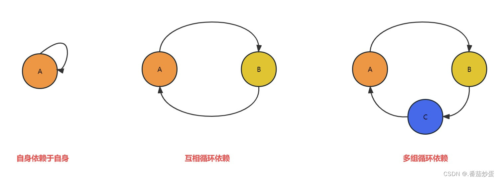

# 循环依赖

自己依赖自己，或者多个类之间相互依赖，形成循环的依赖关系，可能会导致程序编译失败或运行时出现异常



<small>[循环依赖详解及解决方案](https://blog.csdn.net/qq_43135259/article/details/130134970)</small>

```java
public class Test {

    public static void main(String[] args) {
        Test t = new Test();
    }

    private Test test = new Test();
}
```

## Spring 中的循环依赖

在 Spring 中只有 singleton 作用域会存在依赖注入问题，在 prototype 作用域下，会直接抛出异常，因为 A、B 循环依赖，在实例化 A 时，发现依赖 B，于是又去实例化 A，依此无限循环下去

```java
@Service
@Scope(scopeName = ConfigurableBeanFactory.SCOPE_PROTOTYPE)
public class A {

    @Autowired
    private B b;
}
```

```java
@Service
@Scope(scopeName = ConfigurableBeanFactory.SCOPE_PROTOTYPE)
public class B {

    @Autowired
    private A a;
}
```


## Spring 自己可以解决的循环依赖


<small>[面渣逆袭：Spring三十五问，四万字+五十图详解！建议收藏！ - Spring可以解决哪些情况的循环依赖？](https://mp.weixin.qq.com/s/Y17S85ntHm_MLTZMJdtjQQ)</small>

注意并不是只有使用构造方法注入才会产生循环依赖，而是在 Spring 启动时就会提醒出现循环依赖，并且启动失败，使用其他方式进行注入也是可能会产生循环依赖的，只是在启动时不会提醒

- 使用构造器注入，应用启动失败，报循环依赖

```java
@Service
public class A {

    private B b;

    @Autowired
    public A(B b) {
        this.b = b;
    }
}

@Service
public class B {

    private A a;

    @Autowired
    public B(A a) {
        this.a = a;
    }
}
```

- A 中使用构造器注入，B 中使用 setter 注入，应用启动失败，报循环依赖

```java
@Service
public class A {

    private B b;

    @Autowired
    public A(B b) {
        this.b = b;
    }
}

@Service
public class B {

    private A a;

    @Autowired
    public void setA(A a) {
        this.a = a;
    }
}
```

Spring 在创建 Bean 时默认会根据自然排序进行创建，所以 A 会先于 B 进行创建。而当 Spring 采用构造方法注入时，Spring 是无法自己解决循环依赖问题的

## 其他情况如何解决

### 重构代码

出现循环依赖，说明代码的结构设计有问题，在条件允许下，重构代码是最优的解决方法

### `@Lazy` 注解

`@Lazy` 注解的作用就是将 Bean 的初始化延迟到第一次使用时，而不是在在容器启动时立即初始化

当一个 Bean 依赖于被 `@Lazy` 注解修饰的 Bean 时，Spring 会返回一个代理对象，而不是实际的 Bean 实例。当代理对象需要被调用时，才会去初始化 Bean

### 使用 setter 注入或属性注入

Bean 只会在被调用时才会被注入

## 三级缓存

Spring 中的三级缓存是针对 Bean 的加载和创建过程而设计的，可以有效的解决循环依赖

三级缓存只适用于单例 Bean，而非单例 Bean 是不需要缓存的

```java
// 一级缓存
private final Map<String, Object> singletonObjects = new ConcurrentHashMap<>(256);

// 二级缓存
private final Map<String, Object> earlySingletonObjects = new ConcurrentHashMap<>(16);

// 三级缓存
private final Map<String, ObjectFactory<?>> singletonFactories = new HashMap<>(16);
```

- singletonObjects：一级缓存，也被称作单例池。存放已完全初始化好的单例 Bean
  - 每次请求获取一个 Bean 时，会先检查一级缓存中是否已存在该 Bean，如果存在则直接返回，不存在才会去创建
- earlySingletonObjects：二级缓存，存放正在创建过程中的 Bean，已实例化，但尚未完成属性注入、初始化
- singletonFactories：三级缓存，存放用以创建 Bean 的对象工厂

在创建 A 实例时，先将 A 的创建工厂放入三级缓存中，对象创建完成后，再将其放入二级缓存中，并移除其在三级缓存中的创建工厂，在属性注入、初始化完成后，将其移除二级缓存，并加入到一级缓存中

如果在 A 创建完成后准备属性注入时，发现发现其依赖 B，会先从一级缓存、二级缓存中依次查找，如果有则直接进行注入，如果没有再从三级缓存中查找

- 如果三级缓存中有，则将 A 放入二级缓存中，再通过创建工厂创建 B，并将 B 注入到 A 中
- 如果三级缓存中也没有，则将 B 的创建工厂放入三级缓存中，再执行上面的操作

如果 A、B 发生了循环依赖，在 A 创建完成后会被加入到二级缓存中，再去实例化 B，此时 A 已经实例化完成了，直接注入到 B 中就行，A 中也可以继续属性注入了，此时 A 中就有了 B 的实例，B 中也有 A 的实例

### 为什么不能解决构造器注入的循环依赖

Spring 解决循环依赖的方式，是先创建一个实例，再为其注入其他对象。而通过构造方法注入，需要同时完成实例化与注入

### 为什么需要三级缓存

二级缓存已经足够能有效的避免循环依赖了，使用三级缓存主要是为了生成代理对象。因为三级缓存中放的是⽣成具体对象的匿名内部类，调用其 getObject 方法获取对象时，可以是代理对象，也可以是普通对象。使⽤三级缓存主要是为了保证不管什么时候使⽤的都是⼀个对象

## 参考

- [@Lazy注解解决循环依赖原理](https://zhuanlan.zhihu.com/p/658671735)
- [循环依赖如何避免和解决](https://juejin.cn/post/6844904039231012878)
- [Spring使用三级缓存解决循环依赖](https://juejin.cn/post/7099745254743474212)
